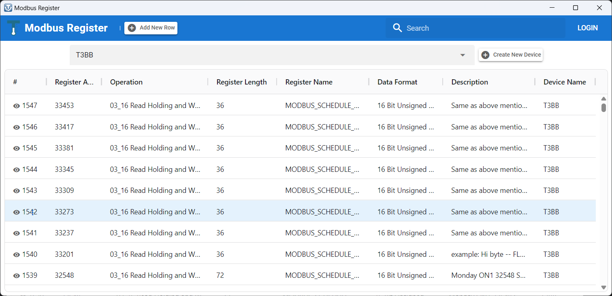
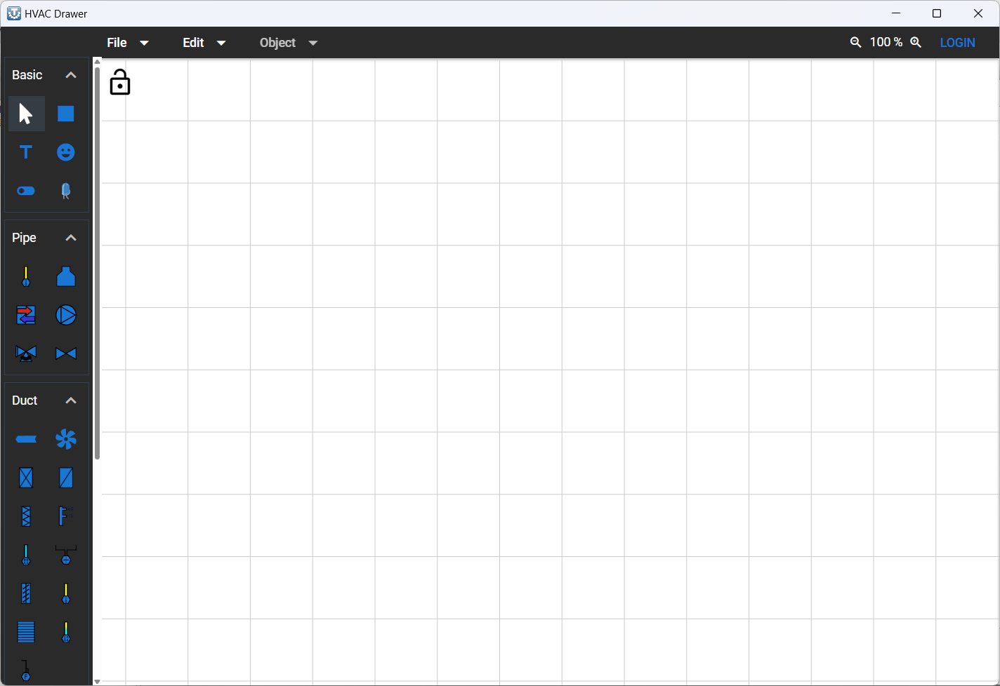

# T3000 Webview

This repository stores the webview components used in the T3000 software. There are two primary components:

- **Modbus Register Tool**: This tool enables users to add, edit, and manage Modbus register lists for Modbus devices. Additionally, it includes a Rust-based API for managing Modbus register data interaction with the SQLite database. The tool can also synchronize the local SQLite database data with the [T3 User Library API](https://github.com/temcocontrols/T3000_ApplicationLibrary_API), if the user enables data syncing in their settings.

- **T3000 HVAC Drawer**: This web-based tool allows users to create and visualize HVAC system drawings for buildings.

## Modbus Register Tool

---

Available at localhost:3003/#/modbus-register



### Overview

The **Modbus Register Tool** is a user-friendly interface designed to manage, edit, and synchronize Modbus register lists for various Modbus devices. It allows interaction with a local SQLite database and provides options for syncing data with the T3 User Library API. This tool is enhanced with a Rust-based API that facilitates seamless Modbus register data management.

### Key Features

- **Add New Modbus Registers**: Users can add new Modbus registers to the register list, specifying details such as register address, operation, length, data format, and description.
- **Edit Existing Registers**: Edit existing entries in the Modbus register table to update the configuration of Modbus devices.
- **Data Syncing**: The tool supports two modes:
  - **Offline Mode**: Operate independently without syncing with the public Modbus registry.
  - **Sync Mode**: Synchronize data with the public Modbus registry, allowing users to push updates (except private rows) or pull data from the public library.
- **Rust-Based API**: The Rust-based API manages Modbus register interactions with the SQLite database to ensure high performance and security.
- **SQLite Database**: The tool stores the register information locally in an SQLite database for fast retrieval and offline usage.

### Interface Breakdown

#### 1. Register Table View

- **Columns**:

  - **Register Address**: The address of the Modbus register.
  - **Operation**: Specifies the operation supported by the register, such as read, write, or read-write (e.g., `03 Read Holding Registers (4x)`, `06 Write Single Register`).
  - **Register Length**: The length of the register, typically represented in bits (e.g., `1`, `36`).
  - **Register Name**: The name associated with the register (e.g., `MODBUS_SCHEDULE_FLAG8`, `MODBUS_PRODUCT_MODEL`).
  - **Data Format**: Indicates the format of the register data (e.g., `16 Bit Unsigned Integer`, `32 Bit Unsigned Integer`).
  - **Description**: A brief description of the register and its purpose.
  - **Device Name**: The device associated with the register.

- **Actions**:
  - **Add New Row**: Allows users to insert a new row into the table by specifying the necessary details for a new Modbus register.
  - **Edit Operation**: Allows changing the operation of a register (e.g., switching between reading, writing, or both).
  - **Delete Row**: Removes a register from the list.

#### 2. Data Sync Settings

The tool provides a settings dialog where users can choose between **Offline Mode** and **Sync Mode**:

- **Offline Mode**: The tool only interacts with the local SQLite database without syncing data.
- **Sync Mode**: In this mode, the tool can:
  - **Push Changes**: Send updates to the public Modbus registry (excluding private rows).
  - **Pull Data**: Retrieve data from the public Modbus registry to update the local database.

#### 3. Supported Data Formats

The tool allows the selection of various data formats, including but not limited to:

- 8 Bit Unsigned Integer
- 8 Bit Signed Integer
- 16 Bit Unsigned Integer
- 16 Bit Signed Integer
- 32 Bit Unsigned Integer
- 16 Bit Unsigned Integer/10 (Scaled values)
- 16 Bit Unsigned Integer/100 (Scaled values)

#### 4. Device List Integration

The tool is capable of handling multiple devices, and each register can be linked to a specific device by selecting the device from a dropdown menu.

### Data Management and Security

- **SQLite Database**: The local database ensures fast data access and secure storage of Modbus registers, even in offline environments.
- **Public Registry Sync**: The tool integrates with the public Modbus registry through the T3 User Library API, allowing users to synchronize their data with the cloud-based registry, providing broader access and sharing options.
- **Private Data**: Users can mark certain registers as private, preventing them from being pushed to the public registry during synchronization.

### API Integration

The tool uses a **Rust-based API** for Modbus register data interaction, providing:

- **Fast performance**: Handling a large number of registers efficiently.
- **Low-level control**: Directly managing Modbus register addresses and operations with high precision.
- **Reliability and Security**: Ensures data integrity and prevents unauthorized access.
- **C++ Compatibility**: We used Rust instead of JavaScript because the API needs to be called from C++ code in the T3000 software, ensuring smooth and efficient communication.

### Getting Started

1. **Add a New Modbus Register**:

   - Click on **"Add New Row"** to open the form for a new register entry.
   - Fill in the details such as **Register Address**, **Operation**, **Register Length**, **Register Name**, **Data Format**, and **Description**.
   - Save the new register, which will then appear in the main table.

2. **Editing an Existing Register**:

   - Locate the register you want to edit in the table.
   - Click on the desired field to make modifications.
   - Save the changes to update the register.

3. **Data Synchronization**:
   - Open the **Settings** menu and choose between **Offline Mode** and **Sync Mode**.
   - If **Sync Mode** is enabled, decide whether to push changes to the public registry or pull updates from it.

### Example

```markdown
# Sample Register Entry

| Register Address | Operation                    | Register Length | Register Name         | Data Format             | Description     | Device Name |
| ---------------- | ---------------------------- | --------------- | --------------------- | ----------------------- | --------------- | ----------- |
| 33453            | 03_16 Read Holding and Write | 36              | MODBUS_SCHEDULE_FLAG8 | 16 Bit Unsigned Integer | Schedule Flag 8 | T3BB        |
```

This example illustrates how a typical Modbus register entry is structured. Users can interact with each column to configure or manage the register details as needed.

## HVAC Drawer

---

Available at localhost:3003/#



### Overview

This project is a web-based HVAC (Heating, Ventilation, and Air Conditioning) drawer, developed using the Quasar framework. It is designed to provide a dynamic and user-friendly interface for creating and manipulating HVAC system diagrams.

### Key Features

**Vue3 Moveable and Vue3 Selecto Integration**: These libraries handle the movement, resizing, and selection of objects, which are primarily SVGs representing HVAC components like ducts, pipes, and more.

**T3000 Software Integration**: The HVAC Drawer communicates directly with the T3000 software, written in C++, through WebView and JavaScript WebView messages. This enables real-time data exchange between the drawer interface and the underlying control systems.

**SVG-Based Object Handling**: The components are drawn and manipulated as SVG elements, ensuring high scalability and flexibility in representing HVAC systems.

**Modern Vue3 Design**: Built with Vue3 for reactivity and modern JavaScript features, ensuring a seamless user experience.

## Contributing

This project welcomes contributions and suggestions.

### Technologies Used

- **Frontend**: Quasar Framework (Vue.js-based)
- **Languages**: TypeScript, JavaScript, HTML, CSS
- **Backend API**: Rust
- **Testing**: Vitest (frontend), Rust's built-in testing framework
- **CI/CD**: GitHub Actions

### Getting Started

1. **Fork the Repository**

   - Clone your fork locally:
     ```bash
     git clone https://github.com/yourusername/T3000Webview.git
     ```

2. **Install Frontend Dependencies**

     - **Prerequisites**
     
       Requires a Node installation to function. Please refer to https://nodejs.org/en/download/package-manager, You can install one with:

       For linux
        ```bash
        sudo apt-get install nodejs npm
        ```
      
       For windows, download Windows Installer MSI from https://nodejs.org and run.

       For mac
       ```bash
       brew install node
       ```

       To install yarn, please refer to https://yarnpkg.com/getting-started/install

       For linux
       ```bash
       sudo apt-get install yarn
       ```

       For windows (run in command window)
       ```bash
       npm install -g yarn
       ```

       For mac
       ```bash
       brew install yarn
       ```

     - **Installation**
      
       Navigate to the project directory and install dependencies:
        ```bash
        npm install
        ```

3. **Available NPM Scripts**

   The project includes several NPM scripts defined in the `package.json` file to streamline development tasks:

   - **Linting**

     ```bash
     npm run lint
     ```

     - Runs ESLint to analyze your code for potential errors and code style issues.

   - **Formatting**

     ```bash
     npm run format
     ```

     - Formats code using Prettier according to the project's style guidelines.

   - **Building for Production**

     ```bash
     npm run build
     ```

     - Builds the app for production using Quasar.

   - **Running the Frontend**

     ```bash
     npm run client-dev
     ```

     - Starts the Quasar development server for the frontend.

   - **Running the Rust API**

     ```bash
     npm run api-dev
     ```

     - Uses `cargo watch` to monitor and rebuild the Rust API on changes. It runs the `run_server` example.

   - **Running Both Frontend and API Concurrently**

     ```bash
     npm run dev
     ```

     - Runs both the frontend and the Rust API simultaneously for development purposes.

   - **Testing**
     - **General Test Command**
     
       We utilize Vitest for unit testing, with all test files located within the test directory.
       ```bash
       npm run test
       ```
       - Displays information about available tests.
     - **Unit Tests with UI**
       ```bash
       npm run test:unit:ui
       ```
       - Runs unit tests using Vitest with a graphical user interface.
     - **Unit Tests**
       ```bash
       npm run test:unit
       ```
       - Runs unit tests using Vitest in the console.
     - **Unit Tests for CI**
       ```bash
       npm run test:unit:ci
       ```
       - Runs unit tests optimized for Continuous Integration environments.

4. **Running the Project**

   To run both the frontend and the Rust API simultaneously:

   ```bash
   npm run dev
   ```

   - This command uses `concurrently` to run both `api-dev` and `client-dev`.
   - Access the app at `http://localhost:3000`.

5. **Contributing to the Frontend (Quasar Framework)**

   - **Quasar Documentation**: [Quasar.dev](https://quasar.dev)
   - Make changes in the `src` folder, following Vue and Quasar's component structure.
   - **Linting and Formatting**
     - Before committing, ensure your code adheres to the project's linting and formatting rules:
       ```bash
       npm run lint
       npm run format
       ```
   - **Testing**
     - Run frontend unit tests to ensure your changes don't break existing functionality:
       ```bash
       npm run test:unit
       ```

6. **Contributing to the Rust-based API**

   - Detailed instructions are available in the `api` folder's [README](api/README.md).
   - **Rust Installation**

     - Ensure you have **Rust** installed via [rustup](https://rustup.rs/).

   - **Note**: The API is compiled into a DLL and included in the T3000 software, which is C++-based.

7. **Testing**

   - **Frontend Tests**
     - Run all unit tests:
       ```bash
       npm run test:unit
       ```
     - Run tests with a UI:
       ```bash
       npm run test:unit:ui
       ```
   - **API Tests**
     - Run tests for the Rust API:
       ```bash
       cargo test
       ```

8. **Building for Production**

   - Build the frontend application for production deployment:
     ```bash
     npm run build
     ```

9. **Code Quality**

   - **Linting**
     - Check your code for linting errors:
       ```bash
       npm run lint
       ```
   - **Formatting**
     - Format your code to match the project's style:
       ```bash
       npm run format
       ```

10. **Submitting a Pull Request**

    - **Commit Guidelines**
      - Write clear and descriptive commit messages.
      - Ensure all tests pass before committing.
    - **Push Changes**
      ```bash
      git push origin feature/your-feature
      ```
    - **Open a Pull Request**
      - Navigate to the main repository and open a Pull Request from your fork.
      - Provide a clear description of the changes and any relevant issues.

## T3000 HVAC Drawer C++ Integration - Developer Notes

This repository serves as a sub-module within the [T3000 Building Automation System](https://github.com/temcocontrols/T3000_Building_Automation_System) repository. The integration allows T3000 software’s C++ code to interact with the HVAC drawer to render animated drawings using data from T3000 devices. The software also controls the state of these drawings, such as animating a fan object when the fan is turned on.

### Communication Between JavaScript and C++

To facilitate communication between JavaScript and C++, the JavaScript side sends messages through `window.chrome.webview.postMessage`, and the C++ side processes these messages and sends a response back using `PostWebMessageAsJson`.

#### Sending Data from JavaScript to C++

When the JavaScript side needs to update an entry (such as a panel input's state), it sends a message using the `postMessage` method. Here's an example of how JavaScript sends an `UPDATE_ENTRY` message to the C++ side:

```javascript
window.chrome?.webview?.postMessage({
  action: 3, // Corresponds to WEBVIEW_MESSAGE_TYPE::UPDATE_ENTRY
  field: key, // The field to be updated (e.g., control, value, auto_manual)
  value: fieldVal, // The value to update the field with
  panelId: pid, // ID of the panel
  entryIndex: index, // Index of the entry in the panel
  entryType: t3Entry.type, // The type of entry (e.g., INPUT, VARIABLE)
});
```

In this example:

- `action: 3` corresponds to the `WEBVIEW_MESSAGE_TYPE::UPDATE_ENTRY` message type.
- The `field` is the name of the attribute being updated (such as `"control"` or `"value"`).
- `value` is the new value for the field.
- `panelId`, `entryIndex`, and `entryType` identify the specific panel and entry being updated.

#### Example: Processing `UPDATE_ENTRY` on the C++ Side

When the C++ side receives the `UPDATE_ENTRY` message, it processes the data and performs the necessary updates, as shown in the following code:

```cpp
case WEBVIEW_MESSAGE_TYPE::UPDATE_ENTRY:
{
    // Process JSON input data for the entry update
    int panel_id = json.get("panelId", Json::nullValue).asInt();
    int entry_index = json.get("entryIndex", Json::nullValue).asInt();
    const std::string field = json.get("field", Json::nullValue).asString();
    int value = json.get("value", Json::nullValue).asInt();

    // Perform update based on entry type and field
    if (field == "control")
    {
        m_Input_data.at(entry_index).control = value;
    }
    else if (field == "value")
    {
        m_Input_data.at(entry_index).value = value * 1000;
    }

    // Send response back to JavaScript with the update status
    Json::Value response;
    response["action"] = "UPDATE_ENTRY_RES";
    response["status"] = true;
    CString output(Json::writeString(builder, response).c_str());
    m_webView->PostWebMessageAsJson(output);
    break;
}
```

In this example:

- The C++ side receives the `panelId`, `entryIndex`, `field`, and `value` from the JSON message sent by the JavaScript side.
- The relevant data (such as `control` or `value`) is updated based on the message.
- A response is sent back to JavaScript to indicate whether the operation was successful.

For more details on how to establish communication between native C++ code and JavaScript, refer to the [Interop of native-side and web-side code](https://learn.microsoft.com/en-us/microsoft-edge/webview2/how-to/communicate-btwn-web-native).
