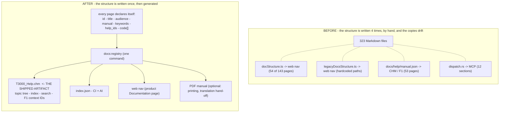
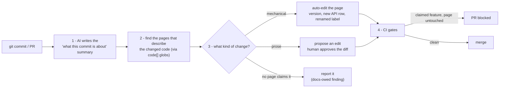

# T3000 help system — long-term design

| | |
|---|---|
| Status | **Draft for review** — no decision taken, nothing implemented |
| Decisions | Replace Dr.Explain with a system we own (product owner, 2026-10); the shipped help file is **CHM, always offline** |
| Scope | How product documentation is authored, kept current, and **compiled into the offline CHM that F1 opens** |
| Out of scope | The content of individual pages; the T3000 application code |

---

## 1. Goal

Build the help system we own, and stop depending on Dr.Explain: one Markdown source in git compiles
into the **offline CHM that F1 in T3000 opens**, with AI keeping the content organized and current and
a human approving anything a customer reads.

Concretely:

1. `npm run build:help` produces the shippable `T3000_Help.chm` with **no other tool in the loop**.
2. The file matches what Dr.Explain produced for us: topic tree, index/keywords, full-text search,
   context-sensitive F1 help, styled pages — all **offline**, no network, no external assets.
3. Adding or moving a page is a one-place edit (no nav lists, no manifest to hand-edit).
4. A change to a feature either updates its page in the same commit, or the commit explains why not.
5. Anyone can ask "which pages are stale?" and get a precise answer (not an opinion).
6. F1 context help resolves to the right topic for every dialog that has a Help button.

## 2. Non-goals

* Not a wiki / Confluence migration. Content stays Markdown in this repo.
* **Not online help.** F1 must work on a machine with no internet: no CDN assets, no web fonts, no
  remote search index. The CHM's own full-text search is the search.
* Not a WYSIWYG editor product. If the doc colleague wants a friendlier surface, they get a live
  preview plus a generated project/status view — the source stays Markdown (§11).
* Not AI-generated prose as the default path. AI drafts and reports; humans approve.
* Not a one-off re-write of the 128 topics currently locked inside `T3000_Help.chm` (§12, phase 5
  migrates the ones worth keeping).

## 3. Where we are today

Real assets, already working:

| Asset | What it does | Count |
|---|---|---|
| `docs/t3000/**` | Product documentation (Markdown) | 143 files |
| `docs/legacy/**` | Engineering / investigation notes | 180 files |
| `docs/help/*.json` | Declares what goes into each help file | 3 manifests (only the manual ships) |
| `scripts/build-t3000-help-chm.mjs` | Builds + deploys `T3000_Help.chm` | 53 pages in the manual, 33.1 MB |
| `scripts/audit-docs.mjs` | Read-only doc linter (headings, fences, links, meta) | 19 rule families |
| `scripts/normalize-docs.mjs` | Mechanical doc cleaner | 6 rule groups |
| `src/t3-react/.../documentation/` | Web Documentation page | 2 hand-written nav files |
| `api/src/mcp/dispatch.rs` | MCP doc tools (`t3000_doc_list` / `t3000_doc_read`) | 12 sections |
| `.github/workflows/` | Existing CI | 4 workflows |
| `T3000_Help_Map.h` (C++) | F1 context IDs ↔ help topics | 131 of 216 mapped |
| `T3000_Help.original.chm` | The pristine shipped manual we build on top of | 128 topics, produced with Dr.Explain, **no source project** |

## 4. The problem

**The requirement:** *"Ideally we want to get away from Dr.Explain… We need a long term solution help
system. Use AI to help us keep it organized and up to date."* (product owner)

Today's manual was made with Dr.Explain and **the project file is gone**, so the 128 topics are frozen:
editing them needs Dr.Explain, and adding our own pages needed a script written by hand. Replacing the
tool is therefore not a formatting question — it is "who owns the source of truth".

The structural problem that stops any replacement from working:

**Four separate hand-maintained lists describe the same 323 files, and they disagree.**

| Consumer | Maintained in | Covers |
|---|---|---|
| Web Documentation page (product) | `docStructure.ts` | 54 of 143 `t3000` pages |
| Web Documentation page (legacy) | `legacyDocsStructure.ts` | 16 sections, hardcoded paths |
| Windows help / F1 | `docs/help/manual.json` | 53 pages |
| MCP / AI clients | `dispatch.rs` | 12 sections |

Consequences, all observed:

* A page can be complete, correct and **invisible** — it exists but no nav lists it.
* Moving a file breaks up to four lists plus any relative link (`33` dead links today).
* Nothing records **which commit a page was verified against**, so "is this current?" has no answer.
* 84 of 216 F1 context IDs are unmapped, and the mapping is one-way (code → topic string).
* Quality rules are applied by a script a human has to remember to run (`182` files currently flagged,
  most of it legitimate engineering material that lives in the wrong audience bucket).
* The 128 original CHM topics have **no source at all** (Dr.Explain project not kept) — the current
  pipeline can extend them but never edit them.

Root cause: **the structure of the documentation is duplicated in code, instead of being declared once
next to the content.**

## 5. Design principles

1. **Docs live in git, next to the code they describe.** Text formats only.
2. **One source, many outputs.** Structure is declared once; nav, CHM manifests and MCP sections are
   generated from it.
3. **Every page declares which code it describes.** Without that, "update the docs automatically" is
   guesswork.
4. **AI proposes, humans approve** — except for mechanical edits, which AI applies directly.
5. **Traceability by commit.** Every page records the last commit it was verified against.
6. **Audience is part of the data** (`user` / `admin` / `engineer`), because the same rules cannot apply
   to the user manual and to a phase-completion note.
7. **Fail loudly, not silently.** CI catches structural drift; nobody has to remember.
8. **The CHM is the product.** If a change does not improve the file users press F1 to open, it is
   optional work.
9. **Offline by construction.** Every asset a page needs ships inside the CHM; CI fails on remote
   references (`http(s)://` in `img`/`script`/`link`).
10. **Capability parity with Dr.Explain is the acceptance test** (§10.1) — we replace it, we do not
    lose anything the doc colleague relies on.

## 6. Architecture



## 7. Layer A — the topic registry

### 7.1 Front matter

Every documentation page gets a YAML block. Fields are **derived by default** from the existing path,
so the migration is mechanical and pages that nobody claims still get sane values.

| Field | Meaning | Default if absent |
|---|---|---|
| `id` | Stable identifier; referenced from code (F1), links and the registry | slug of the path |
| `title` | Display title (must match the H1) | first H1 |
| `audience` | `user` \| `admin` \| `engineer` — drives the quality rules and the CHM split | `t3000/**` → `user`, `legacy/**` → `engineer` |
| `manual` | Appears in the shipped help file | per current `docs/help/manual.json` |
| `order` | Position inside its chapter | numeric prefix / alphabetical |
| `keywords` | Index terms compiled into the CHM's **Index** tab | derived from the H1 and headings |
| `help_ids` | F1 context IDs this page answers (§9.3) | none |
| `code` | Globs of the code this page describes | empty (treated as "unclaimed", reported) |
| `reviewed` | `<date>@<sha>` of the last commit the page was verified against | commit that last touched it |
| `owner` | Team or person responsible | `unassigned` (reported) |

```yaml
---
id: trend-logs
title: Trend Logs
audience: user
manual: true
code: ["src/t3-react/features/trendlog/**", "api/src/trendlog.rs", "T3000-Source/TrendLog/**"]
owner: trendlog
---
```

### 7.2 Generated registry

`npm run docs:registry` writes `docs/help/index.json`: every page with its metadata, plus derived
facts (H1, headings, word count, inbound links, images, manual membership, staleness). This file is a
build artifact — committed so the MCP tools and CI can read it without running Node.

### 7.3 Generated consumers

| Currently hand-written | Becomes |
|---|---|
| `docStructure.ts` | generated section tree (`audience: user` + `manual: true`) |
| `legacyDocsStructure.ts` | generated from `audience: engineer` |
| `docs/help/manual.json` etc. | generated from `manual:` + `order:` |
| `dispatch.rs` section list | generated sections from `audience` + folder |
| the CHM's Contents | already generated — unchanged |

Net effect: **structure is authored once, in the page.** The four lists become outputs.

## 8. Layer B — the commit → docs loop

Trigger: every push to a feature branch, every PR update, and every merge to `main`.
Entry point: `npm run docs:sync -- --from <sha> --to <sha>` (the same script CI calls).



### 8.1 The commit summary

Written on every commit, in two places:

* **Short** — appended to the release/change-log page for the version that is in development
  (`docs/t3000/releases/**`), so the shipped help file has a "what's new" chapter that is always current.
* **Long** — a comment on the PR listing impacted pages and what the AI changed/proposed.

The summary is derived from the diff and the commit messages, not invented: the prompt requires it to
cite the files it is describing.

### 8.2 Auto-apply vs propose

| Change class | Example | Policy |
|---|---|---|
| Mechanical | new endpoint row in an API table, version bump, renamed UI label, moved file | **auto-apply**, commit by the bot |
| Structural | page split, chapter reorder, new page for a new feature | auto-create the page as a *draft*, human fills prose |
| Behavioural prose | "what the feature does" changed | **propose only** — PR comment with a suggested diff |
| Ambiguous / no match | code changed, no page claims it | no edit; raise the docs-owed finding (§9.1) |

Hard rule: AI never rewrites an accepted page's prose without a human approving that specific diff.
Otherwise docs become confidently wrong — the exact failure mode this system exists to prevent.

## 9. Layer C — guards

### 9.1 Docs-owed check

For the changed files in a PR, take every page whose `code` globs match. If none of those pages changed
in the same PR → the check fails, listing the pages it expected to move. Waivers:

* label `docs-not-needed` on the PR, or
* the author adds `docs-owed: <reason>` to the PR body (recorded, so we can see if it becomes a habit).

Unclaimed code (a changed file no page matches) is reported as a warning with the nearest pages
suggested, not a failure — until the registry coverage is high enough to make it a gate (§12).

### 9.2 Quality gate

`node scripts/audit-docs.mjs --fail-on <severity>` in CI, split by audience:

* **Blocking for `audience: user`** — unbalanced fences, dead relative links, missing/duplicate H1,
  TODO markers, non-technical sections ("Review & Approval"), authoring metadata.
* **Blocking for `audience: engineer`** — unbalanced fences and dead links only. Status words,
  phase headings and changelog sections are expected there and must not be "fixed" by a well-meaning
  AI (this is why audience is data, not a folder convention).

Baseline today: 3 unbalanced fences, 33 dead links, 6 TODO markers, 6 duplicate H1 pairs.

### 9.3 F1 context help — generated end to end

The C++ side asks the Help viewer for a topic by ID
(`::HtmlHelp(..., HH_HELP_CONTEXT, IDH_TOPIC_*)`), and the ID must exist in the compiled `.hhc`
alias table. Today we *guess* the mapping from an existing `T3000_Help_Map.h` (131 of 216 IDs) — the
wrong direction. Instead the registry owns the IDs and we **generate** both sides of the contract:

```yaml
---
id: trend-logs
help_ids: [IDH_TOPIC_TREND_LOGS]
---
```
```cpp
// generated: T3000_Help_Map.h
#define IDH_TOPIC_TREND_LOGS  1234
```

`npm run docs:map` writes the `.h` file, and the CHM build adds an `[ALIAS]`/`[MAP]` entry per ID. CI
then asserts: every `IDH_TOPIC_*` referenced in the C++ tree has a page, and every `help_ids` entry is
in the generated header. New dialogs cannot ship a Help button without a target topic — which is how
coverage gets to 100% by construction instead of by auditing.

### 9.4 Offline-safety gate (new)

Because the CHM must work with no network (non-goal §2), CI fails if any page in the manual references a
remote asset: `http(s)://` in `img src`, `script src`, `link href`, `@import`, or a CSS `url()`.
Existing Dr.Explain pages pass this today; the risk is new Markdown pages pasting a web image.

### 9.5 Weekly upkeep (scheduled, no human in the loop)

A scheduled agent run produces one report and at most one PR:

* **Stale** — pages whose `code` files changed after `reviewed`.
* **Orphans** — pages no nav/manifest lists, or reachable from nothing.
* **Duplicates** — near-identical or identically-titled pages (the `TRENDLOG_DATA_FLOW_ANALYSIS` /
  `TrendLog-Data-Flow-Analysis` pair and the two `TRENDLOG_DATABASE_DESIGN` revisions were live
  examples; titles/names were disambiguated in phase 0, the merge decision stays with the editor).
* **Misplaced audience** — engineering content inside the user manual, status words in user pages.
* **Dead weight** — investigation notes superseded by a later conclusion, proposed for merge or deletion.

Output: `docs/help/reports/upkeep-<date>.md`, reviewed like any PR. Deleting content is always a human
decision; the agent only proposes.

## 10. Layer D — outputs

`T3000_Help.chm` is the deliverable; everything else is a by-product of the same source:

| Output | Consumer | Priority | Status |
|---|---|---|---|
| **`T3000_Help.chm`** | **F1 in T3000, offline** | **P0 — the product** | exists; manifest becomes generated, parity work in §10.1 |
| `index.json` | CI, agents, staleness reports | P0 | new |
| Web Documentation page | product UI, shareable links | P1 | exists — nav becomes generated |
| PDF manual | printing, translation hand-off, support | P2 | new (same pages) |
| MCP doc tools | AI clients | P2 | exists — sections become generated |

Hard rule: **the CHM never depends on a network** — no CDN, no web fonts, no remote images, no
server-side search. Everything it needs is compiled into the file.

### 10.1 Capability parity with Dr.Explain (the acceptance test)

We are replacing the tool, so the replacement must do everything the doc colleague and F1 rely on:

| Dr.Explain capability | Our answer | State |
|---|---|---|
| Topic tree (TOC) | generated `.hhc` from the registry | already works |
| Index / keywords | `keywords:` front matter → generated `.hhk` | **done** (2026-10-09) |
| Full-text search | `Full-text search=Yes` — hhc compiles its own index | already works |
| Context-sensitive help | registry owns the IDs → we **generate** `T3000_Help_Map.h` and the `.hhc` aliases | new, stronger than today (§9.3) |
| Styled pages | `css/docs-extra.stylesheet` on the kept Dr.Explain base theme | already works |
| Multiple formats | CHM (P0) and PDF (P2) from one Markdown source | CHM works |
| Topic statuses / progress view | front matter + a generated status report for the doc colleague | new (§11) |
| Screenshot annotation | capture helper + numbered-callout convention; manual annotation for now | **partial — known gap** |
| Editor comfort for a non-technical writer | live preview (`npm run help:preview`) + generated status view | **partial — `help:preview` done**, status view pending |
| Team collaboration | git branches + PR review | different, not worse |
| Works offline | `docs:blocking` gate fails on any remote asset reference | **done** (2026-10-09) |

The two "partial" rows are the honest cost of leaving Dr.Explain, and they are why §11 gives the doc
colleague a preview and a status view rather than "just use VS Code".

### 10.2 What we take from others

| Example | What we copy |
|---|---|
| **Sphinx** (`htmlhelp` builder) | Proof that Markdown → `.hhp`/`.hhc` → `hhc.exe` → CHM is a standard, supportable path |
| **Microsoft Learn** | Markdown in git, required review, every page validated in CI, help IDs resolved to topics |
| **Kubernetes / Docker / Rust** | Docs live in the product repo and version with the release |
| **Diátaxis** | Every page is one of four types — tutorial / how-to / reference / explanation — so the manual stays organized as it grows |
| **Paligo / DITA-OT** | Structured content → many formats + translation; the enterprise version of this architecture |
| **Mintlify / GitBook / Document360** | The AI half (drafts, PR-based updates, staleness) is a product category — we model it, git-native |

## 11. Roles and approval policy

| Decision | Owner |
|---|---|
| Merge of AI-generated *mechanical* edits | automatic (bot PR, CI green) |
| Merge of AI *prose* proposals | the page's `owner` (or the docs editor) |
| Deleting / merging pages | docs editor |
| Changing the audience of a page (moving it into or out of the manual) | product owner |
| Keeping the CHM's structure and quality | the doc colleague (named **docs editor** below) |
| Changing these rules | this document, via PR |

Need a single named **docs editor** role. Without one owner this system degrades into "AI proposes, nobody
merges", which is the same rot with more machinery. Note that this role is currently filled by the person
who built the manual in Dr.Explain — §15.1 asks whether they move to Markdown or keep their old tool for
authoring.

## 12. Migration plan

Each phase is independently useful and ends in something demonstrable.

| Phase | Work | Exit criteria | Estimate |
|---|---|---|---|
| **0. Baseline** | Fix the 3 fence breaks, 33 dead links, duplicate H1 pair; delete the orphan CHMs | `audit-docs.mjs` reports 0 blocking findings for `audience: user` | 0.5 day |
| **1. CHM parity** | `keywords:` → index; generate `T3000_Help_Map.h` from the registry; `help:preview` (build + open); offline-safety gate | the CHM we build is indistinguishable in capability from the Dr.Explain one: tree, index, search, F1 IDs, styling — fully offline | 3–4 days |
| **2. Registry** | Front matter (path-derived defaults) + `docs:registry` + generate the CHM manifest, web nav and MCP sections from it | one structure source; adding a page needs no code change | 2–3 days |
| **3. Ownership + commit loop** | Fill `code:`/`owner:` for the manual's pages; `docs:sync` (commit → summary → affected pages → PR); auto-apply vs propose split | a feature commit produces a summary plus a page diff a human can approve | 4–6 days |
| **4. Guards** | Docs-owed check, audit gate by audience, generated status view for the doc colleague, weekly upkeep report | a PR that changes a claimed feature without its page fails CI | 2 days |
| **5. Content debt** | Migrate the valuable frozen CHM topics into Markdown; map the remaining 84 element-level F1 IDs; PDF output if wanted | F1 coverage > 90%; the frozen list is known and shrinking | ongoing |

Total to a working system (phases 0–4): roughly **12–16 person-days**, split across one developer and
one docs owner. The hard part is phases 3 and 5 (content and ownership decisions), not the tooling.

Phase 1 is deliberately first: it is the phase that proves we can leave Dr.Explain without losing the
CHM, and it is the part the doc colleague can judge immediately.

## 13. Alternatives considered

**A. Buy Dr.Explain and keep authoring in it.** Rejected by the product owner (*"ideally we want to get
away from doctor explain"*). Its own history makes the case: the project file was lost, which is why 128
shipped topics cannot be edited today, and a binary project cannot take part in commit-driven review or
AI upkeep. It stays as the **benchmark** — §10.1 is the capability checklist we must match.

**B. Buy a knowledge base (Confluence, SharePoint wiki).** Rejected: leaves git, no code mapping, no CI
gates, and forks the content away from the MCP tools and the CHM.

**C. Keep the current pipeline, add discipline.** Rejected: tested for months — four hand-maintained
lists, 33 dead links, 84 unmapped F1 IDs. Discipline is not the missing component; a single source is.

**D. Docs-as-code without AI.** The registry and the gates work; what is lost is the per-commit summary
and the upkeep triage, i.e. exactly the part that stops drift. The AI adds leverage to a correct
structure — it cannot substitute for one.

## 14. Success metrics

| Metric | Today | Target |
|---|---|---|
| Who builds the shipped CHM | Dr.Explain (for 128 topics) + our append script | our pipeline, 100% |
| Dr.Explain dependency | required to edit the existing manual | none |
| Offline violations (remote refs in CHM pages) | not checked | 0, enforced in CI |
| Structure sources | 4 hand-written | 1 (generated) |
| Unclaimed code areas among changed files | unknown | < 20% |
| Median page staleness (commits since `reviewed`) | not measurable | measurable; < 30 for the manual |
| Blocking audit findings | 3 fences, 33 dead links | 0 for `audience: user` |
| F1 context-ID coverage | 131 / 216 (61%) | > 90%, header generated |
| Shipped CHM size | 33.1 MB (17.8 MB is screenshots) | unchanged or smaller |

## 15. Open decisions (need a human)

**Settled:** the CHM stays and it is always offline; the web page is secondary; we replace Dr.Explain
rather than buy it.

1. **How does the doc colleague work?** This is the adoption risk of leaving Dr.Explain: do they author
   in Markdown (VS Code + `help:preview`, AI drafting), or do we keep Dr.Explain *for them only* while
   our pipeline owns the build and the source? §10.1 lists exactly what they lose (screenshot
   annotation, editor comfort). **Answer this before phase 3.**
2. Who is the **docs editor** (§11) — by name, with time allocated?
3. Is a **PDF** manual needed (printing, translation hand-off, support), or is the CHM enough?
4. Engineering notes: keep as a searchable archive (current), or archive them out of `docs/` entirely?
   They are 180 of 323 files and they are what makes the audit numbers look alarming.
5. Per-PR doc review, or asynchronous bot PRs against `main`?

## Appendix A — defect baseline (measured 2026-10-09)

`node scripts/audit-docs.mjs` over 323 files / 4.38 MB / 8918 headings → 182 files with findings.
Blocking-by-design items:

* 3 unbalanced code fences — `t3000/architecture/system-overview.md` (21),
  `legacy/implementations/t3-bas-web/left-panel/LEFT_PANEL_STEP_BY_STEP_GUIDE.md` (79),
  `legacy/implementations/trend-log/tlm-Light-Theme-Update.md` (39)
* 33 broken relative `.md` links, concentrated in `building-platform/control-messages/message-index.md`,
  `building-platform/device-settings-structure.md`, `legacy/development/{bugs,data-mnt,project}/README.md`
* 6 TODO markers, 6 duplicate H1 pairs, 1 unmapped `IDH_TOPIC_*`

Non-blocking (expected in engineering material, must not be "cleaned": 303 status words, 98 metadata lines).

## Appendix B — commands

```
npm run docs:audit        # lint (read-only)
npm run docs:blocking     # lint, exit non-zero only for findings that break the shipped manual
npm run docs:clean        # mechanical cleanup (dry-run by default)
npm run build:help        # build + deploy the shipped CHM
npm run help:tree         # preview the CHM Contents tree
npm run help:preview      # build and open the CHM locally
npm run docs:map          # (phase 1, remaining) regenerate T3000_Help_Map.h from the registry
npm run docs:registry     # (phase 2) regenerate docs/help/index.json
npm run docs:sync         # (phase 3) commit → summary + page updates
```
