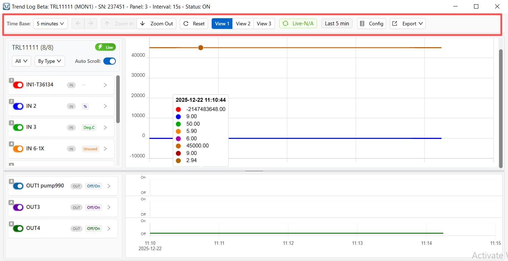
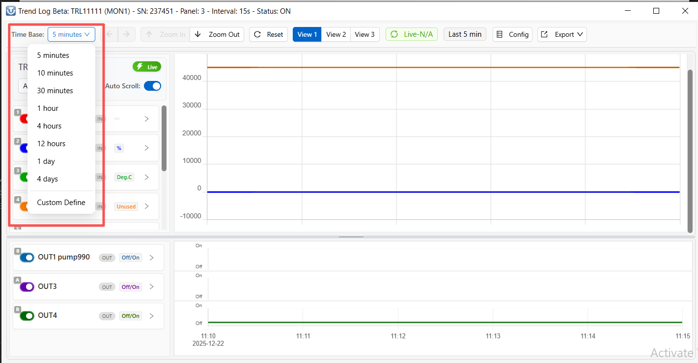
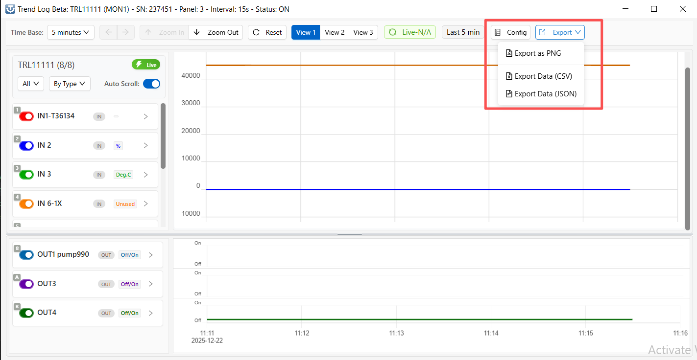
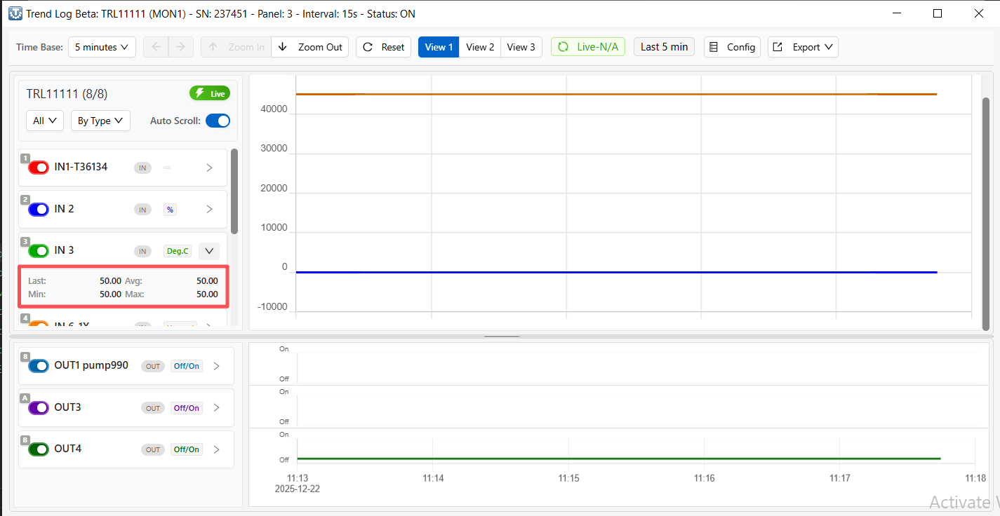
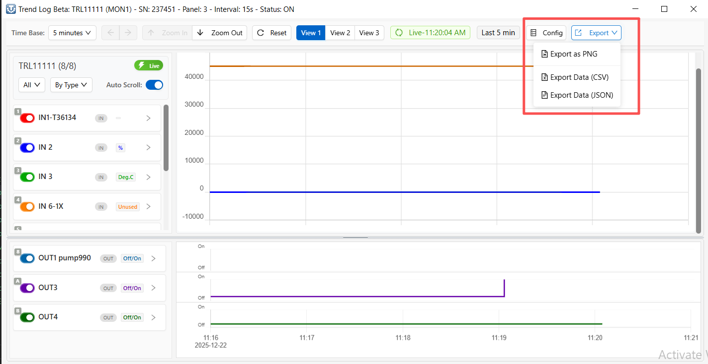

# T3000 Trend Log Beta - Quick Start Guide

## What is Trend Log?

Trend Log helps you view and analyze historical data from your building's sensors and equipment. You can monitor temperature, humidity, pressure, equipment status, and other measurements over time.

---

## Interface Layout

The Trend Log page has three main areas:

### 1. Top Control Bar

**Time Controls:**
- **Time Base**: Select preset ranges (5 min, 1 hour, 1 day, 4 days) or Custom Define for specific dates
- **Navigation arrows**: Move backward/forward in time (when viewing historical data)
- **Zoom buttons**: Zoom in/out on the time range

**Views:**
- **View 1**: Shows all configured trend points
- **View 2/View 3**: Custom views - select specific items to monitor
- **Settings button**: Configure which items appear in View 2/3

**Actions:**
- **Reset**: Return to live view (last 5 minutes)
- **Config**: Configure trend log settings
- **Export**: Save charts as images (PNG/JPG) or data (CSV/JSON)

**Status:**
- **Green "Live"**: Data updating automatically every 30 seconds
- **Blue "Historical"**: Viewing past data (frozen)

---

### 2. Left Data Panel

Lists all available data points divided into:
- **Analog**: Continuous values (temperature, pressure, etc.)
- **Digital**: ON/OFF states (equipment status, alarms, etc.)

Each item shows:
- Checkbox to show/hide on chart
- Color indicator
- Current value
- Min/Max values (for analog items)

**Tip:** Check only the items you need - too many lines make charts hard to read.

---

### 3. Chart Area

Displays data as line charts:
- **Top chart**: Analog values (continuous lines)
- **Bottom chart**: Digital values (ON/OFF states)

**Features:**
- Hover mouse over chart to see exact values at any time
- Click and drag to zoom into a specific time range
- Each line color matches the color shown in left panel

---

## Common Tasks

### View Live Data
1. Click **Reset** button
2. Green "Live" badge appears
3. Data updates automatically

### View Historical Data

1. Click **Time Base** dropdown
2. Select **Custom Define**
3. Set start and end date/time
4. Click **OK**

### Export Data

1. Set up your chart with desired items and time range
2. Click **Export** button
3. Choose format:
   - **PNG/JPG**: Save chart as image
   - **CSV**: Download data for Excel
   - **JSON**: Download data for programming

### Create Custom Views
1. Click **View 2** or **View 3** tab
2. Click **Select Items to Track** button
3. Add items from Available list to Selected list
4. Click **Apply**

---

## Quick Tips

- **Green "Live" badge** = Data updating automatically
- **Blue "Historical" badge** = Viewing past data (not updating)
- Hover over charts to see exact values
- Uncheck items in left panel to simplify charts
- Use Custom Time to investigate specific incidents
- Export charts for reports and documentation

---

**Version**: 1.0
**Last Updated**: December 22, 2025
