## 2024-11-01

#### 1. Added a toolbar along the top with menu [Edit] and [Object]'s all options.

#### 1. Added a new option "Weld Selected" to menu [Edit] and top toolbar. Allow user to weld two selected ducts into one duct.

## 2024-11-22

#### 1. Updated the “Weld Selected�?function to make the welded item resizable and moveable.

#### 2. Added rulers and grid dots to the drawing area.

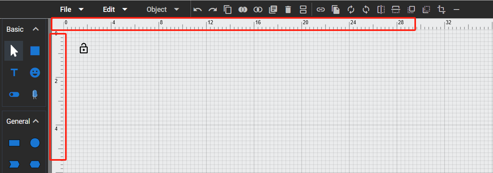

#### 3. Added a new tool category “General�?with some basic shapes.

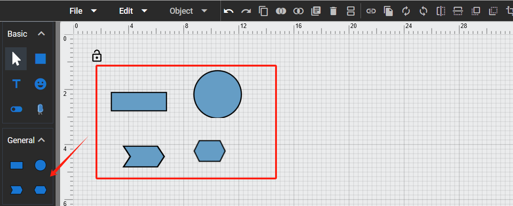

#### 4. Added a new type of wall “Interior/Exterior Wall�?to Room tool category.

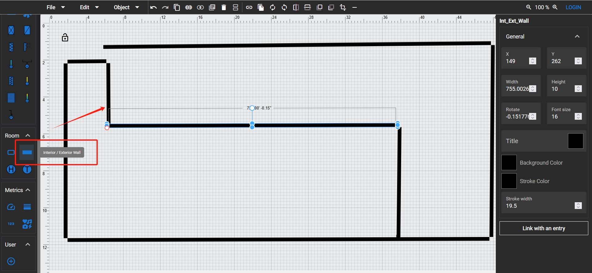

## 2024-12-13

#### 1. Updated the default value of link entry's [Display field] to description field, and can remember the user last selection after window been closed.

#### 2. Updated the Auto/Manual mode icon with larger size.

#### 3. Updated the draw logic, can draw the shape by single click the left mouse

#### 4. Added a context menu to toggle the value of [Mode] and [Value] fields, when the selected shape been right clicked.

## 2024-12-18

#### 1. Added a new feature [Insert key], to add a new shape and automatically link to the selected entry when the insert key been pressed

## 2025-01-21

#### 1. Added a new feature, to access the "Webview Graphic" via external browser (Firefox, Chrome, Microsoft Edge).

##### 1.1 Open the T3000 application, and keep it running.

##### 1.2 Open a web browser (e.g. Firefox), and type "http://localhost:9103" in the address bar to access the webview graphic.

###### 1.2.1 If you want to access it in a local area network (LAN), open a cmd window to find the host ip address where the T3000 is running.

use cmd "ipconfig" to find the IPV4 address (e.g. 192.168.1.8)

###### 1.2.2 Use http://192.168.1.8:9103 to access it on a remote computer.

##### 1.3 By default, system will automatically load all devices info from T3000. Please choose one device and one graphic before working on it. By click "Confirm" to confirm the selection.

##### 1.4 System will load existing data from T3000 for selected device and graphic.

##### 1.5 By clicking the "Show more devices" under "Device(***)" section to switch the device and graphic.

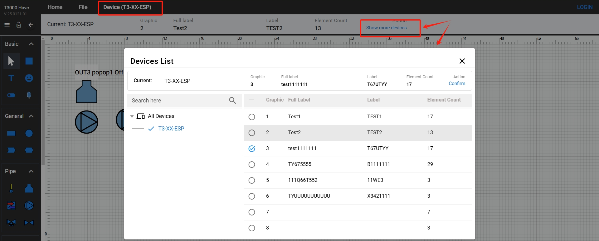

##### 1.6 Updated the top menu bar and divided the operations into "Home","File","Device" categories.

## 2025-05-21
#### 1. Added a drawing area with SVG as backend technology for drawing shapes, ducts, pipes, and walls. Open the T3000 application.
Access the HVAC drawer via a web browser with URL http://localhost:9104 and switch to "New UI" by clicking the last tab on the top menu bar.

#### 2. For the new drawing area, use Ctrl + Mouse wheel scroll to zoom in or zoom out.

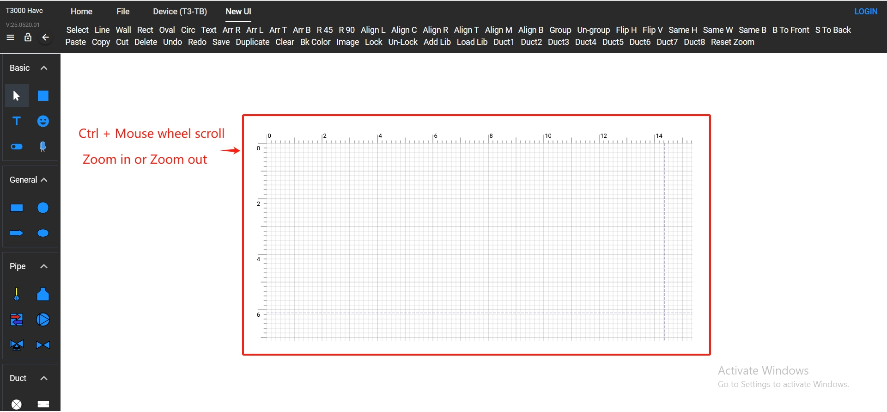

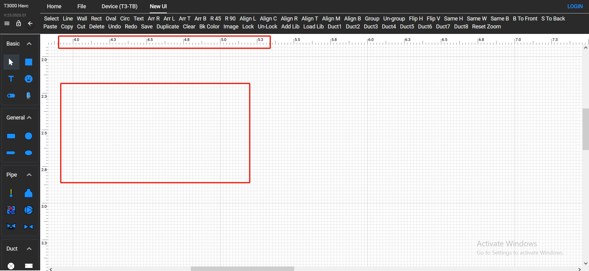

<!-- [video: Zoom in or out](./pic/2025-05-21/2_3.mp4) -->

#### 3. New duct category includes new shapes for drawing.

#### 4. Added new general shapes: Rectangle, Circle, Oval, Line, Segment Line, Arrow Right, Arrow Left, Arrow Top, and Arrow Bottom.

#### 5. Added new top toolbar with functions to manage the shapes' state when drawing,
including Align Left, Align Right, Align Middle, Align Bottom, Group, Ungroup, Flip Horizontal, Flip Vertical, Make Same Size, and Make Same Width.
Mouse hovering displays the full function name.

#### 6. Draw ducts, pipes, and walls with newly added shapes as shown in the demonstration below.

(For text shapes, currently only supported by pasting text into them.)

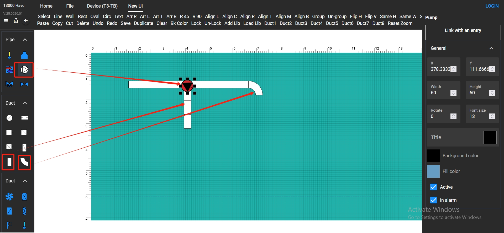

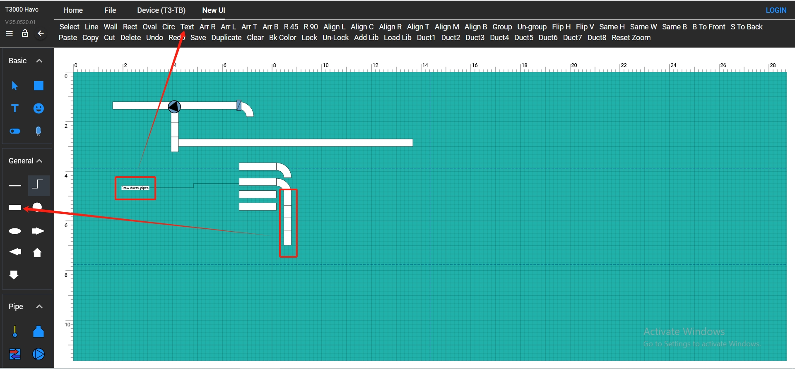

#### 7. Zoom in or out to view details for the mouse-selected area and scroll horizontally or vertically to adjust the shape with a better viewport.

## 2025-12-21

#### 1. Added new Trend Log Beta page with modern charting interface. Includes top control bar, left data panel, and large chart display area.

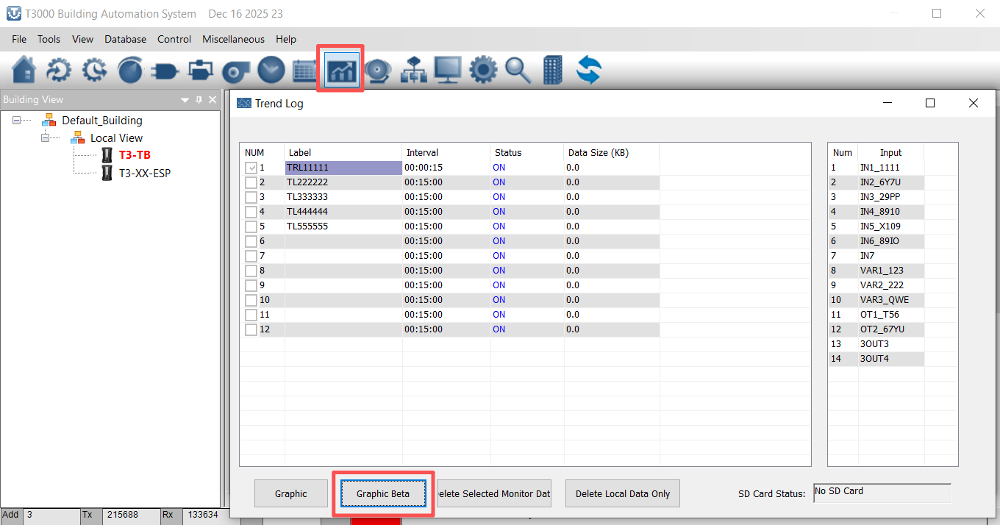

#### 2. Top control bar with time range presets (5m to 4d), custom date picker, navigation arrows, zoom controls, view selector, live/historical mode toggle, and export options.

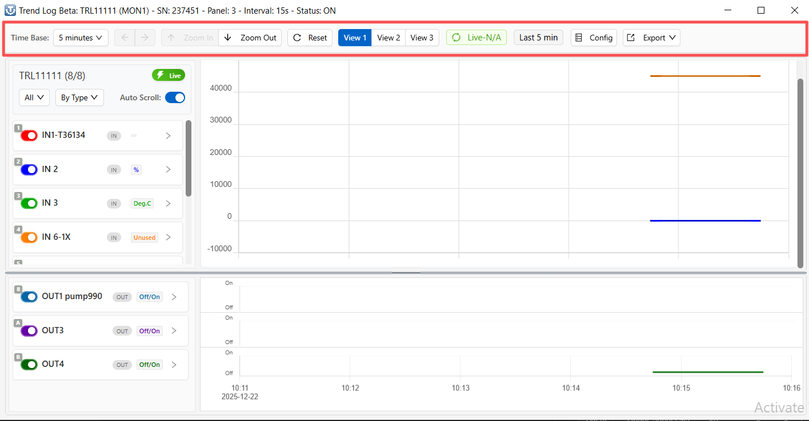

#### 3. Left panel displays all trend items with checkboxes, color indicators, live values, and min/max ranges. Separated into analog and digital sections.

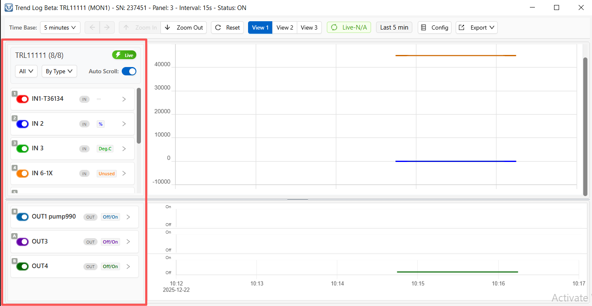

#### 4. Dual-chart display: analog chart (top) with line plots, digital chart (bottom) with step plots. Synchronized time axis and auto-scaling.

#### 5. Enhanced tooltips with gray background, collision detection, formatted time display, series names, and compact 11px font.

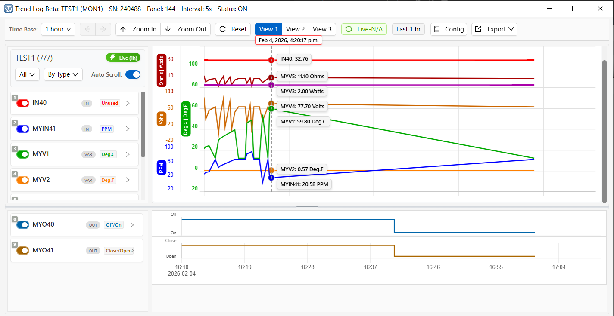

#### 6. Vertical crosshair line appears on hover, connecting data points to time axis for precise alignment.

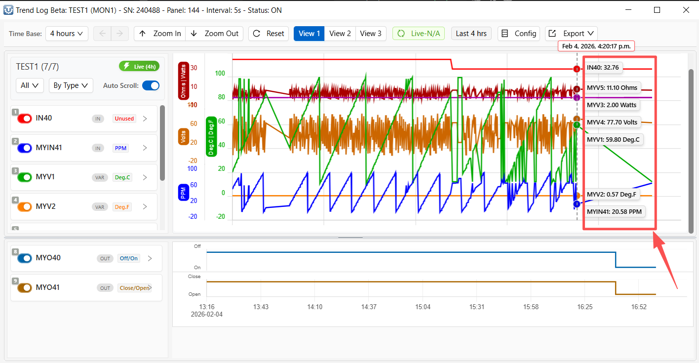

#### 7. Individual tooltips for each data series with smart positioning to avoid overlaps and chart boundaries.

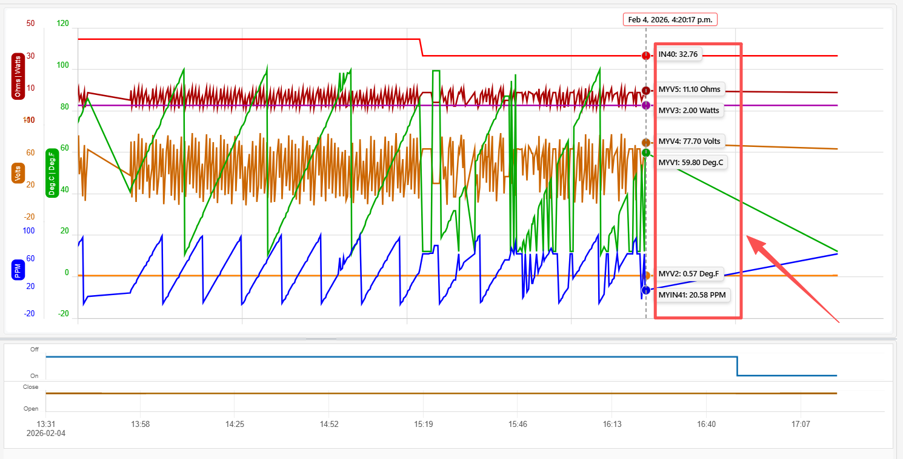

#### 8. Colored Y-axis labels with rounded bordered boxes (6px radius) and white text. Colors: gray (#595959), blue (#1890ff), green (#52c41a), orange (#fa8c16).

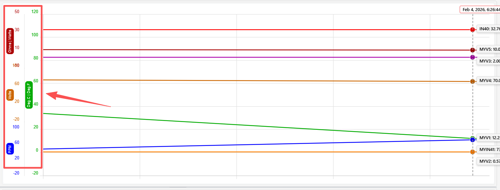

#### 9. Multi-axis support for up to 4 independent Y-axes, allowing different units (°F, %, PSI, CFM) on one chart.

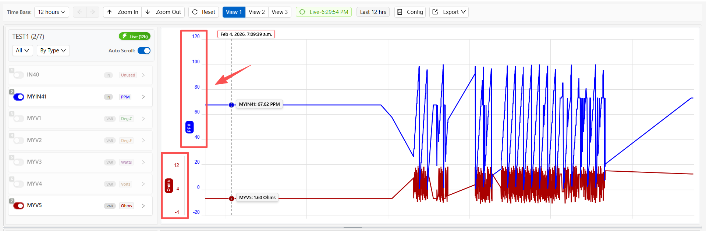

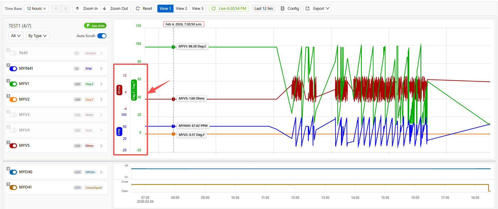

#### 10. Export data to PNG, JPG, CSV, or JSON formats for reports and analysis.

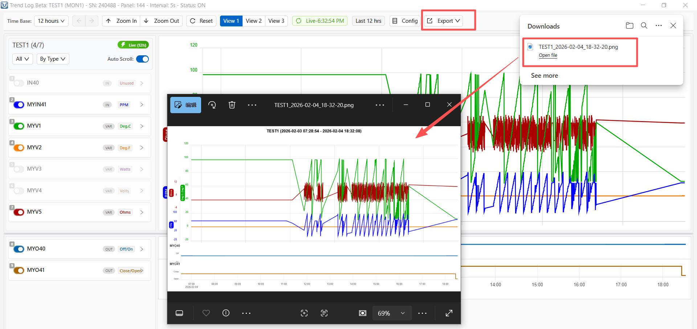

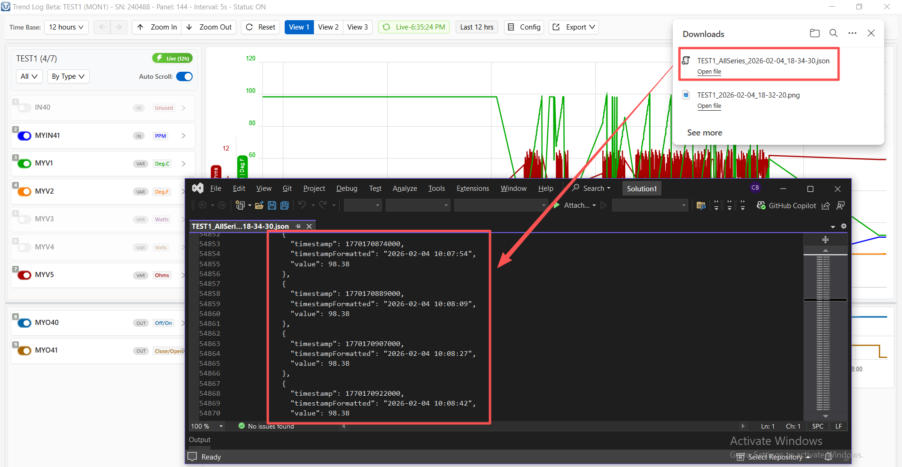

#### 11. Create up to 3 custom views to save different data point configurations for various monitoring scenarios.

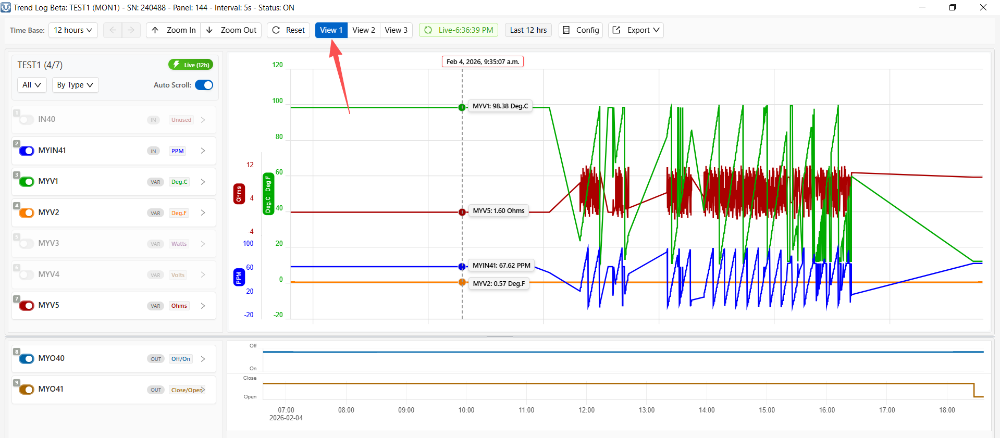

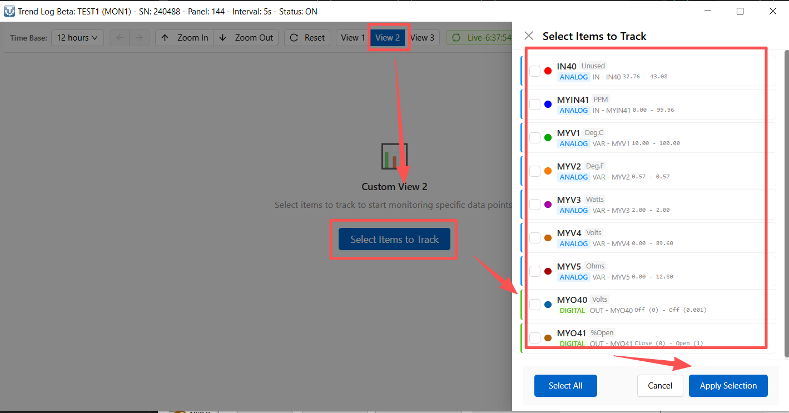

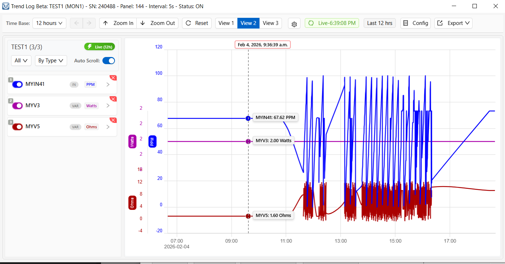

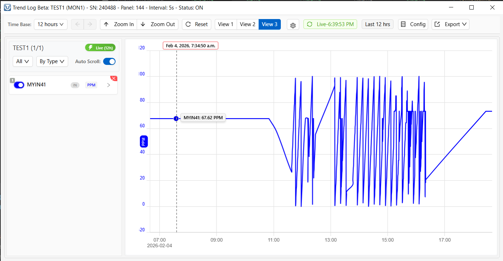

#### 11. Interactive controls: zoom with mouse wheel, pan by dragging, double-click to reset, legend toggle to show/hide series.

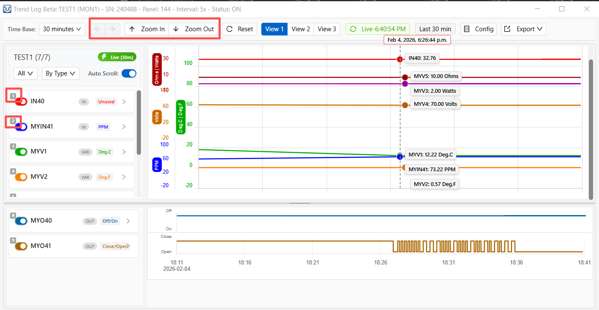

## 2026-02-04

#### 1. Fixed digital chart Y-axis label ordering. Labels now display first state at top, second state at bottom (e.g., "Close" at top for "Close/Open" unit, "Off" at top for "Off/On" unit).

#### 2. Fixed digital point tooltip accuracy. Tooltip displays correct state name based on control value (control=0 shows first value, control=1 shows second value in unit pair).

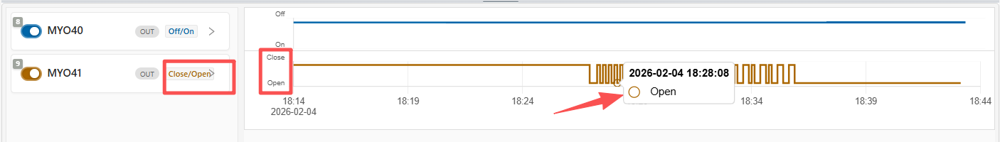

#### 3. Corrected digital output database storage. Digital outputs now save control field (0/1) instead of value field for accurate historical data.

#### 4. Fixed digital value scaling bug. Digital control values no longer divided by 1000, ensuring correct Y-axis positioning on chart.

#### 5. Added reversed Y-axis for digital charts. Visual layout with Y-axis reversed (reverse: true) provides intuitive state display matching unit string order.
