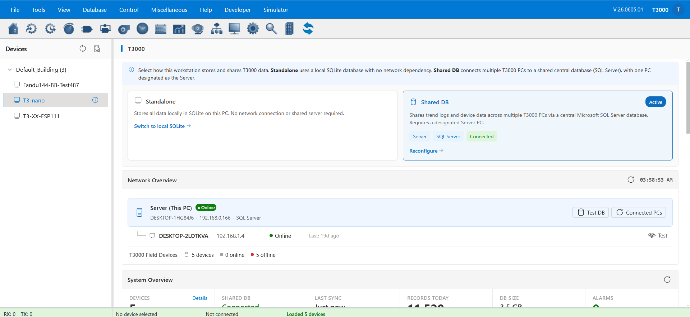
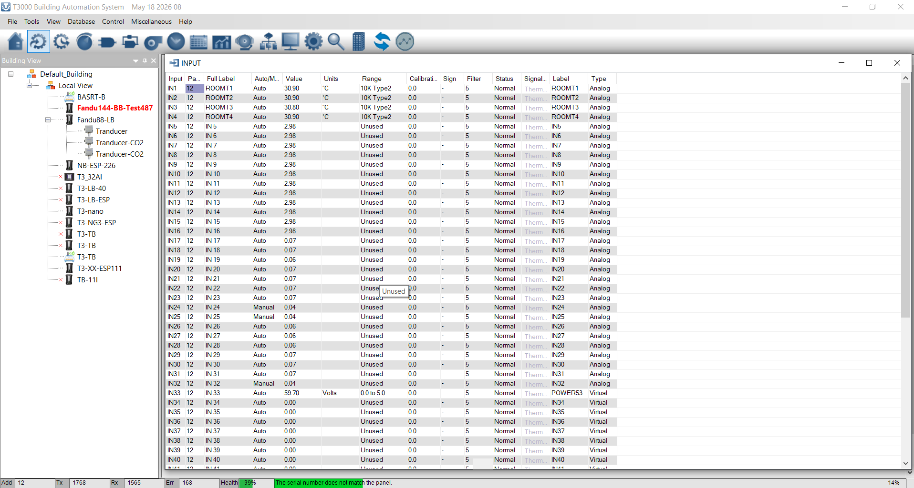

# T3000 Building Automation System — WebView Edition

## 🔍 Overview

We have built a **new web‑based layout for the T3000 Building Automation System**, designed as an assist system to the existing T3000 desktop application.  

This WebView edition keeps the same layout and features you already know from T3000, but makes them available directly in your browser — on PC, tablet, or mobile.  

It’s essentially the **web version of T3000**: same functionality, same depth, but easier to access and mobile‑ready.

---

## 📋 How to Use It

Getting started is simple:

1. **Open T3000.exe** on your PC and keep it running.  
2. **Leave T3000 open** — it acts as the host and BACnet engine.  
3. **Open a browser** on the same PC or another device on your local network.  
4. **Go to**: `http://localhost:9103/#/t3000/`  
5. The WebView UI will load, showing the same layout and features as the desktop version.  

---

## 🔀 What’s the Same, What’s New, and What’s Next

### Kept the Same
WebView preserves the familiar T3000 layout and workflow:  
- **Left panel** for building view and device tree  
- **Top menu** for navigation  
- **Second bar** for quick actions  
- **Right area** for detail views such as trend logs and inputs  
- **Bottom status bar** for system health and alarms  

This means users can continue operating WebView just as they did in T3000, without relearning the interface. Some features are not yet fully built in WebView but are actively being developed to ensure full parity with the desktop application. *(You can add screenshots here later to show each area.)*

---

### Newly Added
WebView introduces several new features beyond the desktop version:  
- **Shared Center DB** — multi‑PC synchronization via SQL Server  
- **Dashboard panel** — live monitoring of network, DB sync, and trends  
- **Mobile responsive design** — works seamlessly on phones and tablets  
- **New event log** — enhanced logging for debugging and system analysis  
- **Built‑in documentation** — integrated help and guides (screenshots can be added here)  

---

### Future Direction
This WebView edition will act as the **center platform** for adding more features over time. While not all enhancements are defined yet, users can expect continuous improvements and expansions to automation, analytics, and integration capabilities.

---

## ⚙️ How It Works (Simplified)

The general flow is straightforward:  
- **Field devices** send data and events.  
- **T3000.exe** collects this information and acts as the host.  
- Data is stored either in **local SQLite** (standalone mode) or in a **shared SQL Server database** (center mode).  
- **WebView** reads this data and displays it in the browser, keeping dashboards, trends, and device views consistent across all users.  

---

## 🛠️ Technology Stack

- **Frontend**: React 18 + Fluent UI v9  
- **Backend**: Rust (Axum) + WebSocket  
- **Database**: SQLite (fast local cache), MSSQL (optional center DB)  
- **Device Interface**: FFI calls into T3000.exe BACnet engine  

Source code and API documentation are available in the `/api/doc` folder.

---

## 📢 Feedback & Contributions

We welcome **recommendations, feedback, and contributions** from the community.  
Your input helps us refine WebView and ensure it meets real‑world needs.
