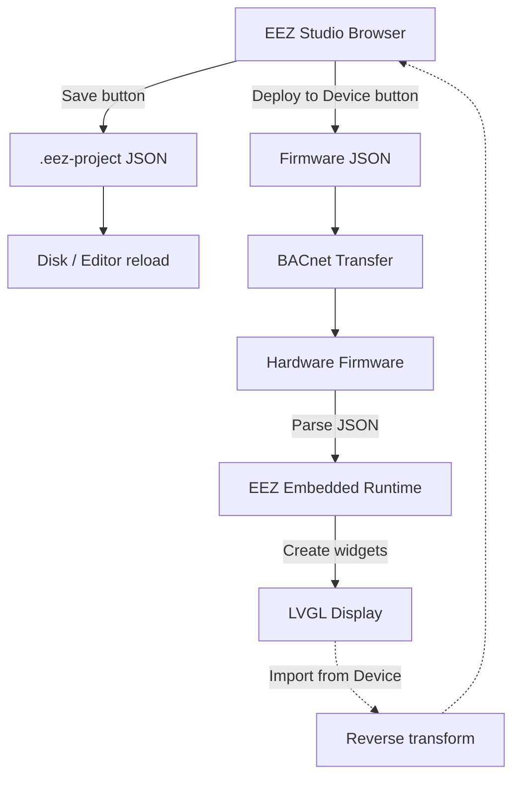

# .EEZ-Project JSON Format — Design Document

## Overview

The `.eez-project` file is a JSON document that describes a complete LVGL UI project created in EEZ Studio. This document covers the full structure of the JSON format.

**Context:** The T3000 Webview platform uses EEZ Studio (browser-based) as its UI designer. Projects designed in the browser export to this JSON format. The format is consumed by:
- The browser-based simulator (renders the UI in a web canvas using LVGL WASM)
- The Rust backend (provides font extraction & file management)
- The embedded firmware (creates LVGL widgets dynamically on the device)

### Two Output Formats

EEZ Studio produces **two different JSON formats** — one for the editor, one for the device:



| Button | Output | Consumer | Size (Smart Home example) |
|---|---|---|---|
| **Save** | `.eez-project` JSON | Editor (reopen), build system | ~1.79 MB (full embedded assets) |
| **Deploy to Device** | Per-screen firmware JSON | Hardware firmware | ~30 KB per screen (stripped) |
| **Import from Device** | `.eez-project` JSON (reconstructed) | Editor (open existing device UI) | Reverse of Deploy |

---

## 1. Top-Level Structure

```json
{
  "settings":      { ... },   // Project-wide settings
  "variables":     { ... },   // Global variables & structures
  "actions":       [ ... ],   // Reusable action definitions
  "userPages":     [ ... ],   // All pages (screens)
  "userWidgets":   [ ... ],   // Reusable custom widgets
  "lvglStyles":    [ ... ],   // LVGL style definitions
  "lvglGroups":    [ ... ],   // Widget groups
  "fonts":         [ ... ],   // Font assets
  "bitmaps":       [ ... ],   // Image/bitmap assets
  "colors":        [ ... ],   // Named colors
  "themes":        [ ... ]    // Theme definitions
}
```

---

## 2. Settings

```json
{
  "settings": {
    "general": {
      "projectVersion": "v3",          // project format version
      "projectType": "lvgl",          // "lvgl" | "dashboard" | "lvgl+flow"
      "lvglVersion": "9.5.0",             // "8.4.0" | "9.0" | "9.2.2" | "9.3.0" | "9.4.0" | "9.5.0"
      "flowSupport": true,            // enables flow engine for widget bindings
      "displayWidth": 800,            // target display width in px
      "displayHeight": 480,           // target display height in px
      "colorFormat": "RGB",           // "RGB" | "BGR" | "RGB565" | "ARGB8888" | "XRGB8888"
      "darkTheme": false,             // dark theme enabled
      "cacheFonts": true,             // cache rasterized fonts to disk
      "extensions": [],               // enabled extension IDs
      "imports": []                   // imported project paths
    },
    "build": {
      "configurations": [
        {
          "name": "Default"
          // configuration-specific overrides
        }
      ],
      "files": [
        {
          "fileName": "screens.c",
          "template": "// C template for code generation"
        }
      ]
    }
  }
}
```

**Key fields for embedded runtime:**
| Field | Purpose |
|---|---|
| `projectType` | Determines if flow engine is needed |
| `lvglVersion` | Select correct LVGL API version (8.x vs 9.x) |
| `displayWidth/Height` | Set LVGL display buffer size |
| `colorFormat` | Set `LV_COLOR_DEPTH` and byte order |
| `flowSupport` | If true, must run flow engine for widget bindings |

---

## 3. Variables (Data Bindings)

```json
{
  "variables": {
    "globalVariables": [
      {
        "name": "temperature",            // variable name (used in expressions)
        "type": "float",                  // "float" | "integer" | "boolean" | "string" | enum/struct name
        "defaultValue": "0.0",             // initial value as string
        "persist": true                    // save value across reboots
      },
      {
        "name": "buttonPressed",
        "type": "boolean",
        "defaultValue": "false",
        "persist": false
      }
    ],
    "structures": [
      {
        "name": "Point",
        "fields": [
          { "name": "x", "type": "float" },
          { "name": "y", "type": "float" }
        ]
      }
    ],
    "enums": [
      {
        "name": "FanSpeed",
        "members": ["OFF", "LOW", "MEDIUM", "HIGH"]
      }
    ]
  }
}
```

**Variables in expressions use dot notation:**
```
variables.temperature        → simple variable
variables.sensor.value      → struct field
variables.speed              → enum value
```

---

## 4. Pages (Screens)

Each page is a full-screen container with widgets:

```json
{
  "userPages": [
    {
      "name": "Main",                       // page name (used by gotoPage)
      "left": 0,                             // page X offset
      "top": 0,                              // page Y offset
      "width": 800,                          // page width (usually matches display)
      "height": 480,                         // page height (usually matches display)
      "createAtStart": true,                 // load this page on boot
      "deleteOnScreenUnload": false,         // keep page in memory after navigating away

      "components": [
        // Page background (always an LVGLScreenWidget)
        {
          "type": "LVGLScreenWidget",
          "left": 0,
          "top": 0,
          "width": 800,
          "height": 480,
          "style": {
            "useStyle": "main_screen_bg"
          },
          "localStyles": {
            "bg_color": "#1A1A2E",
            "bg_opa": "COVER"
          },
          "children": [
            // ... all widgets on this page
          ]
        }
      ],

      "connectionLines": [],
      "localVariables": []
    }
  ]
}
```

### Page Background

The first `component` is always an `LVGLScreenWidget`. Its:
- `style.useStyle` — references a named style from `lvglStyles`
- `localStyles` — inline style overrides (background color, opacity, etc.)
- `children` — all visible widgets on the page

To set a page background color:
```json
"localStyles": {
  "bg_color": "#1A1A2E",
  "bg_opa": "COVER"
}
```

To set a background image:
```json
"localStyles": {
  "bg_img_src": "my_background_image"
}
```

---

## 5. All Widget Types

### 5.1 Widget Common Properties (every widget has these)

| Property | Type | Example | Description |
|---|---|---|---|
| `type` | string | `"LVGLLabelWidget"` | Widget type identifier |
| `left` | number | `100` | X position (pixels) |
| `top` | number | `50` | Y position (pixels) |
| `width` | number/string | `200` or `"content"` | Width (pixels or auto) |
| `height` | number/string | `30` or `"content"` | Height (pixels or auto) |
| `leftUnit` | string | `"px"` | Unit for left |
| `topUnit` | string | `"px"` | Unit for top |
| `widthUnit` | string | `"px"` or `"content"` | Unit for width |
| `heightUnit` | string | `"px"` or `"content"` | Unit for height |
| `style` | object | `{ "useStyle": "default" }` | Reference to named style |
| `localStyles` | object | `{ "bg_color": "#FF0000" }` | Inline style overrides |
| `eventHandlers` | array | `[{ "trigger": "CLICKED", ... }]` | Event bindings |
| `children` | array | `[ {Widget}, ... ]` | Child widgets |
| `hiddenFlagType` | string | `"literal"` or `"expression"` | Visibility control |
| `hiddenFlag` | string | `""` or `"variables.show"` | Hidden condition |
| `clickableFlag` | bool | `true` | Whether clickable |
| `clickableFlagType` | string | `"literal"` | Clickable control |
| `disabledStateType` | string | `"literal"` or `"expression"` | Disabled control |
| `widgetFlags` | string | `"CLICKABLE|PRESS_LOCK"` | LVGL object flags |
| `groupIndex` | number | `0` | Input group index |
| `customInputs` | array | `[]` | Custom flow inputs |
| `customOutputs` | array | `[]` | Custom flow outputs |
| `timeline` | array | `[]` | Animation timeline |
| `states` | string | `""` | Widget state overrides |

### 5.2 Widget-Specific Properties

#### LVGLLabelWidget (Text Label)

```json
{
  "type": "LVGLLabelWidget",
  "left": 10, "top": 20,
  "width": 200, "height": 30,
  "text": "Temperature: 25.3 °C",
  "textType": "expression",           // "literal" | "expression"
  "longMode": "WRAP",                 // "WRAP" | "DOT" | "SCROLL" | "SCROLL_CIRCULAR" | "CLIP"
  "recolor": false,                   // Enable recolor with #RRGGBB tags
  "style": { "useStyle": "label_style" },
  "eventHandlers": [
    {
      "trigger": "CLICKED",
      "action": "gotoPage",
      "page": "Details"
    }
  ]
}
```

**textType values:**
- `"literal"` → static text, `text` is the actual string
- `"expression"` → dynamic, `text` contains an expression like `"Temperature: " + string(variables.temp) + " °C"`

#### LVGLButtonWidget (Button)

```json
{
  "type": "LVGLButtonWidget",
  "left": 100, "top": 200,
  "width": 120, "height": 50,
  "eventHandlers": [
    {
      "trigger": "CLICKED",
      "action": "setVariable",
      "variable": "variables.ledOn",
      "value": "true"
    }
  ],
  "children": [
    {
      "type": "LVGLLabelWidget",
      "width": "content", "height": "content",
      "text": "Turn ON",
      "textType": "literal"
    }
  ]
}
```

**Button has a child Label** — the button's text is a nested `LVGLLabelWidget`.

#### LVGLSwitchWidget (Toggle Switch)

```json
{
  "type": "LVGLSwitchWidget",
  "left": 50, "top": 100,
  "width": 60, "height": 30,
  "checkedStateType": "expression",     // "literal" | "expression"
  "checkedState": "variables.power",    // boolean or expression
  "eventHandlers": [
    {
      "trigger": "VALUE_CHANGED",
      "action": "setVariable",
      "variable": "variables.power",
      "value": "event.value"
    }
  ]
}
```

#### LVGLSliderWidget (Slider)

```json
{
  "type": "LVGLSliderWidget",
  "left": 20, "top": 300,
  "width": 300, "height": 20,
  "minType": "literal", "min": "0",
  "maxType": "literal", "max": "100",
  "valueType": "expression", "value": "variables.brightness",
  "eventHandlers": [
    {
      "trigger": "VALUE_CHANGED",
      "action": "setVariable",
      "variable": "variables.brightness",
      "value": "event.value"
    }
  ]
}
```

#### LVGLArcWidget (Arc Gauge)

```json
{
  "type": "LVGLArcWidget",
  "left": 400, "top": 50,
  "width": 150, "height": 150,
  "minType": "literal", "min": "0",     // "literal" | "expression"
  "maxType": "literal", "max": "100",
  "valueType": "expression", "value": "variables.humidity",
  "rotation": 135,                       // arc rotation in degrees
  "bgStartAngle": 0, "bgEndAngle": 270,  // background arc angles
  "startAngleType": "literal", "startAngle": "135",
  "endAngleType": "literal", "endAngle": "45",
  "mode": "NORMAL",               // "NORMAL" | "REVERSE" | "SYMMETRICAL"
  "localStyles": {
    "arc_color": "#00FF00",
    "arc_width": 5,
    "bg_arc_color": "#333333"
  }
}
```

#### LVGLBarWidget (Progress Bar)

```json
{
  "type": "LVGLBarWidget",
  "left": 20, "top": 400,
  "width": 300, "height": 20,
  "minType": "literal", "min": "0",
  "maxType": "literal", "max": "100",
  "valueType": "expression", "value": "variables.progress",
  "mode": "NORMAL",               // "NORMAL" | "SYMMETRICAL" | "RANGE"
  "orientation": "HORIZONTAL",    // "HORIZONTAL" | "VERTICAL"
  "localStyles": {
    "bg_color": "#00FF00",
    "bg_opa": "COVER"
  }
}
```

#### LVGLImageWidget (Image)

```json
{
  "type": "LVGLImageWidget",
  "left": 10, "top": 10,
  "width": 64, "height": 64,
  "src": "logo",                  // bitmap name from "bitmaps" array
  "pivotX": 32, "pivotY": 32,    // rotation pivot point
  "rotationType": "literal", "rotation": "0",   // "literal" | "expression", 0.1 deg units
  "zoomType": "literal", "zoom": "256"           // "literal" | "expression", 256 = 1x
}
```

#### LVGLMeterWidget (Meter/Gauge)

```json
{
  "type": "LVGLMeterWidget",
  "left": 500, "top": 20,
  "width": 200, "height": 200,
  "scales": [
    {
      "minType": "literal", "min": "0",
      "maxType": "literal", "max": "100",
      "angleRange": 270,
      "rotation": 135,
      "majorTicks": [
        { "valueType": "literal", "value": "0" },
        { "valueType": "literal", "value": "25" },
        { "valueType": "literal", "value": "50" },
        { "valueType": "literal", "value": "75" },
        { "valueType": "literal", "value": "100" }
      ],
      "indicators": [
        {
          "type": "needle_line",
          "valueType": "expression", "value": "variables.speed",
          "localStyles": { "line_color": "#FF0000", "line_width": 2 }
        }
      ]
    }
  ]
}
```

#### LVGLChartWidget (Chart)

```json
{
  "type": "LVGLChartWidget",
  "left": 10, "top": 50,
  "width": 400, "height": 200,
  "chartType": "LINE",          // "LINE" | "BAR" | "SCATTER"
  "series": [
    {
      "color": "#00FF00",
      "pointCount": 50
    }
  ],
  "xAxis": {
    "minType": "literal", "min": "0",
    "maxType": "literal", "max": "100",
    "majorTicks": [{ "value": "0" }, { "value": "50" }, { "value": "100" }]
  },
  "yAxis": {
    "minType": "literal", "min": "0",
    "maxType": "literal", "max": "100"
  }
}
```

#### LVGLContainerWidget (Container)

```json
{
  "type": "LVGLContainerWidget",
  "left": 10, "top": 50,
  "width": 300, "height": 200,
  "layoutType": "FLEX",          // "NONE" | "FLEX" | "GRID"
  "flexFlow": "ROW_WRAP",        // "ROW" | "COLUMN" | "ROW_WRAP" | "COLUMN_WRAP" | "ROW_REVERSE" | "COLUMN_REVERSE"
  "children": [
    // Widgets positioned by the layout engine
  ]
}
```

#### Full Widget Type Reference

| Type | LVGL Object | Key Properties |
|---|---|---|
| `LVGLScreenWidget` | `lv_obj_create(NULL)` | `bg_color`, `bg_img_src` |
| `LVGLLabelWidget` | `lv_label_create()` | `text`, `textType`, `longMode`, `recolor` |
| `LVGLButtonWidget` | `lv_btn_create()` | `children` (contains label) |
| `LVGLSwitchWidget` | `lv_switch_create()` | `checkedState`, `checkedStateType` |
| `LVGLSliderWidget` | `lv_slider_create()` | `min`, `max`, `value` |
| `LVGLArcWidget` | `lv_arc_create()` | `min`, `max`, `value`, `rotation`, `mode` |
| `LVGLBarWidget` | `lv_bar_create()` | `min`, `max`, `value`, `mode`, `orientation` |
| `LVGLImageWidget` | `lv_img_create()` | `src`, `rotation`, `zoom` |
| `LVGLMeterWidget` | `lv_meter_create()` | `scales[].indicators[]` |
| `LVGLChartWidget` | `lv_chart_create()` | `chartType`, `series[]`, `xAxis`, `yAxis` |
| `LVGLContainerWidget` | `lv_obj_create()` | `layoutType`, `flexFlow` |
| `LVGLTextAreaWidget` | `lv_textarea_create()` | `text`, `placeholder`, `maxLength` |
| `LVGLCheckboxWidget` | `lv_checkbox_create()` | `text`, `checkedState` |
| `LVGLDropdownWidget` | `lv_dropdown_create()` | `options`, `selectedIndex` |
| `LVGLRollerWidget` | `lv_roller_create()` | `options`, `selectedIndex`, `visibleRows` |
| `LVGLLedWidget` | `lv_led_create()` | `color`, `brightness` |
| `LVGLSpinnerWidget` | `lv_spinner_create()` | — |
| `LVGLKeyboardWidget` | `lv_keyboard_create()` | `mode` |
| `LVGLCalendarWidget` | `lv_calendar_create()` | — |
| `LVGLTabWidget` | `lv_tabview_create()` | `tabs[]`, `tabPosition` |
| `LVGLCanvasWidget` | `lv_canvas_create()` | `canvasWidth`, `canvasHeight` |
| `LVGLQRCodeWidget` | `lv_qrcode_create()` | `text`, `size` |
| `LVGLLineWidget` | `lv_line_create()` | `points` |
| `LVGLWindowWidget` | `lv_win_create()` | `title` |
| `LVGLTableWidget` | `lv_table_create()` | `rows`, `columns`, `cellValues` |
| `LVGLSpinboxWidget` | `lv_spinbox_create()` | `range`, `value`, `step` |
| `LVGLImgButtonWidget` | `lv_imgbtn_create()` | `srcReleased`, `srcPressed` |
| `LVGLButtonMatrixWidget` | `lv_btnmatrix_create()` | `map[]` |
| `LVGLColorwheelWidget` | `lv_colorwheel_create()` | `mode` |
| `LVGLMenuWidget` | `lv_menu_create()` | `items[]` |
| `LVGLMsgBoxWidget` | `lv_msgbox_create()` | `title`, `text`, `buttons[]` |
| `LVGLLottieWidget` | `lv_lottie_create()` | `src` |
| `LVGLAnimationImageWidget` | `lv_animimg_create()` | `src`, `duration` |
| `LVGLScaleWidget` | `lv_scale_create()` | `mode`, `majorTicks[]` |
| `LVGLPanelWidget` | `lv_obj_create()` | (styled container) |
| `LVGLTileViewWidget` | `lv_tileview_create()` | `tiles[]` |
| `LVGLListWidget` | `lv_list_create()` | `items[]` |
| `LVGLSpanWidget` | `lv_spangroup_create()` | `spans[]` |
| `LVGLUserWidgetWidget` | References `userWidgets[]` | `userWidgetName` |

---

## 6. Style System

Styles define the visual appearance (colors, fonts, borders, shadows, etc.).

### Named Style (global, referenced by `useStyle`)

```json
{
  "lvglStyles": [
    {
      "name": "main_screen_bg",
      "properties": {
        "bg_color": "#1A1A2E",
        "bg_opa": "COVER",
        "border_width": 0,
        "pad_all": 0
      },
      "stateStyles": {
        "PRESSED": {
          "bg_color": "#2A2A3E"
        },
        "FOCUSED": {
          "border_color": "#00FF00",
          "border_width": 2
        }
      }
    },
    {
      "name": "label_style",
      "properties": {
        "text_color": "#FFFFFF",
        "text_font": "roboto_16",
        "text_align": "CENTER"
      }
    }
  ]
}
```

### Local Style Inline

Each widget can have inline style overrides:

```json
"localStyles": {
  "bg_color": "#FF0000",
  "bg_opa": "COVER",
  "border_width": 2,
  "border_color": "#00FF00",
  "radius": 8,
  "pad_all": 5,
  "pad_top": 10,
  "shadow_width": 3,
  "shadow_color": "#000000",
  "shadow_ofs_x": 2,
  "shadow_ofs_y": 2,
  "text_color": "#FFFFFF",
  "text_font": "roboto_16",
  "text_align": "CENTER",
  "text_letter_space": 1,
  "text_line_space": 2,
  "arc_color": "#00FF00",
  "arc_width": 5,
  "arc_rounded": true,
  "bg_img_src": "my_image",
  "bg_img_opa": "COVER",
  "bg_img_recolor": "#FFFFFF",
  "bg_img_tiled": true,
  "line_color": "#FF0000",
  "line_width": 2,
  "line_dash_width": 5,
  "line_dash_gap": 3,
  "line_rounded": true,
  "transform_width": 200,
  "transform_height": 200,
  "transform_angle": 450,        // 0.1 degree units
  "transform_zoom": 256,         // 256 = 1x
  "opa": "COVER"
}
```

### LVGL Style Property Reference

| JSON Property | LVGL Style | Type |
|---|---|---|
| `bg_color` | `LV_STYLE_BG_COLOR` | hex color |
| `bg_opa` | `LV_STYLE_BG_OPA` | 0-255 or "COVER" |
| `bg_img_src` | `LV_STYLE_BG_IMG_SRC` | image name |
| `bg_img_opa` | `LV_STYLE_BG_IMG_OPA` | 0-255 |
| `border_color` | `LV_STYLE_BORDER_COLOR` | hex color |
| `border_width` | `LV_STYLE_BORDER_WIDTH` | px |
| `border_opa` | `LV_STYLE_BORDER_OPA` | 0-255 |
| `radius` | `LV_STYLE_RADIUS` | px |
| `pad_top/bottom/left/right` | `LV_STYLE_PAD_*` | px |
| `pad_all` | all pads | px |
| `shadow_width` | `LV_STYLE_SHADOW_WIDTH` | px |
| `shadow_color` | `LV_STYLE_SHADOW_COLOR` | hex |
| `shadow_ofs_x/y` | `LV_STYLE_SHADOW_OFS_*` | px |
| `text_color` | `LV_STYLE_TEXT_COLOR` | hex color |
| `text_font` | `LV_STYLE_TEXT_FONT` | font name |
| `text_align` | `LV_STYLE_TEXT_ALIGN` | "LEFT"/"CENTER"/"RIGHT" |
| `text_letter_space` | `LV_STYLE_TEXT_LETTER_SPACE` | px |
| `text_line_space` | `LV_STYLE_TEXT_LINE_SPACE` | px |
| `arc_color` | `LV_STYLE_ARC_COLOR` | hex color |
| `arc_width` | `LV_STYLE_ARC_WIDTH` | px |
| `arc_rounded` | `LV_STYLE_ARC_ROUNDED` | bool |
| `line_color` | `LV_STYLE_LINE_COLOR` | hex color |
| `line_width` | `LV_STYLE_LINE_WIDTH` | px |
| `line_dash_width` | `LV_STYLE_LINE_DASH_WIDTH` | px |
| `line_dash_gap` | `LV_STYLE_LINE_DASH_GAP` | px |
| `line_rounded` | `LV_STYLE_LINE_ROUNDED` | bool |
| `transform_angle` | `LV_STYLE_TRANSFORM_ANGLE` | 0.1 deg |
| `transform_zoom` | `LV_STYLE_TRANSFORM_ZOOM` | 256=1x |
| `opa` | `LV_STYLE_OPA` | 0-255 |

---

## 7. Event Handlers

Events connect widget interactions to actions:

```json
{
  "trigger": "CLICKED",
  "action": "gotoPage",
  "page": "Settings"
}
```

### Trigger Types

| Trigger | LVGL Event | When |
|---|---|---|
| `CLICKED` | `LV_EVENT_CLICKED` | Press+release on widget |
| `PRESSED` | `LV_EVENT_PRESSED` | Widget pressed |
| `RELEASED` | `LV_EVENT_RELEASED` | Widget released |
| `VALUE_CHANGED` | `LV_EVENT_VALUE_CHANGED` | Slider/arc/bar value changed |
| `LONG_PRESSED` | `LV_EVENT_LONG_PRESSED` | Long press |
| `SCROLL` | `LV_EVENT_SCROLL` | Widget scrolled |
| `FOCUSED` | `LV_EVENT_FOCUSED` | Widget focused |
| `DEFOCUSED` | `LV_EVENT_DEFOCUSED` | Widget lost focus |
| `CHECKED` | `LV_EVENT_VALUE_CHANGED` | Switch/checkbox checked |
| `UNCHECKED` | `LV_EVENT_VALUE_CHANGED` | Switch/checkbox unchecked |
| `KEY_DOWN` | `LV_EVENT_KEY` | Key pressed |
| `SCREEN_LOAD_START` | custom | When page loads |
| `SCREEN_UNLOAD_START` | custom | When page unloads |

### Action Types (Flow Actions)

| Action | Description | Parameters |
|---|---|---|
| `gotoPage` | Navigate to another page | `page: "PageName"` |
| `setVariable` | Set a variable value | `variable, value` |
| `toggleVariable` | Toggle a boolean variable | `variable` |
| `incrementVariable` | Increment a numeric variable | `variable, value` |
| `executeActions` | Run a list of sub-actions | `actions: [...]` |
| `ifCondition` | Conditional execution | `condition, thenActions, elseActions` |
| `delay` | Wait before next action | `milliseconds` |
| `loop` | Repeat actions | `count, actions` |
| `callAction` | Call a named action from `actions[]` | `actionName` |
| `showWidget` | Show a widget | `widget` |
| `hideWidget` | Hide a widget | `widget` |
| `startAnimation` | Start a timeline animation | `timeline` |
| `setPageVariable` | Set a page-local variable | `variable, value` |

### Expression Syntax for Dynamic Values

When `*Type` is `"expression"`, the value is evaluated dynamically. Expressions use JavaScript-like syntax:

```
// Simple variable reference
variables.temperature

// Math
(variables.temp * 9/5) + 32

// String formatting
"Value: " + string(variables.temp) + " °C"

// Conditional (ternary)
variables.temp > 30 ? "#FF0000" : "#00FF00"

// Function calls
min(variables.a, variables.b)
max(variables.a, variables.b)
round(variables.value, 2)
```

---

## 8. Colors

References used in styles:

```json
{
  "colors": [
    {
      "name": "primary",
      "color": "#FF6B35"
    },
    {
      "name": "background_dark",
      "color": "#1A1A2E"
    },
    {
      "name": "accent_green",
      "color": "#00FF00"
    }
  ]
}
```

---

## 9. Fonts & Bitmaps

### Fonts

Font files are embedded as raw base64 strings (no data URI prefix). Each font entry specifies:

| Field | Type | Description |
|---|---|---|
| `name` | string | Font name referenced by `text_font` in styles |
| `renderingEngine` | string | `"LVGL"` (LVGL rasterizer) |
| `source` | object | `{ objID, filePath, size }` — original source font file metadata |
| `embeddedFontFile` | string | **Raw base64** of the OTF/TTF font file (no `data:` prefix) |
| `lvglBinFile` | string | **Raw base64** of the LVGL pre-rasterized binary font blob |
| `bpp` | number | Bits per pixel: `1`, `2`, `4`, or `8` |
| `threshold` | number | Binarization threshold (typically `128`) |
| `height` | number | Font height in px |
| `ascent` | number | Ascent in px |
| `descent` | number | Descent in px |
| `glyphs` | array | Custom glyph overrides (usually empty) |
| `lvglRanges` | string | Unicode ranges, e.g. `"32 - 127,176"` |
| `lvglSymbols` | string | Extra symbol characters |

```json
{
  "fonts": [
    {
      "name": "regular_16",
      "renderingEngine": "LVGL",
      "source": {
        "objID": "7132b131-8d39-...",
        "filePath": "MyriadPro-Regular.otf",
        "size": 16
      },
      "embeddedFontFile": "T1RUTwANAIAAAwBQQkFTRWUlXb0AAXGYAAAA...",
      "lvglBinFile": "MAAAAGhlYWQBAAAABAAQAAwA/P8MAPz/AwD8/wwA...",
      "bpp": 4,
      "threshold": 128,
      "height": 16,
      "ascent": 12,
      "descent": 4,
      "glyphs": [],
      "lvglRanges": "32 - 127,176",
      "lvglSymbols": ""
    }
  ]
}
```

### Bitmaps (Images)

Images are stored as **data URIs** with PNG base64 encoding:

| Field | Type | Description |
|---|---|---|
| `name` | string | Image name referenced by `src` in widgets or `bg_img_src` in styles |
| `image` | string | **Data URI**: `"data:image/png;base64,<base64_string>"` |
| `bpp` | number | Bits per pixel of the source image (usually `32` for RGBA PNG) |
| `alwaysBuild` | boolean | Force rebuild on every export |
| `lvglBinaryOutputFormat` | number | Target LVGL color format enum (see table below) |
| `lvglDither` | boolean | Apply dithering when converting to lower BPP |

**`lvglBinaryOutputFormat` values:**

| Value | LVGL Constant | Description |
|---|---|---|
| `1` | `LVGL_COLOR_FORMAT_I1` | 1-bit indexed |
| `2` | `LVGL_COLOR_FORMAT_I2` | 2-bit indexed |
| `3` | `LVGL_COLOR_FORMAT_ARGB8888` | 32-bit ARGB |
| `4` | `LVGL_COLOR_FORMAT_I4` | 4-bit indexed |
| `5` | `LVGL_COLOR_FORMAT_I8` | 8-bit indexed |
| `6` | `LVGL_COLOR_FORMAT_RGB565` | 16-bit RGB565 |
| `7` | `LVGL_COLOR_FORMAT_RGB888` | 24-bit RGB |
| `8` | `LVGL_COLOR_FORMAT_XRGB8888` | 32-bit XRGB (no alpha) |
| `9` | `LVGL_COLOR_FORMAT_A8` | 8-bit alpha only |

```json
{
  "bitmaps": [
    {
      "name": "background_1",
      "image": "data:image/png;base64,iVBORw0KGgoAAAANSUhEUgAAAyAAA...",
      "bpp": 32,
      "alwaysBuild": false,
      "lvglBinaryOutputFormat": 3,
      "lvglDither": false
    }
  ]
}
```

---

## 10. Themes

```json
{
  "themes": [
    {
      "name": "Dark",
      "colors": {
        "bg": "#1A1A2E",
        "text": "#FFFFFF",
        "primary": "#FF6B35",
        "secondary": "#16213E"
      }
    },
    {
      "name": "Light",
      "colors": {
        "bg": "#FFFFFF",
        "text": "#000000",
        "primary": "#FF6B35",
        "secondary": "#F0F0F0"
      }
    }
  ]
}
```

---

## 11. Embedded Runtime Algorithm (Pseudocode)

```c
// ====== INITIALIZATION ======
void eez_runtime_init(const char *json_string) {
    project = cJSON_Parse(json_string);

    // Set LVGL display size from settings
    int w = cJSON_GetObjectItem(project, "settings")...["displayWidth"];
    int h = cJSON_GetObjectItem(project, "settings")...["displayHeight"];
    lv_disp_drv_init_with_size(w, h);

    // Load fonts
    cJSON *fonts = cJSON_GetObjectItem(project, "fonts");
    for (font in fonts) {
        lv_font_t *f = load_lvgl_font(font->name, font->size, font->bpp, font->data);
        register_font(font->name, f);
    }

    // Load bitmaps
    cJSON *bitmaps = cJSON_GetObjectItem(project, "bitmaps");
    for (bmp in bitmaps) {
        lv_img_dsc_t *img = load_lvgl_image(bmp->name, bmp->data, bmp->format);
        register_image(bmp->name, img);
    }

    // Build style cache
    cJSON *styles = cJSON_GetObjectItem(project, "lvglStyles");
    for (style in styles) {
        lv_style_t *s = build_lvgl_style(style->properties);
        register_style(style->name, s);
    }
}

// ====== PAGE NAVIGATION ======
void eez_load_page(const char *page_name) {
    cJSON *page = find_page(project, page_name);
    lv_obj_t *screen = lv_obj_create(NULL);
    render_widget(screen, page->components[0]);
    lv_scr_load(screen);
    current_page = page;
}

// ====== WIDGET RENDERING ======
void render_widget(lv_obj_t *parent, cJSON *w) {
    const char *type = cJSON_GetObjectItem(w, "type")->valuestring;
    lv_obj_t *obj = NULL;

    // === Widget Factory ===
    if (strcmp(type, "LVGLScreenWidget") == 0)
        obj = lv_obj_create(parent);
    else if (strcmp(type, "LVGLLabelWidget") == 0) {
        obj = lv_label_create(parent);
        const char *text = cJSON_GetObjectItem(w, "text")->valuestring;
        lv_label_set_text(obj, text);
    }
    else if (strcmp(type, "LVGLButtonWidget") == 0)
        obj = lv_btn_create(parent);
    else if (strcmp(type, "LVGLSwitchWidget") == 0)
        obj = lv_switch_create(parent);
    else if (strcmp(type, "LVGLSliderWidget") == 0) {
        obj = lv_slider_create(parent);
        lv_slider_set_range(obj, get_number(w, "min"), get_number(w, "max"));
    }
    // ... etc for all 43 widget types

    // === Position & Size ===
    lv_obj_set_pos(obj, get_number(w, "left"), get_number(w, "top"));
    if (isContentSize(w, "width"))
        lv_obj_set_width(obj, LV_SIZE_CONTENT);
    else
        lv_obj_set_width(obj, get_number(w, "width"));
    // Same for height

    // === Apply Styles ===
    apply_style(obj, w);  // Combine useStyle + localStyles

    // === Event Handlers ===
    cJSON *handlers = cJSON_GetObjectItem(w, "eventHandlers");
    for (int i = 0; i < cJSON_GetArraySize(handlers); i++) {
        cJSON *h = cJSON_GetArrayItem(handlers, i);
        register_event_handler(obj, h, w);
    }

    // === Render Children ===
    cJSON *children = cJSON_GetObjectItem(w, "children");
    for (int i = 0; i < cJSON_GetArraySize(children); i++) {
        render_widget(obj, cJSON_GetArrayItem(children, i));
    }
}

// ====== DATA BINDING LOOP ======
void eez_update_bindings() {
    cJSON *page = current_page;
    update_widget_recursive(page->components[0]);
}

void update_widget_recursive(cJSON *w) {
    // Check if any property has expression binding
    if (isExpression(w, "text"))      update_label_text(w);
    if (isExpression(w, "value"))     update_slider_value(w);
    if (isExpression(w, "checkedState")) update_switch_state(w);
    if (isExpression(w, "hiddenFlag"))   update_visibility(w);
    // ... etc

    // Recurse
    for (child in w->children)
        update_widget_recursive(child);
}
```

---

## 12. Real-World Example: Smart Home (LVGL 9.0)

**File:** `project/examples/Smart Home (LVGL 9.x)/Smart Home (LVGL 9.x).eez-project`  
**Size:** 1.8 MB JSON  
**Target:** LVGL 9.0, 800×480 display  
**Contents:** 3 pages, 6 fonts (2 typefaces × multiple sizes), 36 bitmaps (all ARGB8888), 2 named styles, 2 widget groups, 1 theme, 4 global variables, 0 actions

### 12.1 Project Settings (Actual)

```json
{
  "settings": {
    "general": {
      "projectVersion": "v3",
      "projectType": "lvgl",
      "lvglVersion": "9.0",
      "flowSupport": true,
      "displayWidth": 800,
      "displayHeight": 480,
      "colorFormat": "BGR",
      "description": "Smart home example for the LVGL version 9.x",
      "keywords": "smart-home lvgl9"
    }
  }
}
```

### 12.2 Page Structure

The project has 3 pages defined in `userPages`:
- `heating_screen` — main thermostat panel (createAtStart: `true`)
- `security_screen` — security/lock control (createAtStart: `true`)
- `lighting_screen` — lighting control panel (createAtStart: `true`)

**Widget tree for `heating_screen` (simplified):**

```
heating_screen (Page)
└── LVGLScreenWidget (800×480, dark background)
    ├── LVGLContainerWidget (top bar)
    │   ├── LVGLLabelWidget "Smart Home Control"
    │   └── LVGLLabelWidget (clock display, expression-bound)
    ├── LVGLContainerWidget (main content area)
    │   ├── LVGLArcWidget (temperature gauge, 0-40°C)
    │   ├── LVGLLabelWidget "25.3°C" (expression: variables.currentTemp)
    │   ├── LVGLButtonWidget (mode: HEAT)
    │   │   └── LVGLLabelWidget "HEAT"
    │   ├── LVGLButtonWidget (mode: COOL)
    │   │   └── LVGLLabelWidget "COOL"
    │   └── LVGLSliderWidget (target temp 16-30°C)
    └── LVGLContainerWidget (bottom status bar)
        ├── LVGLImageWidget (WiFi icon)
        ├── LVGLLabelWidget "Connected"
        └── LVGLImageWidget (battery icon)
```

### 12.3 Fonts

Fonts are embedded as raw base64 OTF files in `embeddedFontFile` and pre-rasterized LVGL binary fonts in `lvglBinFile`. Each font entry specifies its source metadata in a nested `source` object.

**Actual font entries from the project:**
```json
{
  "fonts": [
    { "name": "regular_16", "bpp": 4, "height": 16, "ascent": 12, "descent": 4, "renderingEngine": "LVGL",
      "source": { "filePath": "MyriadPro-Regular.otf", "size": 16 },
      "embeddedFontFile": "T1RUTwANAIAAAwBQQkFTRWUlXb0AAXGYAAAA..." },
    { "name": "regular_21", "bpp": 4, "height": 22, "ascent": 16, "descent": 6, "renderingEngine": "LVGL",
      "source": { "filePath": "MyriadPro-Regular.otf", "size": 21 },
      "embeddedFontFile": "T1RUTwANAIAAAwBQQkFTRWUlXb0AAXGYAAAA..." },
    { "name": "regular_36", "bpp": 4, "height": 37, "ascent": 28, "descent": 9, "renderingEngine": "LVGL",
      "source": { "filePath": "MyriadPro-Regular.otf", "size": 36 },
      "embeddedFontFile": "T1RUTwANAIAAAwBQQkFTRWUlXb0AAXGYAAAA..." },
    { "name": "bold_17",    "bpp": 4, "height": 18, "ascent": 14, "descent": 4, "renderingEngine": "LVGL",
      "source": { "filePath": "MyriadPro-Bold.otf", "size": 17 },
      "embeddedFontFile": "T1RUTwANAIAAAwBQQkFTRWUlXb0AAXhkAAAA..." },
    { "name": "bold_21",    "bpp": 4, "height": 22, "ascent": 17, "descent": 5, "renderingEngine": "LVGL",
      "source": { "filePath": "MyriadPro-Bold.otf", "size": 21 },
      "embeddedFontFile": "T1RUTwANAIAAAwBQQkFTRWUlXb0AAXhkAAAA..." },
    { "name": "bold_23",    "bpp": 4, "height": 24, "ascent": 18, "descent": 6, "renderingEngine": "LVGL",
      "source": { "filePath": "MyriadPro-Bold.otf", "size": 23 },
      "embeddedFontFile": "T1RUTwANAIAAAwBQQkFTRWUlXb0AAXhkAAAA..." }
  ]
}
```

> **Note:** The same OTF file (e.g., `MyriadPro-Regular.otf`) is embedded in multiple font entries at different sizes. EEZ Studio rasterizes each size independently, producing unique `lvglBinFile` blobs.

### 12.4 Bitmaps / Images

36 images are embedded in the project. Each bitmap uses a **data URI** (`data:image/png;base64,...`) with an `lvglBinaryOutputFormat` of `3` (ARGB8888). All source images are 32 BPP RGBA PNGs.

```json
{
  "bitmaps": [
    { "name": "background_1",   "bpp": 32, "lvglBinaryOutputFormat": 3, "lvglDither": false,
      "image": "data:image/png;base64,iVBORw0KGgoAAAA..." },
    { "name": "background_2",   "bpp": 32, "lvglBinaryOutputFormat": 3, "lvglDither": false,
      "image": "data:image/png;base64,iVBORw0KGgoAAAA..." },
    { "name": "heating_button", "bpp": 32, "lvglBinaryOutputFormat": 3, "lvglDither": false,
      "image": "data:image/png;base64,iVBORw0KGgoAAAA..." },
    { "name": "switch_on",      "bpp": 32, "lvglBinaryOutputFormat": 3, "lvglDither": false,
      "image": "data:image/png;base64,iVBORw0KGgoAAAA..." }
  ]
}
```

### 12.5 Variables

The project defines 4 global variables with struct-backed array types:

```json
{
  "variables": {
    "globalVariables": [
      { "name": "users",         "type": "array:struct:User" },
      { "name": "zones",         "type": "array:struct:Zone" },
      { "name": "selected_user", "type": "integer", "defaultValue": "0" },
      { "name": "selected_zone", "type": "integer", "defaultValue": "0" }
    ],
    "structures": [
      {
        "name": "User",
        "fields": [{ "name": "name", "type": "string" }]
      },
      {
        "name": "Zone",
        "fields": [
          { "name": "name", "type": "string" },
          { "name": "temperature", "type": "float" },
          { "name": "power", "type": "float" },
          { "name": "locked", "type": "boolean" },
          { "name": "lighting_percent", "type": "float" },
          { "name": "heating_saved", "type": "boolean" },
          { "name": "lighting_saved", "type": "boolean" }
        ]
      }
    ]
  }
}
```

### 12.6 Navigation

Page switching is defined through `gotoPage` events on widgets. Example from a button on `heating_screen`:

```json
{
  "type": "LVGLButtonWidget",
  "eventHandlers": [
    {
      "trigger": "CLICKED",
      "action": "gotoPage",
      "page": "security_screen"
    }
  ]
}
```

---

## Appendix A: Base64-Encoded Data Types

This appendix documents every base64-encoded field found in real `.eez-project` files, based on analysis of the **Smart Home (LVGL 9.x)** project (1.8 MB, 36 bitmaps, 6 fonts, 3 pages).

### A.1 Summary of Base64 Types

There are **three distinct base64 encoding patterns** used in the JSON:

| # | Field | Location | Encoding | What It Contains |
|---|---|---|---|---|
| 1 | `image` | `bitmaps[].image` | Data URI | PNG image → `data:image/png;base64,...` |
| 2 | `image` | `settings.general.image` | Data URI | PNG preview icon → `data:image/png;base64,...` |
| 3 | `embeddedFontFile` | `fonts[].embeddedFontFile` | Raw base64 | OTF/TTF font binary (no `data:` prefix) |
| 4 | `lvglBinFile` | `fonts[].lvglBinFile` | Raw base64 | LVGL pre-rasterized binary font blob |

### A.2 Type 1 & 2: PNG Data URIs (`image`)

**Used in:** `bitmaps[].image` and `settings.general.image`

**Format:** `"data:image/png;base64,<base64_encoded_png>"`

This is a standard [RFC 2397 Data URI](https://datatracker.ietf.org/doc/html/rfc2397). The base64 payload decodes to a valid PNG file. The MIME type is always `image/png` (even if the source was JPEG or BMP — EEZ Studio converts all images to PNG before embedding).

**Decoding:** Strip the `data:image/png;base64,` prefix, base64-decode the remainder to get the raw PNG bytes.

**Example (truncated):**
```
data:image/png;base64,iVBORw0KGgoAAAANSUhEUgAAAyAAAAHgCAYAAABdBwn1AAAgAElEQVR4nO...
```

**Real project statistics (36 bitmaps):**

| Name | Image Length | BPP | LVGL Output Format |
|---|---|---|---|
| `background_1` | 102,598 | 32 | ARGB8888 (3) |
| `background_2` | 138,406 | 32 | ARGB8888 (3) |
| `background_3` | 109,454 | 32 | ARGB8888 (3) |
| `heating_button` | 7,390 | 32 | ARGB8888 (3) |
| `heating_button_hoover` | 12,122 | 32 | ARGB8888 (3) |
| `security_button` | 6,718 | 32 | ARGB8888 (3) |
| `security_button_hoover` | 11,290 | 32 | ARGB8888 (3) |
| `lighting_button` | 7,246 | 32 | ARGB8888 (3) |
| `lighting_button_hoover` | 11,774 | 32 | ARGB8888 (3) |
| `face_0` | 11,490 | 32 | ARGB8888 (3) |
| `face_1` | 11,182 | 32 | ARGB8888 (3) |
| `face_2` | 10,446 | 32 | ARGB8888 (3) |
| `header_menu` | 7,498 | 32 | ARGB8888 (3) |
| `button_main` | 7,658 | 32 | ARGB8888 (3) |
| `save` | 918 | 32 | ARGB8888 (3) |
| `saved` | 1,398 | 32 | ARGB8888 (3) |
| `temperature_background` | 15,786 | 32 | ARGB8888 (3) |
| `power_background` | 16,090 | 32 | ARGB8888 (3) |
| `watch` | 4,374 | 32 | ARGB8888 (3) |
| `slider_indicator` | 8,638 | 32 | ARGB8888 (3) |
| `slider_knob` | 598 | 32 | ARGB8888 (3) |
| `garage_arrows` | 730 | 32 | ARGB8888 (3) |
| `garage_arrows_hoover` | 770 | 32 | ARGB8888 (3) |
| `account_box` | 5,734 | 32 | ARGB8888 (3) |
| `arrow_account_hoover` | 538 | 32 | ARGB8888 (3) |
| `arrow_account` | 462 | 32 | ARGB8888 (3) |
| `checkmark` | 4,438 | 32 | ARGB8888 (3) |
| `big_checkmark` | 7,422 | 32 | ARGB8888 (3) |
| `switch_off` | 1,582 | 32 | ARGB8888 (3) |
| `switch_on` | 1,978 | 32 | ARGB8888 (3) |
| `light_bulb` | 12,030 | 32 | ARGB8888 (3) |
| `slider_lighting` | 1,234 | 32 | ARGB8888 (3) |
| `arrow_next_hover` | 594 | 32 | ARGB8888 (3) |
| `arrow_prev_hoover` | 618 | 32 | ARGB8888 (3) |
| `arrow_next` | 578 | 32 | ARGB8888 (3) |
| `arrow_prev` | 602 | 32 | ARGB8888 (3) |

### A.3 Type 3: Raw Base64 Font File (`embeddedFontFile`)

**Used in:** `fonts[].embeddedFontFile`

**Format:** Raw base64 string (no `data:` prefix, no MIME type). Decodes to a complete OTF or TTF binary font file.

**Magic bytes:** The first 5 bytes of the base64 string `"T1RUTwA..."` decode to `OTTO\x00` (0x4F54544F00), the standard [OpenType magic number](https://learn.microsoft.com/en-us/typography/opentype/spec/otff).

**Decoding:** Base64-decode the entire string to get the raw OTF/TTF bytes.

**Real project statistics (6 fonts):**

| Name | Source File | Source Size | Font File Length | LVGL Bin Length | BPP |
|---|---|---|---|---|---|
| `regular_16` | MyriadPro-Regular.otf | 16 px | 135,644 | 7,584 | 4 |
| `regular_21` | MyriadPro-Regular.otf | 21 px | 135,644 | 11,080 | 4 |
| `regular_36` | MyriadPro-Regular.otf | 36 px | 135,644 | 24,800 | 4 |
| `bold_17` | MyriadPro-Bold.otf | 17 px | 137,964 | 8,928 | 4 |
| `bold_21` | MyriadPro-Bold.otf | 21 px | 137,964 | 11,816 | 4 |
| `bold_23` | MyriadPro-Bold.otf | 23 px | 137,964 | 13,436 | 4 |

> **Note:** The same OTF file is reused across multiple font sizes (e.g., `regular_16`, `regular_21`, and `regular_36` all embed the same 135,644-byte `MyriadPro-Regular.otf`). EEZ Studio rasterizes at the target `bpp` and generates the `lvglBinFile`.

### A.4 Type 4: Raw Base64 LVGL Binary Font (`lvglBinFile`)

**Used in:** `fonts[].lvglBinFile`

**Format:** Raw base64 string (no `data:` prefix). Decodes to the LVGL internal binary font format — a pre-rasterized font blob that LVGL can load directly via `lv_binfont_create()`.

**Magic bytes:** The first 4 bytes (`"MAAA..."` → `0x30000000`) identify it as an LVGL binary font with glyph bitmaps and kerning data already baked in.

**Decoding:** Base64-decode the entire string → pass the resulting byte array to `lv_binfont_create()`.

### A.5 How the Embedded Runtime Handles Base64

```c
// Image loading (data URI → LVGL image descriptor)
const char *img_field = cJSON_GetObjectItem(bmp, "image")->valuestring;

// 1. Strip the "data:image/png;base64," prefix
const char *prefix = "data:image/png;base64,";
const char *b64 = strstr(img_field, prefix);
if (b64) b64 += strlen(prefix);
else b64 = img_field;  // fallback: raw base64

// 2. Base64 decode → PNG bytes
size_t png_len;
uint8_t *png_data = base64_decode(b64, &png_len);

// 3. PNG decode → raw pixels (RGBA8888)
lv_image_dsc_t *img = png_to_lvgl_image(png_data, png_len);

// 4. Convert to target format if needed (ARGB8888, RGB565, etc.)
if (bmp->lvglBinaryOutputFormat == 6)  // RGB565
    img = convert_to_rgb565(img);

// 5. Register image for use in styles/widgets
register_image(bmp->name, img);


// Font loading (raw base64 → LVGL binary font)
const char *font_b64 = cJSON_GetObjectItem(font, "lvglBinFile")->valuestring;
size_t bin_len;
uint8_t *bin_data = base64_decode(font_b64, &bin_len);
lv_font_t *lvgl_font = lv_binfont_create_from_buffer(bin_data, bin_len);
register_font(font->name, lvgl_font);
```

### A.6 Key Differences from Earlier EEZ Versions

| Aspect | EEZ Studio v2 / LVGL 8.x | EEZ Studio v3 / LVGL 9.x |
|---|---|---|
| Font storage | `data` field containing raw base64 TTF | `embeddedFontFile` (OTF) + `lvglBinFile` (rasterized) |
| Font source metadata | `size`, `bpp` at top level | `source: { filePath, size }` nested object |
| Image fields | `width`, `height`, `format`, `data` | `image` (data URI), `bpp`, `lvglBinaryOutputFormat`, `lvglDither` |
| Image encoding | Raw base64, format specified via `format` string | `data:image/png;base64,...` data URI, always PNG |
| LVGL version | `"8.4.0"` | `"9.0"`, `"9.2.2"`, `"9.3.0"`, `"9.4.0"`, `"9.5.0"` |
| Rendering engine field | Not present | `renderingEngine: "LVGL"` |

---

## Appendix B: Firmware JSON Format

### B.1 Why

The `.eez-project` JSON is the **editor format** — it contains everything EEZ Studio needs to reopen and edit a project: embedded font binaries (base64 TTF), embedded image data (base64 PNG), editor-internal identifiers, build settings, and animation timelines.

The hardware controller does not need any of this. It has fonts and images pre-loaded in flash, already knows its display resolution and LVGL version, and renders widgets from properties — not from editor metadata.

The **Firmware JSON** strips all editor-only data, keeping only what the controller needs: widget positions, style overrides, event bindings, and font/image **names** (not binaries). This reduces payload size by two orders of magnitude and produces a consistent, easy-to-parse structure.

### B.2 What Changed

| .eez-project field | Firmware JSON | Action |
|---|---|---|
| `type: "LVGLLabelWidget"` | `type: "Widget"` + `sub_type: "label"` | Fixed `type` + type in `sub_type` |
| `type: "LVGLButtonWidget"` | `type: "Widget"` + `sub_type: "button"` | Same rule for all widget types |
| `type: "LVGLArcWidget"` | `type: "Widget"` + `sub_type: "arc"` | |
| `type: "LVGLBarWidget"` | `type: "Widget"` + `sub_type: "bar"` | |
| `type: "LVGLImageWidget"` | `type: "Widget"` + `sub_type: "image"` | |
| `type: "LVGLSwitchWidget"` | `type: "Widget"` + `sub_type: "switch"` | |
| `type: "LVGLPanelWidget"` | `type: "Widget"` + `sub_type: "panel"` | |
| `type: "LVGLDropdownWidget"` | `type: "Widget"` + `sub_type: "dropdown"` | |
| `type: "LVGLScreenWidget"` | *(unwrapped)* | Children promoted to `widgets{}` |
| `type: "LVGLActionComponent"` | *(removed)* | Flow logic, not UI |
| `type: "SetVariableActionComponent"` | *(removed)* | Flow logic, not UI |
| `left`, `top` | `x_pos`, `y_pos` | Renamed (present on every widget) |
| `width`, `height` | `width`, `height` | Unchanged (present on every widget) |
| `identifier` | *(becomes key name)* | `"heating_button_1": {...}` |
| `text`, `textType` | `obj_text`, `text_type` | Renamed (present on every widget) |
| `eventHandlers[]` | `events: { EVENT: {...} }` | Array → flat object |
| `localStyles.definition` | `style` | Flattened one level |
| `children[]` | `children: {...}` | Named keys, same structure recursively |
| `embeddedFontFile` (base64 TTF) | `{name, size}` in `fonts[]` | Stripped, names only |
| `image` (base64 PNG) | `"name"` in `bitmaps[]` | Stripped, names only |
| `settings`, `themes`, `lvglStyles`, `lvglGroups` | *(removed)* | Hardware-known or editor-only |
| `objID`, `*Unit`, `*FlagType`, `states`, `timeline`, `groupIndex` | *(removed)* | Editor-only |
| `customInputs`, `customOutputs`, `connectionLines` | *(removed)* | Flow wiring, not UI |
| *(project root)* | `{ "screen_name": { ... } }` | Screen name becomes root key, contains `fonts` + `bitmaps` + `widgets` |

### B.3 Consistent Widget Structure

**Every widget has these 8 fields always present:**

| Field | Type | Always | Arc example | Label example |
|---|---|---|---|---|
| `type` | string | `"Widget"` | `"Widget"` | `"Widget"` |
| `sub_type` | string | ✅ | `"arc"` | `"label"` |
| `x_pos` | number | ✅ | `480` | `208` |
| `y_pos` | number | ✅ | `120` | `160` |
| `width` | number | ✅ | `80` | `200` |
| `height` | number | ✅ | `80` | `23` |
| `obj_text` | string | ✅ | `""` | `"zones[...].temperature"` |
| `text_type` | string | ✅ | `"literal"` | `"expression"` |

**Optional on any widget:**
- `style` — per-state overrides (`DEFAULT`, `PRESSED`, `CHECKED`, `DISABLED`)
- `events` — handlers (`CLICKED`, `VALUE_CHANGED`, `PRESSED`, etc.)
- `children` — nested widgets (same structure recursively)

**Type-specific — appended only when needed:**

| `sub_type` | Extra fields |
|---|---|
| `label` | `long_mode`, `recolor` |
| `button` | *(uses `style` + `events`)* |
| `arc`, `bar` | `min`, `max`, `value`, `value_type` |
| `image` | `src` |
| `switch` | `checked`, `checked_type` |
| `panel` | *(uses `children`)* |
| `dropdown` | `options`, `selected` |

### B.4 Final Format

Based on `Smart Home (LVGL 9.x).eez-project` — `heating_screen` transformed:

```json
{
  "heating_screen": {
    "fonts": [
      { "name": "regular_16", "size": 16 },
      { "name": "regular_21", "size": 21 },
      { "name": "regular_36", "size": 36 },
      { "name": "bold_17",    "size": 17 },
      { "name": "bold_21",    "size": 21 },
      { "name": "bold_23",    "size": 23 }
    ],
    "bitmaps": [
      "background_1", "background_2", "background_3",
      "heating_button", "heating_button_hoover",
      "security_button", "security_button_hoover",
      "lighting_button", "lighting_button_hoover",
      "face_0", "face_1", "face_2",
      "arrow_next", "arrow_prev", "arrow_next_hover", "arrow_prev_hoover",
      "switch_on", "switch_off", "light_bulb", "slider_lighting",
      "save", "saved", "checkmark", "big_checkmark",
      "header_menu", "button_main", "account_box",
      "temperature_background", "power_background",
      "watch", "slider_indicator", "slider_knob",
      "garage_arrows", "garage_arrows_hoover",
      "arrow_account", "arrow_account_hoover"
    ],
    "widgets": {
      "background": {
        "type": "Widget",
        "sub_type": "image",
        "x_pos": 0, "y_pos": 0, "width": 800, "height": 480,
        "obj_text": "",
        "text_type": "literal",
        "src": "background_1"
      },
      "heating_button_1": {
        "type": "Widget",
        "sub_type": "button",
        "x_pos": 31, "y_pos": 90, "width": 111, "height": 114,
        "obj_text": "",
        "text_type": "literal",
        "style": {
          "DEFAULT":  { "bg_img_src": "heating_button", "bg_opa": 0, "border_opa": 0, "shadow_opa": 0 },
          "PRESSED":  { "bg_img_src": "heating_button_hoover", "bg_opa": 255 },
          "CHECKED":  { "bg_img_src": "heating_button_hoover" }
        }
      },
      "security_button_1": {
        "type": "Widget",
        "sub_type": "button",
        "x_pos": 31, "y_pos": 217, "width": 111, "height": 114,
        "obj_text": "",
        "text_type": "literal",
        "style": {
          "DEFAULT":  { "bg_img_src": "security_button", "bg_opa": 0, "border_opa": 0, "shadow_opa": 0 },
          "PRESSED":  { "bg_img_src": "security_button_hoover", "bg_opa": 0 },
          "CHECKED":  { "bg_img_src": "security_button_hoover" }
        },
        "events": {
          "CLICKED": { "action": "flow", "user_data": 0 }
        }
      },
      "temperature_label": {
        "type": "Widget",
        "sub_type": "label",
        "x_pos": 208, "y_pos": 160, "width": 200, "height": 23,
        "obj_text": "zones[selected_zone].temperature",
        "text_type": "expression",
        "style": {
          "DEFAULT": { "text_font": "regular_36", "text_color": "#FF6B35", "text_align": "CENTER" }
        }
      },
      "power_arc": {
        "type": "Widget",
        "sub_type": "arc",
        "x_pos": 480, "y_pos": 120, "width": 80, "height": 80,
        "obj_text": "",
        "text_type": "literal",
        "min": 0, "max": 100,
        "value": "zones[selected_zone].power",
        "value_type": "expression",
        "style": {
          "DEFAULT": { "arc_color": "#00AAFF", "arc_width": 4, "bg_opa": 30 }
        }
      },
      "heating_temperature_panel": {
        "type": "Widget",
        "sub_type": "panel",
        "x_pos": 164, "y_pos": 90, "width": 303, "height": 298,
        "obj_text": "",
        "text_type": "literal",
        "children": {
          "temp_background": {
            "type": "Widget",
            "sub_type": "image",
            "x_pos": 2, "y_pos": 0, "width": 303, "height": 158,
            "obj_text": "",
            "text_type": "literal",
            "src": "temperature_background"
          },
          "temperature_value": {
            "type": "Widget",
            "sub_type": "label",
            "x_pos": 10, "y_pos": 30, "width": 100, "height": 30,
            "obj_text": "zones[selected_zone].temperature",
            "text_type": "expression",
            "style": {
              "DEFAULT": { "text_font": "regular_36", "text_color": "#FF6B35", "text_align": "CENTER" }
            }
          }
        }
      }
    }
  }
}
```

### B.5 Widget Type Mapping

| .eez-project type | Firmware `sub_type` |
|---|---|
| `LVGLLabelWidget` | `"label"` |
| `LVGLButtonWidget` | `"button"` |
| `LVGLArcWidget` | `"arc"` |
| `LVGLBarWidget` | `"bar"` |
| `LVGLImageWidget` | `"image"` |
| `LVGLSwitchWidget` | `"switch"` |
| `LVGLPanelWidget` | `"panel"` |
| `LVGLDropdownWidget` | `"dropdown"` |
| `LVGLUserWidgetWidget` | `"user_widget"` + `"widget": "<name>"` |
| `LVGLScreenWidget` | *(unwrapped — children promoted to `widgets{}`)* |
| `LVGLActionComponent` | *(removed)* |
| `SetVariableActionComponent` | *(removed)* |
| `WatchVariableActionComponent` | *(removed)* |

### B.6 Firmware Parser Pseudocode

```c
// ── Entry point: parse one screen JSON ──
void parse_screen(cJSON *root) {
    cJSON *screen = root->child;  // first key = screen name
    if (!screen) return;

    // Load fonts (register name → lv_font_t lookup)
    cJSON *fonts = cJSON_GetObjectItem(screen, "fonts");
    if (fonts) register_fonts(fonts);

    // Load bitmaps (register name → lv_img_dsc_t lookup)
    cJSON *bitmaps = cJSON_GetObjectItem(screen, "bitmaps");
    if (bitmaps) register_bitmaps(bitmaps);

    // Create all widgets
    cJSON *widgets = cJSON_GetObjectItem(screen, "widgets");
    if (widgets) parse_widgets(widgets, lv_scr_act());
}

// ── Recursively parse widgets (named keys) ──
void parse_widgets(cJSON *widgets, lv_obj_t *parent) {
    cJSON *w = widgets->child;  // iterate named children
    for (; w; w = w->next) {
        // ═══ Base fields — EVERY widget has these 8 ═══
        char *sub_type = cJSON_GetObjectItem(w, "sub_type")->valuestring;
        int x  = cJSON_GetObjectItem(w, "x_pos")->valueint;
        int y  = cJSON_GetObjectItem(w, "y_pos")->valueint;
        int wd = cJSON_GetObjectItem(w, "width")->valueint;
        int ht = cJSON_GetObjectItem(w, "height")->valueint;
        char *obj_text = cJSON_GetObjectItem(w, "obj_text")->valuestring;
        char *text_type = cJSON_GetObjectItem(w, "text_type")->valuestring;

        // ── Create base object ──
        lv_obj_t *obj = lv_obj_create(parent);
        lv_obj_set_pos(obj, x, y);
        lv_obj_set_size(obj, wd, ht);

        // ── Optional: style (same for ALL types) ──
        cJSON *style = cJSON_GetObjectItem(w, "style");
        if (style) apply_style(obj, style);

        // ── Type-specific create + props ──
        if (strcmp(sub_type, "label") == 0) {
            obj = lv_label_create(parent);
            lv_label_set_text(obj, obj_text);
            if (strcmp(text_type, "expression") == 0) {
                bind_label_expression(obj, obj_text);
            }
            cJSON *lm = cJSON_GetObjectItem(w, "long_mode");
            if (lm) lv_label_set_long_mode(obj, parse_long_mode(lm->valuestring));
            if (cJSON_GetObjectItem(w, "recolor")) lv_label_set_recolor(obj, true);

        } else if (strcmp(sub_type, "button") == 0) {
            obj = lv_btn_create(parent);
            // style + events already handled above

        } else if (strcmp(sub_type, "arc") == 0 || strcmp(sub_type, "bar") == 0) {
            if (sub_type[0] == 'a') obj = lv_arc_create(parent);
            else obj = lv_bar_create(parent);
            int min = cJSON_GetObjectItem(w, "min")->valueint;
            int max = cJSON_GetObjectItem(w, "max")->valueint;
            lv_arc_set_range(obj, min, max);   // same API for bar
            cJSON *val = cJSON_GetObjectItem(w, "value");
            if (val && cJSON_GetObjectItem(w, "value_type")) {
                bind_value_expression(obj, val->valuestring);
            }

        } else if (strcmp(sub_type, "image") == 0) {
            obj = lv_img_create(parent);
            cJSON *src = cJSON_GetObjectItem(w, "src");
            if (src) lv_img_set_src(obj, lookup_image(src->valuestring));

        } else if (strcmp(sub_type, "switch") == 0) {
            obj = lv_switch_create(parent);
            cJSON *checked = cJSON_GetObjectItem(w, "checked");
            if (checked) bind_switch_state(obj, checked->valuestring);

        } else if (strcmp(sub_type, "dropdown") == 0) {
            obj = lv_dropdown_create(parent);
            cJSON *opts = cJSON_GetObjectItem(w, "options");
            if (opts) {
                lv_dropdown_clear_options(obj);
                cJSON *opt = opts->child;
                for (; opt; opt = opt->next)
                    lv_dropdown_add_option(obj, opt->valuestring, LV_DROPDOWN_POS_LAST);
            }
            cJSON *sel = cJSON_GetObjectItem(w, "selected");
            if (sel) lv_dropdown_set_selected(obj, sel->valueint);

        } else if (strcmp(sub_type, "panel") == 0) {
            // panel = plain container, position/size already set
        }

        // ═══ After setting size/pos on type-specific object ═══
        lv_obj_set_pos(obj, x, y);
        lv_obj_set_size(obj, wd, ht);

        // ── Optional: events (same for ALL types) ──
        cJSON *events = cJSON_GetObjectItem(w, "events");
        if (events) register_events(obj, events);

        // ── Optional: children (same for ALL types) ──
        cJSON *children = cJSON_GetObjectItem(w, "children");
        if (children) parse_widgets(children, obj);
    }
}
```


