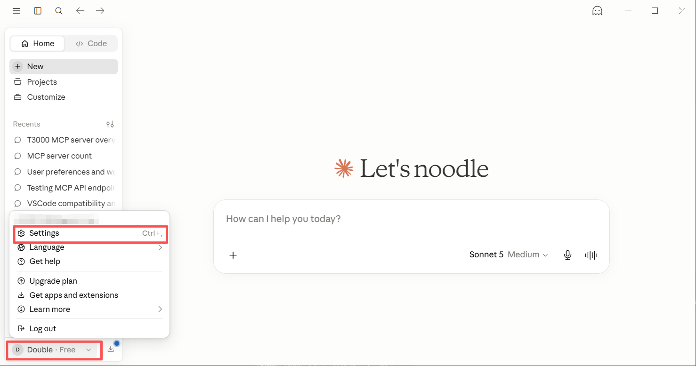
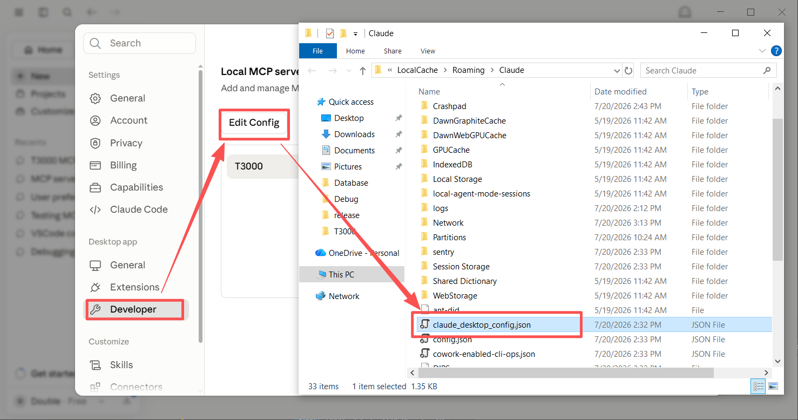
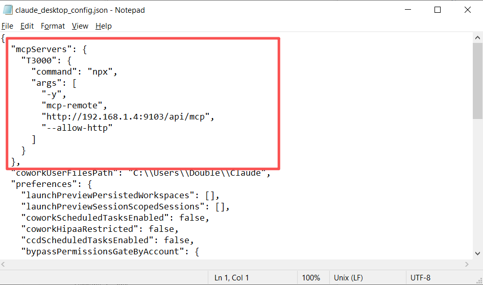
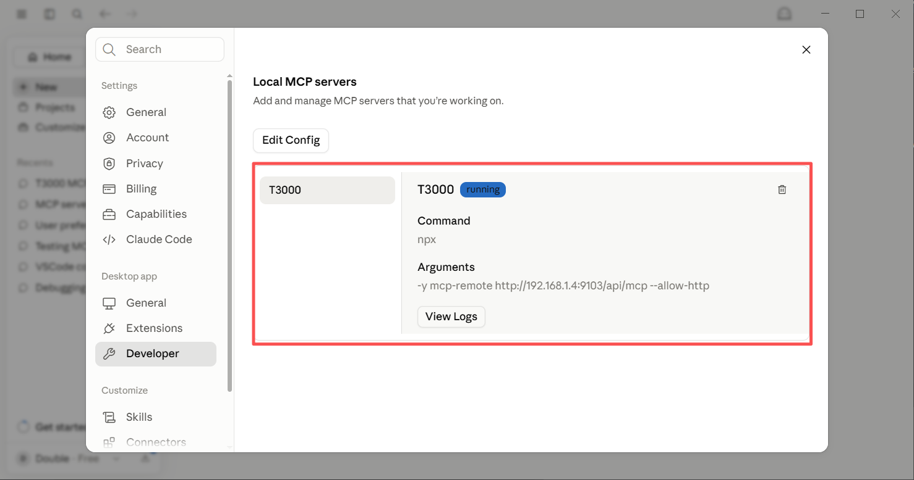
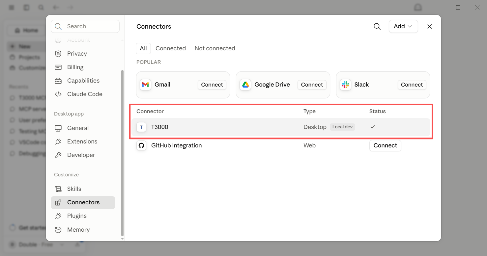
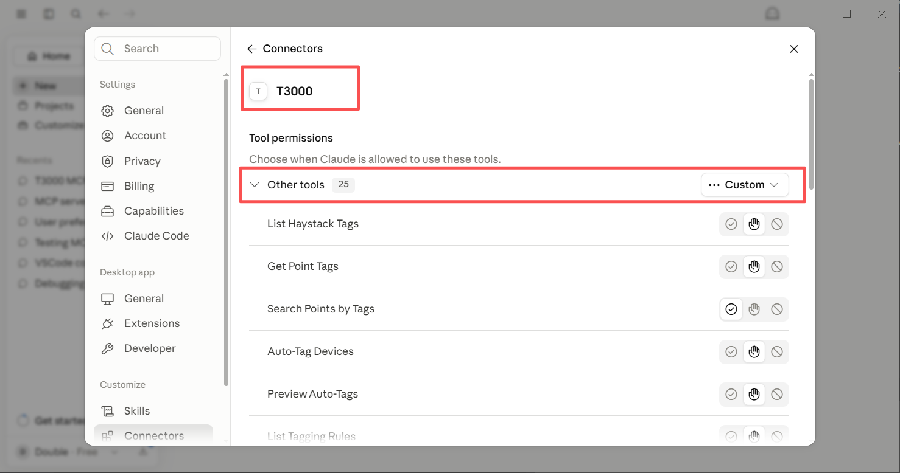

## Claude Desktop MCP Setup

> ⬅️ [Back to MCP Server tab](/#/t3000/auto-tagging#mcp)

Connect Claude Desktop to the T3000 MCP server to let Claude query devices, read/write points, manage Haystack tags, and run analytics.

Covers: **Claude Desktop**, **Cursor**, **Cline**, **Continue.dev** — all use the same `mcp-remote` approach.

---

## Prerequisites

- T3000 API running on port `9103`
- [Node.js](https://nodejs.org/) installed (provides `npx`)
- Claude Desktop installed

---

## Step 1: Open Claude Settings

Open Claude Desktop → **Settings** → **Developer** → **Edit Config**

| | |
|---|---|
|  |  |

---

## Step 2: Paste the Config

Replace `<host>` with `localhost` (local) or the machine's LAN IP (remote):

```json
{
  "mcpServers": {
    "T3000": {
      "command": "npx",
      "args": [
        "-y",
        "mcp-remote",
        "http://<host>:9103/api/mcp",
        "--allow-http"
      ]
    }
  }
}
```

Example for local:
```json
{
  "mcpServers": {
    "T3000": {
      "command": "npx",
      "args": [
        "-y",
        "mcp-remote",
        "http://localhost:9103/api/mcp",
        "--allow-http"
      ]
    }
  }
}
```

| | |
|---|---|
|  |  |

---

## Step 3: Restart Claude Desktop

Close and reopen Claude Desktop. On first run, `npx` will automatically download `mcp-remote`.

---

## Step 4: Verify Connection

Look for the 🔌 **plug icon** in Claude's interface — it confirms the MCP server is connected.

Ask Claude: *"List T3000 devices"* — it should call the `device_list` tool and return your devices.

---

## Other Clients

| Client | Config Location | Config Format |
|---|---|---|
| **Cursor** | `.cursor/mcp.json` | Same as Claude Desktop |
| **Cline** | MCP Servers view in VS Code | Same as Claude Desktop |
| **Continue.dev** | `config.json` | Same as Claude Desktop |

---

## Troubleshooting

| Issue | Fix |
|---|---|
| `npx` not found | Install Node.js from [nodejs.org](https://nodejs.org/) |
| Connection refused | Ensure T3000 API is running on port 9103 |
| Tools not appearing | Check Claude logs: `Help` → `View Logs` |
| 25 tools expected | Verify you see all categories: Haystack, Core, Data, Operational, Analytics, Rules, Alarms |

---

## Available Tools (25)

| Category | Tools |
|---|---|
| **Haystack** | `haystack_list_tags`, `haystack_get_point_tags`, `haystack_search_points`, `haystack_auto_tag`, `haystack_preview_tags`, `haystack_list_rules`, `haystack_get_brick_class` |
| **Core** | `ping`, `get_version`, `describe_tool` |
| **Data** | `device_list`, `device_get_points`, `point_get_metadata`, `metadata_search` |
| **Operational** | `point_read`, `point_write`, `point_read_batch`, `point_write_batch` |
| **Analytics** | `haystack_validate`, `haystack_export` |
| **Rules** | `rule_toggle`, `rule_create` |
| **Alarms** | `alarm_list`, `alarm_acknowledge`, `trendlog_query` |


| | |
|---|---|
|  |  |
