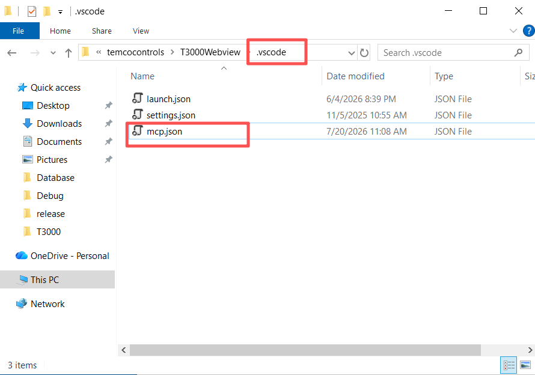
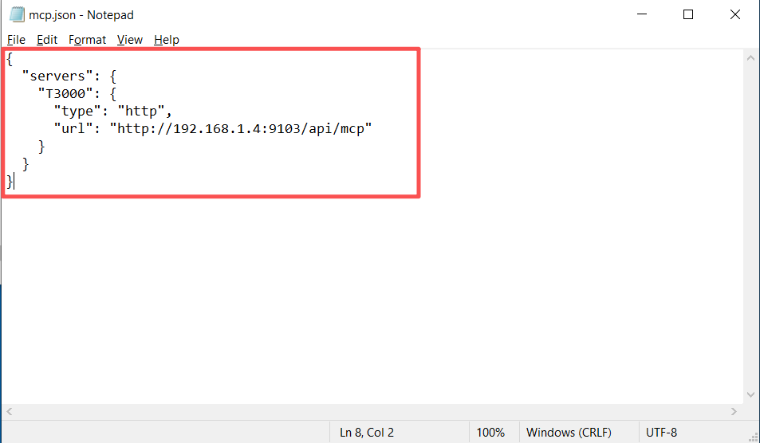
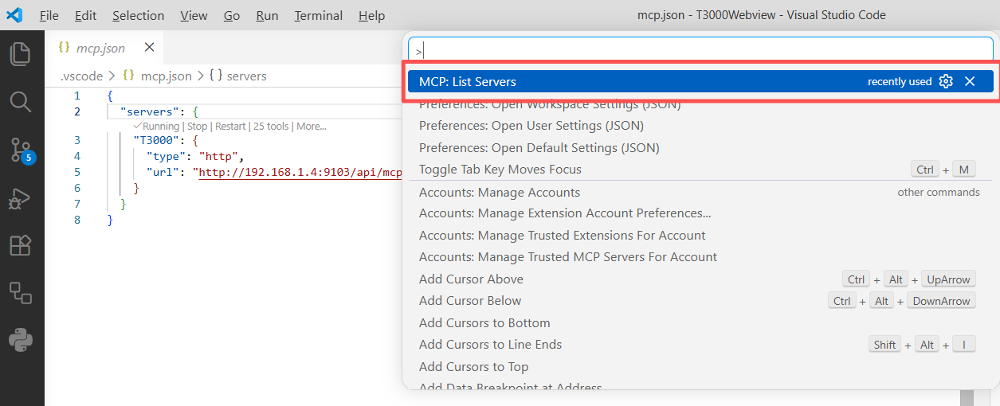
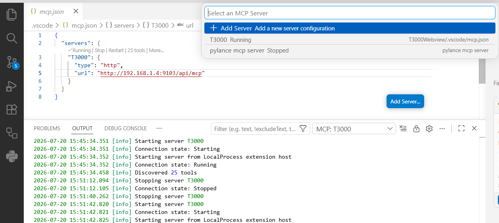

## VS Code Copilot MCP Setup

> ⬅️ [Back to MCP Server tab](/#/t3000/auto-tagging#mcp)

Connect VS Code Copilot to the T3000 MCP server to let Copilot query devices, read/write points, and manage Haystack tags.

---

## Prerequisites

- T3000 API running on port `9103`
- <a href="https://marketplace.visualstudio.com/items?itemName=GitHub.copilot" target="_blank">GitHub Copilot extension</a> installed in VS Code (includes built-in MCP support)

---

## Step 1: Create MCP Config

In your project root, create `.vscode/mcp.json`. For global access across all projects, place it at `C:\Users\<username>\AppData\Roaming\Code\User\mcp.json` (Windows) or `~/.config/Code/User/mcp.json` (macOS/Linux).

```json
{
  "servers": {
    "T3000": {
      "type": "http",
      "url": "http://<host>:9103/api/mcp"
    }
  }
}
```

Replace `<host>` with `localhost` (local) or the machine's LAN IP (remote).

> **Note:** VS Code uses `"servers"` (not `"mcpServers"` like Claude Desktop).

| | |
|---|---|
|  |  |


---

## Step 2: Reload VS Code

Press `Ctrl+Shift+P` → type **Reload Window** → press Enter.

---

## Step 3: Verify Connection

Press `Ctrl+Shift+P` → type **MCP: List Servers** → press Enter.

Confirm the `T3000` server shows as **connected**. If it shows an error or "disconnected", check that:
- The T3000 API is running on port 9103
- The URL in `mcp.json` is reachable (ping the host)

| | |
|---|---|
|  |  |

---

## Step 4: Try a Query

Open Copilot Chat and test any tool:

| Ask Copilot | Expected Tool |
|---|---|
| *"List the Haystack auto-tagging rules"* | `haystack_list_rules` |
| *"Show me the input points for device T3-NB-ESP"* | `device_get_points` |

See the full [MCP API examples](./mcp-api-examples.md) for all 25 tools with prompt text.

---

## Troubleshooting

| Issue | Fix |
|---|---|
| 25 tools not appearing | Reload VS Code window (`Ctrl+Shift+P` → Reload Window) |
| Connection refused | Ensure T3000 API is running on port 9103 |
| Config not picked up | Verify file is at `.vscode/mcp.json` (not `mcpServers`) |
| Tools list but calls fail | Check T3000 API logs for errors |

---

## Available Tools (25)

| Category | Tools |
|---|---|
| **Haystack** | `haystack_list_tags`, `haystack_get_point_tags`, `haystack_search_points`, `haystack_auto_tag`, `haystack_preview_tags`, `haystack_list_rules`, `haystack_get_brick_class` |
| **Core** | `ping`, `get_version`, `describe_tool` |
| **Data** | `device_list`, `device_get_points`, `point_get_metadata`, `metadata_search` |
| **Operational** | `point_read`, `point_write`, `point_read_batch`, `point_write_batch` |
| **Analytics** | `haystack_validate`, `haystack_export` |
| **Rules** | `rule_toggle`, `rule_create` |
| **Alarms** | `alarm_list`, `alarm_acknowledge`, `trendlog_query` |
