# SQL Server Express 2022 Setup for T3000 (Detailed Step-by-Step)

<!-- USER-GUIDE -->

Estimated time: 25 to 40 minutes.

> **Official documentation:**
> Microsoft SQL Server installation documentation:
> https://learn.microsoft.com/en-us/sql/database-engine/install-windows/install-sql-server
> This guide may be used as an alternative step-by-step reference for the T3000 setup workflow.

> **Database size limit (SQL Server Express):**
> SQL Server Express has a maximum relational database size of **10 GB per database**.
> This limit is defined by Microsoft in SQL Server 2022 Scale limits.
> If a single database requires more than 10 GB, use SQL Server Standard or higher.
> Source: https://learn.microsoft.com/en-us/sql/sql-server/editions-and-components-of-sql-server-2022#scale-limits

## What You Need Before Starting

1. Windows 10 or Windows 11 PC (64-bit) with administrator rights.
2. Internet access.
3. T3000 application installed.
4. At least 1.5 GB free disk space.

> **Tip: Separate install folder and data folder**
> Keep SQL Server program files in the default install location, and place database data files on another drive.
> During setup, open the **Data Directories** tab and set **Data Root Directory** to a path like **D:\SQLData**.
> This keeps the C: drive from filling up and leaves more room for Windows and applications.

## Step 1: Download SQL Server 2022 Express

1. Open your web browser.
2. Go to this URL:
   ```
   https://www.microsoft.com/en-us/download/details.aspx?id=104781&msockid=01e188d1ef006e6936d29f94ee4a6f7a
   ```
3. Scroll down to **Express** section.
4. Click **Download now** under SQL Server 2022 Express.
5. Save file to your Desktop.

Expected file name:
- `SQL2022-SSEI-Expr.exe` (small web installer, ~5 MB, downloads installation files during setup)


## Step 2: Run SQL Server Express Installer

1. Right-click the downloaded file.
2. Click **Run as administrator**.
3. Click **Yes** on User Account Control prompt.

> If Windows shows a security warning ("publisher can't be verified"), click **Run** to continue.
> This is expected for the Microsoft installer.

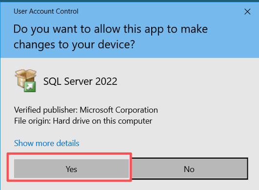

## Step 3: Prepare SQL Server Installer Media (Pre-Install)

1. In the SQL Server Express launcher, select **Download Media**.
2. On the download options screen, keep **Express Core** selected.
3. Select a download folder (for example: `C:\Users\<your-user>\Downloads`).
4. Click **Download** and wait for the media download to finish.
5. When download is complete, click **Open folder**.

Expected result:
- The full installer file is available in the selected folder.
- Continue by running that installer in the next step.


## Step 4: Start the Full SQL Server Installation

1. In the folder opened from Step 3, find and run **SQLEXPR_x64_ENU.exe**.
2. If User Account Control appears, click **Yes**.
3. In **SQL Server Installation Center**, click:
   - **New SQL Server standalone installation or add features to an existing installation**
4. On **Product Updates**, click **Next**.
5. On **Install Rules**, review the results and click **Next**.

Notes:
- A Windows Firewall warning on Install Rules can appear and does not block installation.
- Network and firewall settings will be configured in later steps.

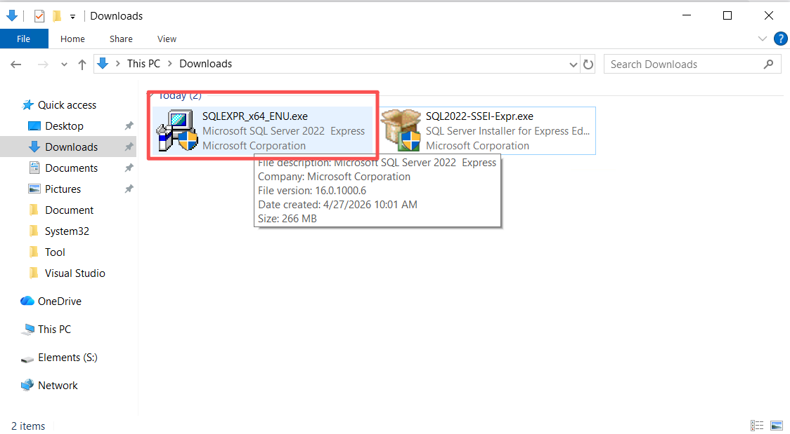

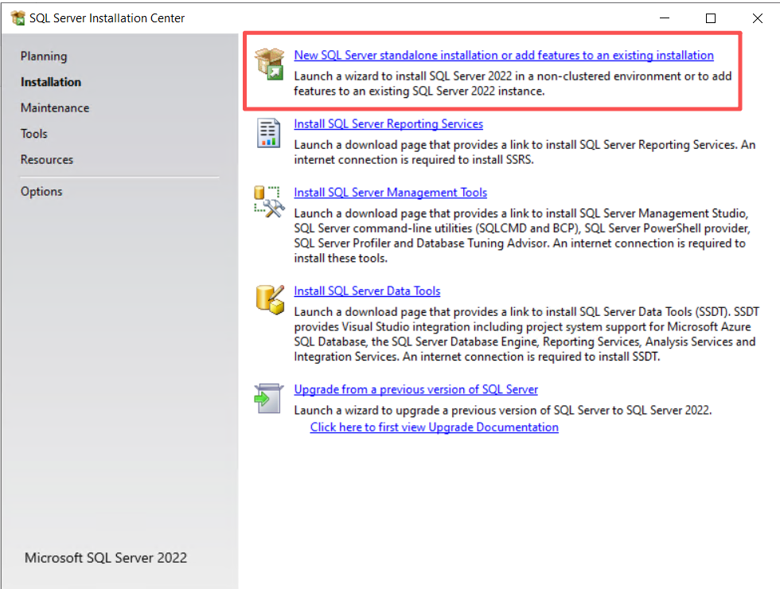
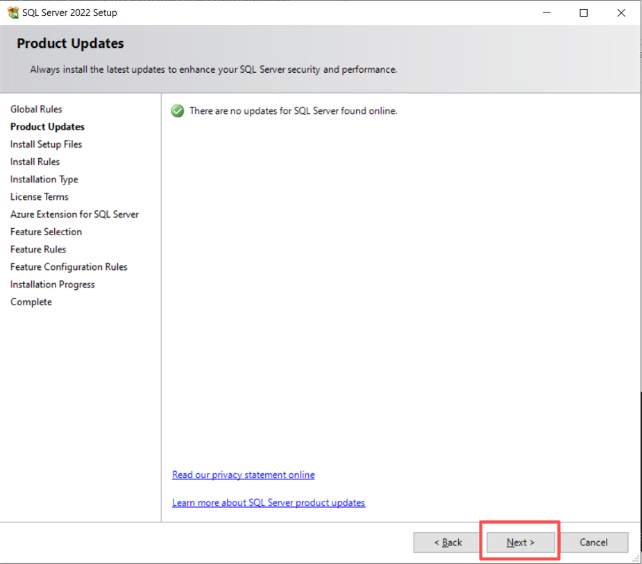
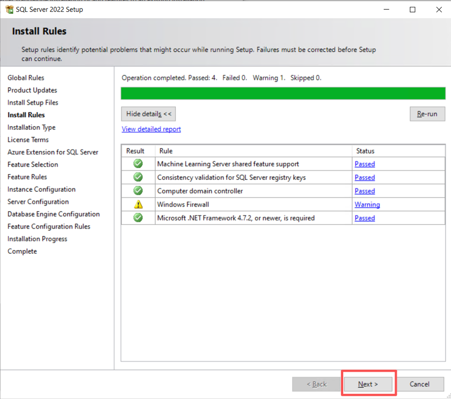

## Step 5: Select Installation Type and Accept Terms

1. On **Installation Type**, select **Perform a new installation of SQL Server 2022**.
2. Click **Next**.
3. On **License Terms**, check **I accept the license terms and Privacy Statement**.
4. Click **Next**.
5. On **Azure Extension for SQL Server**, leave **Use Microsoft Update to check for updates** unchecked.
6. Click **Next**.

Notes:
- If an existing SQL instance is listed, keep **Perform a new installation** selected for SQL Express.
- The Azure Extension option is not required for this setup.

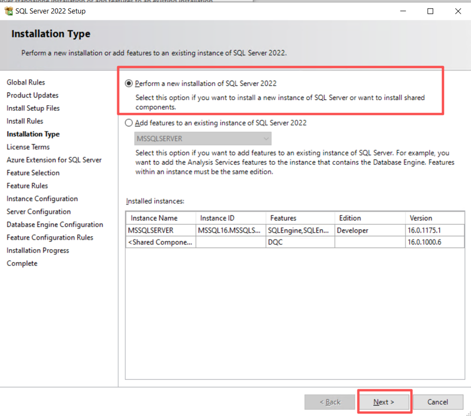
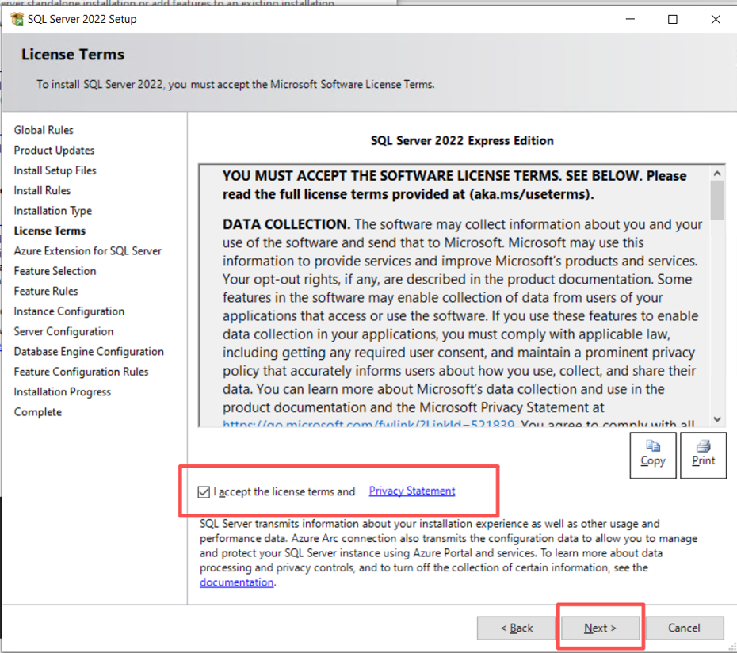


## Step 6: Select Features, Instance, and Server Configuration

1. On **Feature Selection**, keep the default selections shown in the installer.
2. Click **Next**.
3. On **Instance Configuration**, set:
   - **Named instance**: `SQLExpress`
   - **Instance ID**: `SQLEXPRESS`
4. Click **Next**.
5. On **Server Configuration**, review the service settings and click **Next**.

Notes:
- Use the same instance naming shown in the screenshots to match later connection steps.
- SQL Server Browser may appear as **Disabled** at this stage and can be configured later.


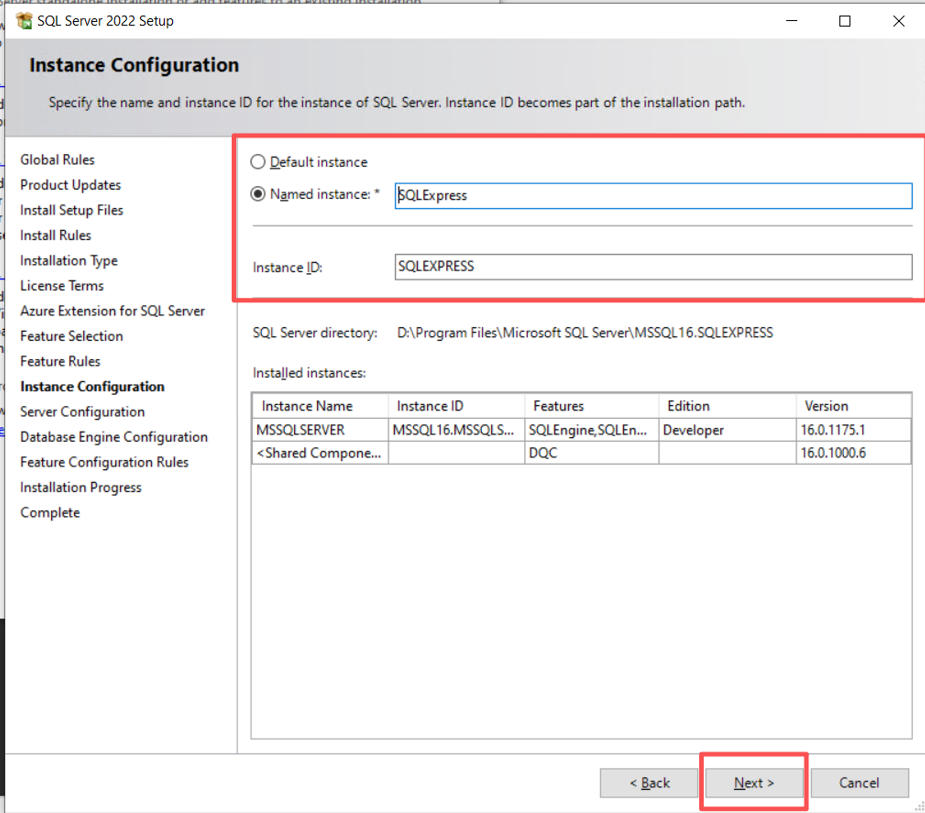
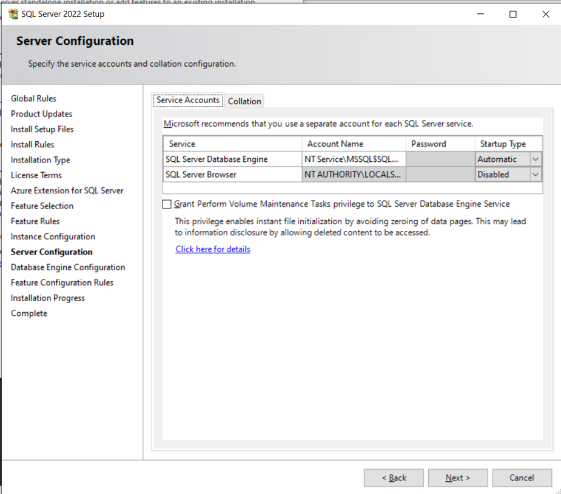

## Step 7: Configure Database Engine and Data Directories

This step has two important tabs: **Server Configuration** and **Data Directories**.

1. In **Database Engine Configuration** on the **Server Configuration** tab:
   - Select **Mixed Mode (SQL Server authentication and Windows authentication)**.
   - Enter and confirm a strong password for the `sa` account.
   - Click **Add Current User** to add your Windows account as SQL administrator.
2. Verify that your Windows account appears in **Specify SQL Server administrators**.
3. Click the **Data Directories** tab.
4. Review the default paths for data, logs, backup, and temp files.
5. If the C: drive is limited, set **Data root directory** to another drive (for example `D:\SQLData`).
6. Keep paths consistent under the selected root so future maintenance is easier.
7. After confirming both tabs, click **Next**.

Recommended practice:
- Keep SQL Server program files and database data files on separate drives when possible.
- This reduces C: drive growth and improves long-term system stability.


## Step 8: Run Installation and Confirm Completion

1. On the **Installation Progress** page, wait until setup finishes.
2. Do not close the installer while the progress bar is active.
3. When the **Complete** page appears, verify each selected feature shows **Succeeded**.
4. Confirm the details area shows **Install successful**.
5. Click **Close**.

Verification checklist:
- **Database Engine Services** status is **Succeeded**.
- **SQL Server Replication** status is **Succeeded** (if selected in Feature Selection).
- Setup summary shows installation completed successfully.
- In **Windows Services**, **SQL Server (SQLEXPRESS)** shows **Running**.

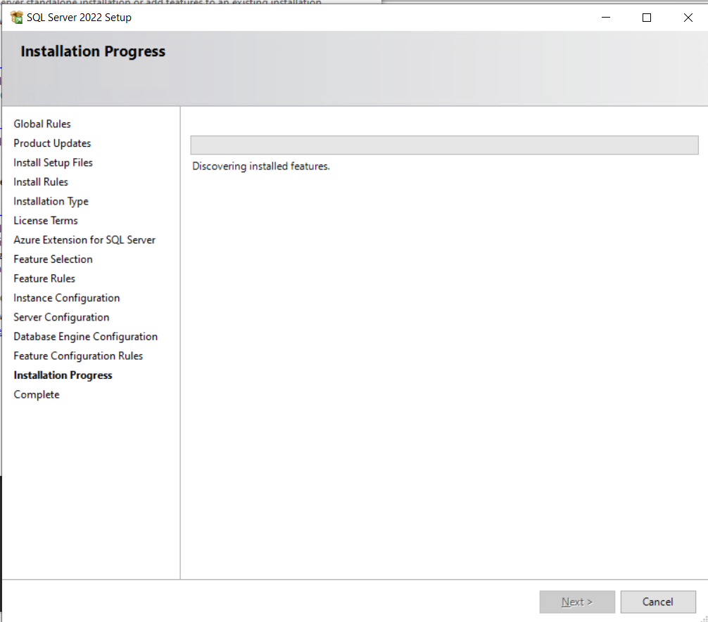
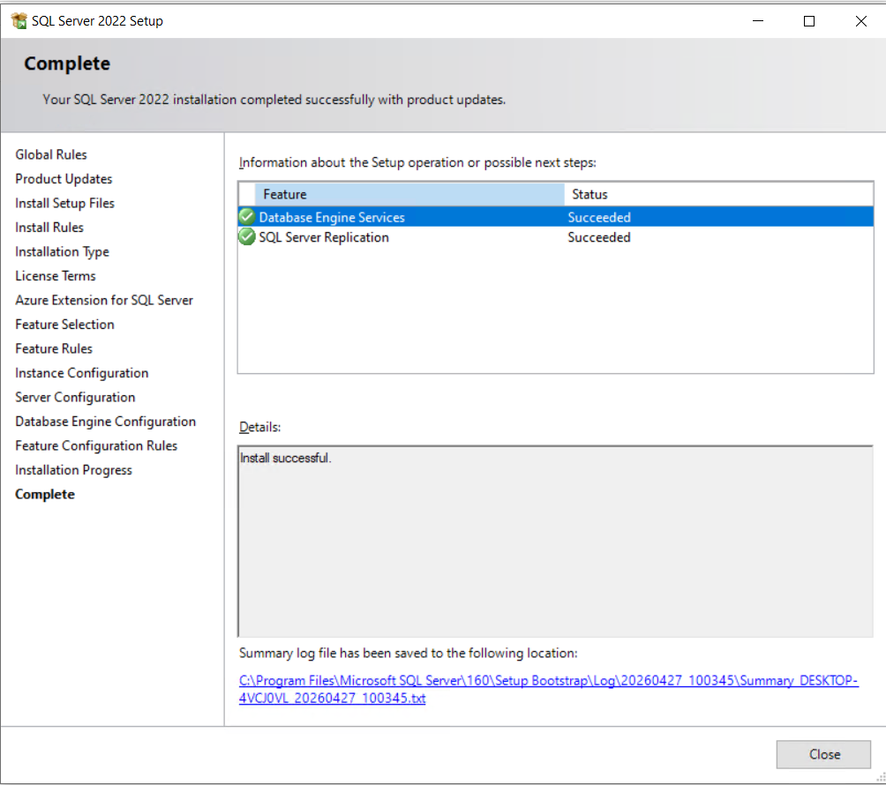


## Step 9 (Optional): Open SQL Server Management Tools Download Page

Use this step only if you want a graphical management tool (SSMS) for manual database tasks.

1. In **SQL Server Installation Center**, stay on the **Installation** tab.
2. Click **Install SQL Server Management Tools**.
3. Your browser opens the Microsoft download page for SSMS.
4. Continue with SSMS installation only if your workflow requires manual administration.

Notes:
- This step is optional for core SQL Server Engine installation.
- It is recommended for troubleshooting, query testing, and manual database setup.

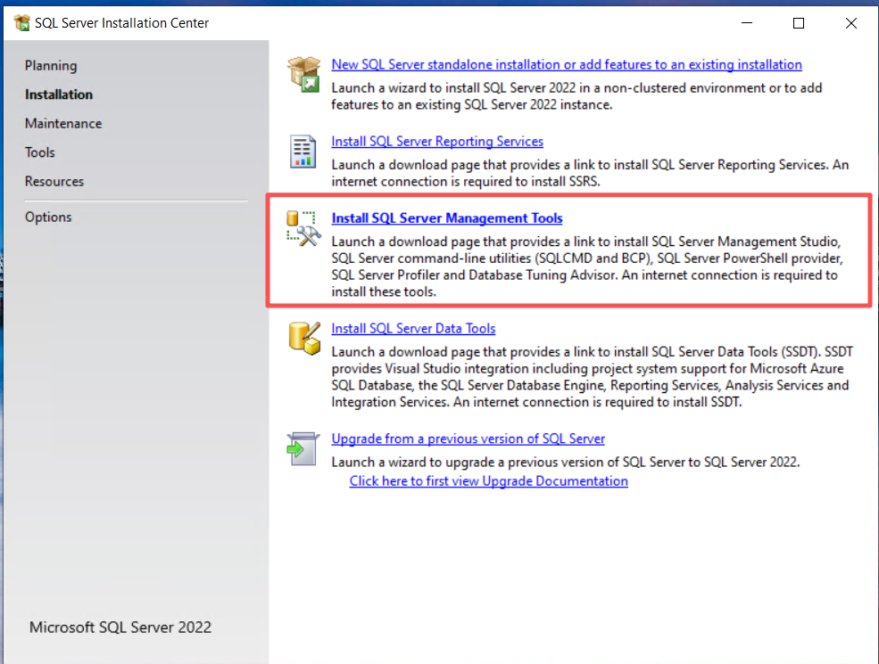

## Step 10: Configure TCP/IP in SQL Server Configuration Manager

Official Microsoft documentation (reference first):
- https://learn.microsoft.com/en-us/sql/database-engine/configure-windows/enable-or-disable-a-server-network-protocol

1. Open **SQL Server 2022 Configuration Manager** from the Windows Start menu.
2. Expand **SQL Server Network Configuration**.
3. Click **Protocols for SQLEXPRESS**.
4. In the right panel, open **TCP/IP** properties and set **Enabled = Yes**.
5. Click **OK** to save.
6. If your environment also requires Named Pipes, open **Named Pipes** properties and set **Enabled = Yes**.
7. Open **Services**, right-click **SQL Server (SQLEXPRESS)**, and click **Restart**.
8. Wait until service status returns to **Running**.

Verification checklist:
- **TCP/IP** shows **Enabled** under Protocols for SQLEXPRESS.
- **SQL Server (SQLEXPRESS)** is **Running** after restart.


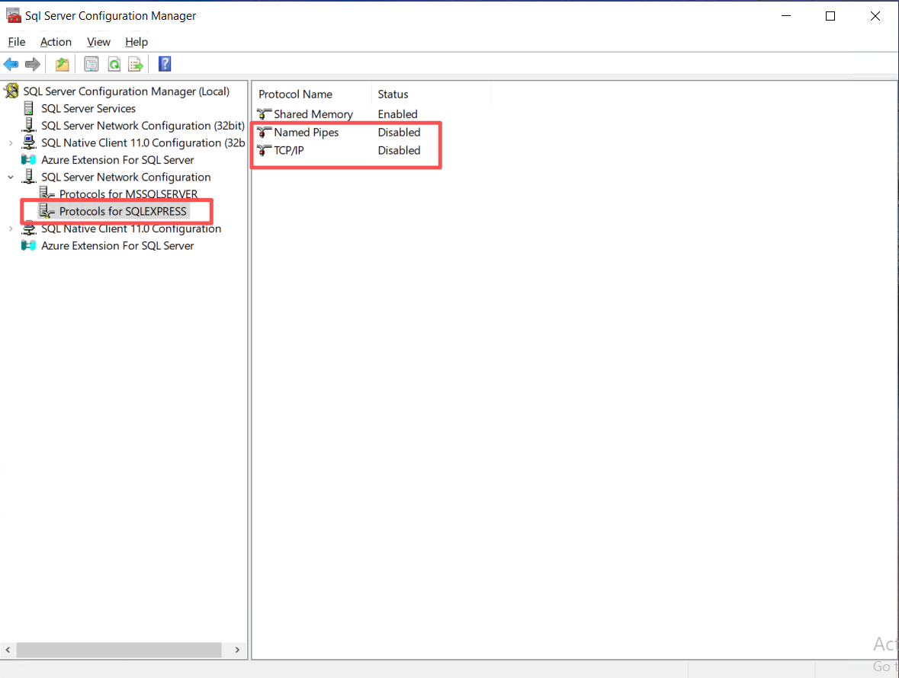
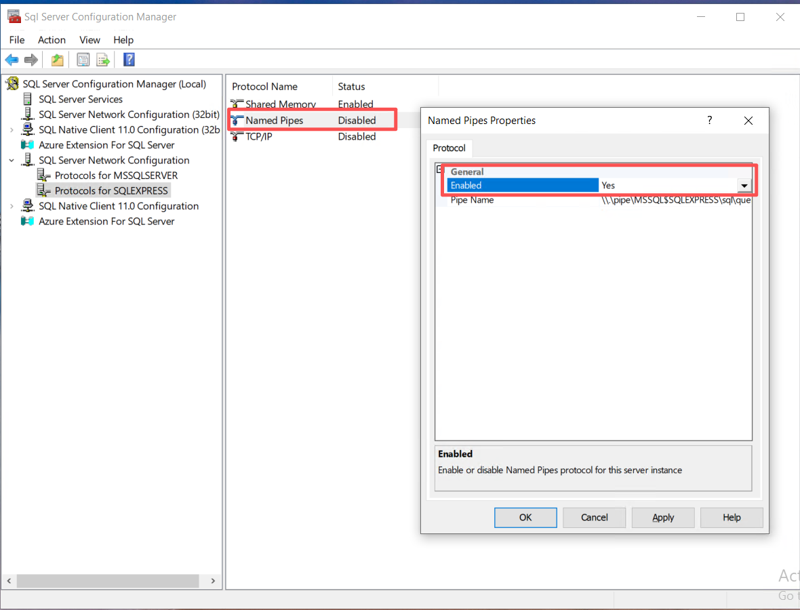


## Step 11: Enable Remote Access for TCP 1433 (Windows Firewall)

Official Microsoft documentation (reference first):
- https://learn.microsoft.com/en-us/sql/sql-server/install/configure-the-windows-firewall-to-allow-sql-server-access

Use this step when clients connect from another PC to this SQL Server instance.

1. Open **Windows Defender Firewall with Advanced Security**.
2. In the left panel, click **Inbound Rules**.
3. In the right panel, click **New Rule...**.
4. In Rule Type, select **Port** and click **Next**.
5. Select **TCP**, choose **Specific local ports**, enter `1433`, then click **Next**.
6. Select **Allow the connection** and click **Next**.
7. Select the network profiles required by your environment (Domain/Private/Public), then click **Next**.
8. Enter a rule name (for example: `SQL SERVER:1433`) and click **Finish**.

Verification checklist:
- New inbound rule for TCP 1433 appears in Firewall Inbound Rules.
- Remote clients can reach the SQL host on port 1433.


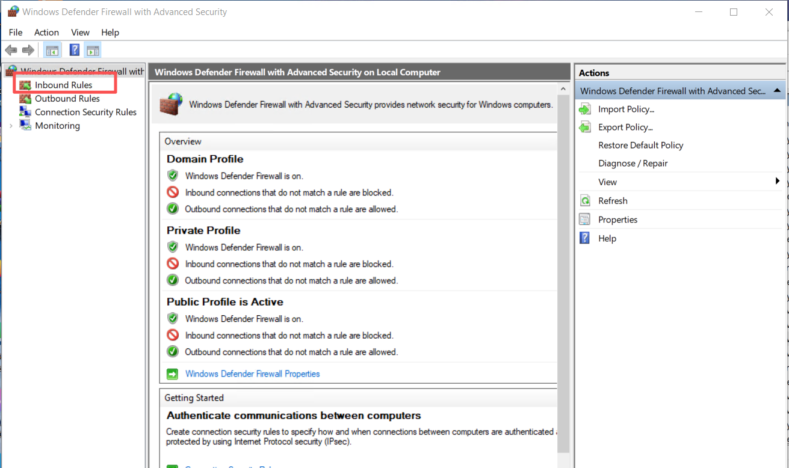
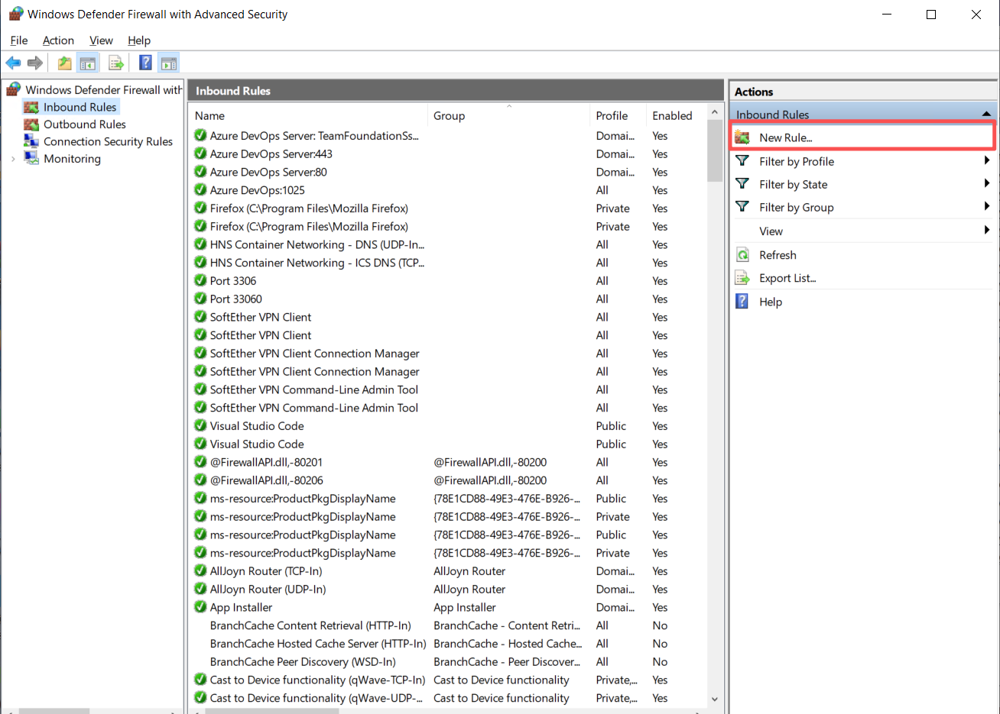
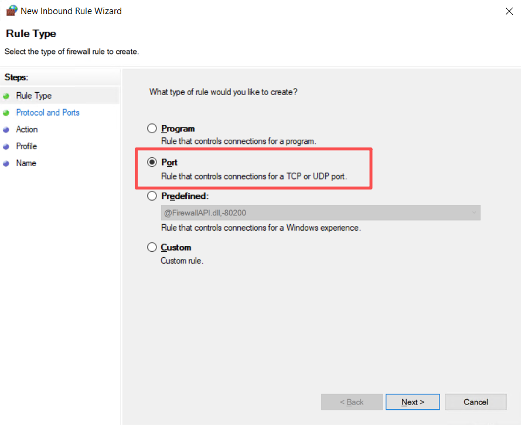
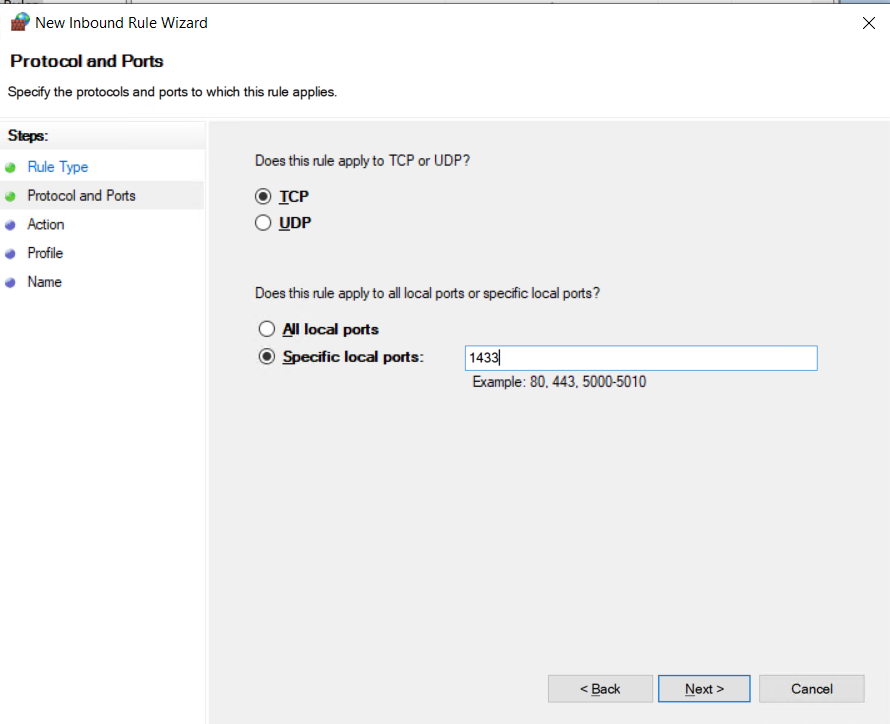


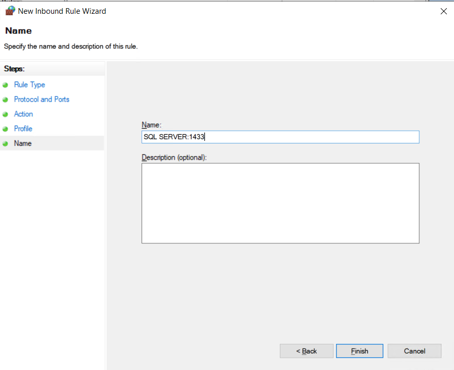

## Step 12: Restart SQL Server Again

Mixed mode authentication requires a restart to activate.

1. Go back to **SQL Server Configuration Manager**.
2. Click **SQL Server Services**.
3. Right-click **SQL Server (SQLEXPRESS)** �?**Restart**.
4. Wait for **Running** status.

> **Alternative:** You can also restart from SSMS �?right-click server �?**Restart**.


## Step 13: Create the T3000 Database

1. In SSMS **Object Explorer**, right-click **Databases**.
2. Click **New Database...**.
3. In the **Database name** field, type exactly: `T3000`
   - Case does not matter, but avoid spaces or special characters.
4. Leave all other settings as default.
5. Click **OK**.
6. You should now see **T3000** appear under **Databases** in the left panel.


## Step 14: Create a SQL Login for T3000

1. In SSMS **Object Explorer**, expand **Security**.
2. Right-click **Logins** �?click **New Login...**.
3. In the **Login name** field, type: `t3000_user`
4. Select **SQL Server authentication**.
5. Enter a password (remember this �?you will need it in T3000).
6. Uncheck **Enforce password expiration** (recommended for service accounts).
7. Uncheck **User must change password at next login**.


## Step 15: Map Login to T3000 Database

Still in the **New Login** window:

1. Click **User Mapping** in the left list.
2. In the top table, check the checkbox next to **T3000**.
3. In the **Database role membership** table below, check **db_owner**.
4. Click **OK**.

> `db_owner` gives full permission to create tables and write data.
> T3000 uses this access to initialize the schema on first run.


## Step 16: Enable the `sa` Account (Optional but Recommended)

The `sa` (System Administrator) account is a built-in SQL login.
Enabling it gives a reliable backup login if `t3000_user` has issues.

1. In SSMS, expand **Security** �?**Logins**.
2. Right-click **sa** �?click **Properties**.
3. In **General**, set a strong password.
4. Click **Status** in the left list.
5. Set **Login** to **Enabled**.
6. Click **OK**.

> This step is optional. Only enable `sa` if you want a fallback admin account.

## Step 17: Add Firewall Rule (Required if SQL Server is on a Different PC)

Skip this step if T3000 and SQL Server are on the **same PC**.

If SQL Server is on a **different PC** on your network:

1. Press **Windows key**, search **Windows Defender Firewall with Advanced Security**.
2. Click **Inbound Rules** in the left panel.
3. Click **New Rule...** on the right.
4. Select **Port** �?click **Next**.
5. Select **TCP**, enter port `1433` �?click **Next**.
6. Select **Allow the connection** �?click **Next**.
7. Check **Domain** and **Private** �?click **Next**.
8. Name: `SQL Server 1433 T3000` �?click **Finish**.

Repeat for UDP port 1434 (SQL Browser):
1. Same steps but select **UDP**, port `1434`.
2. Name: `SQL Browser 1434 T3000`.


## Step 17: Open T3000 Database Configuration Page

1. Open T3000 application.
2. Click the **Settings** or gear icon.
3. Go to **Database Configuration** page.
4. Under **Shared Database (Center DB)**, select backend type: **Microsoft SQL Server**.


## Step 18: Fill in SQL Server Connection Fields

Enter these values exactly:

| Field | Value | Example |
|---|---|---|
| Host / Server | IP address or hostname of the SQL Server PC | `192.168.1.22` or `localhost` |
| Port | `1433` | `1433` |
| Instance Name | `SQLEXPRESS` | `SQLEXPRESS` |
| Database Name | `T3000` | `T3000` |
| Username | `t3000_user` | `t3000_user` |
| Password | The password you set in Step 14 | |

> **Same PC?** Use `127.0.0.1` or `localhost` as the host.
>
> **Different PC on network?** Use the IP address of the PC where SQL Server is installed.
> You can find the IP by running `ipconfig` on that PC and looking for **IPv4 Address**.


## Step 19: Click Test Connection

1. Click the **Test Connection** button.
2. Wait a few seconds.
3. A green success message should appear with the connection latency (e.g. `Connected (12ms)`).

If you see an error, go to the **Troubleshooting** section at the bottom of this guide.


## Step 20: Click Save Configuration

1. Click **Save Configuration**.
2. Wait for the success message.
3. T3000 will now remember these settings.


## Step 21: Initialize Schema

This step creates all required T3000 tables inside the `T3000` database.
Only needs to be done once on first setup.

1. Click the **Init Schema** button.
2. Wait for the process to complete (usually 10�?0 seconds).
3. Confirm success message appears.

> If `Init Schema` button is greyed out, ensure Test Connection succeeded first.


## Step 22: Set Shared DB Role

1. In T3000 Database Configuration, find the **Role** setting.
2. Set this PC's role:
   - **Server** �?this PC owns the database and syncs all devices to it.
   - **Client** �?this PC reads/writes through the Server PC's database.
3. Set **Enabled** to **On**.
4. Save again.

> In most single-server deployments, set role to **Server**.
> Only set **Client** on secondary PCs that connect to the primary Server PC.

## Step 23: Restart T3000

1. Close T3000 application (or stop the T3000 Windows service if running as a service).
2. Reopen / restart T3000.
3. T3000 will connect to SQL Server on startup using the saved configuration.


## Step 24: Verify in Dashboard

1. Open the T3000 **Dashboard**.
2. In the **Sync & Database Health** widget:
   - Status badge should show **Connected** (green).
   - Role should show **Server** (or **Client**).
   - **Last Sync** should update within 2 minutes.
   - **Records Today** should start counting.
3. In **System Overview**:
   - **CENTER DB** card should show **Connected**.
   - **DB SIZE** will show the SQL Server database size.


---

## Troubleshooting

### Error: Connection timeout / Unable to connect

Check in order:
1. SQL Server service is running �?open **Services** (`Win` �?`services.msc`), look for `SQL Server (SQLEXPRESS)`, status must be **Running**.
2. TCP/IP is enabled �?see Step 6.
3. Static port 1433 is configured �?see Step 7.
4. SQL Server was restarted after TCP/IP change �?see Step 9.
5. Firewall allows TCP 1433 �?see Step 17 (required even for same-PC using IP, not `localhost`).
6. Host/IP in T3000 is correct �?try `127.0.0.1` for same PC.

### Error: Login failed for user 't3000_user'

Check:
1. Mixed mode authentication is enabled �?see Step 11.
2. SQL Server was restarted after enabling mixed mode �?see Step 12.
3. Username is exactly `t3000_user` (no extra spaces).
4. Password is correct.
5. User is mapped to T3000 database �?see Step 15.

### Error: Cannot open database 'T3000'

Check:
1. Database name in T3000 config is exactly `T3000` (capital T, no spaces).
2. T3000 database was created in SSMS �?see Step 13.
3. The login `t3000_user` has `db_owner` rights on the T3000 database �?see Step 15.

### Error: SQL Server Down (red badge in T3000 Dashboard)

Check:
1. SQL Server service is running.
2. Port 1433 is reachable from this PC:
   Open PowerShell and run:
   ```powershell
   Test-NetConnection 192.168.1.22 -Port 1433
   ```
   `TcpTestSucceeded: True` means port is reachable.
3. Firewall is not blocking.

### Error: Named Pipes / Wrong Instance

If you see errors about Named Pipes or wrong instance:
1. Confirm instance name is `SQLEXPRESS` (all caps, no spaces).
2. In T3000 config, Instance Name field must say `SQLEXPRESS`.
3. SQL Browser service must be running �?see Step 8.

---

<!-- TECHNICAL -->

## Technical Checklist (Quick Reference)

| Item | Required |
|---|---|
| SQL Server (SQLEXPRESS) service Running | �?|
| SQL Browser service Running + Automatic | �?|
| TCP/IP protocol Enabled | �?|
| Static port 1433, dynamic port empty | �?|
| Mixed mode (SQL + Windows) authentication | �?|
| SQL Server restarted after mode change | �?|
| T3000 database created | �?|
| SQL login `t3000_user` created | �?|
| `t3000_user` mapped to T3000 with db_owner | �?|
| Firewall TCP 1433 open (remote scenario) | �?|
| Firewall UDP 1434 open (remote scenario) | �?|
| T3000 Test Connection succeeds | �?|
| Save + Init Schema completed | �?|
| T3000 restarted | �?|
| Dashboard shows Connected | �?|
