# Try the new T3000 UI (beta) — Inputs, Trend Logs, Haystack, AI Assistant and the new Designer

Hi everyone,

T3000 now has a new interface, and it opens in your browser. It is the same T3000 — same toolbar, same devices,
same data — so everything you already work with is there: Inputs, Outputs, Variables and Trend Logs.

New capabilities that come with it:

- **Haystack tags** — tag devices and points, and let auto-tagging suggest the rest
- **MCP tools and the AI Assistant** — ask questions about your system in plain language
- **The new Designer** — HVAC schematics and LVGL / EEZ Studio, drawn in the browser, deployed to the device
- **Shared Center DB** — trend logs and device data in one central Microsoft SQL Server database shared by
  several T3000 PCs

This is a **beta**: it is ready for you to look at and try, and we want your feedback before the official
release. Please do **not** use it as your only tool for live buildings yet — try it on a spare PC or a test
panel first. Installing it does not change your existing T3000 installation.

### At a glance

- **One click to open it:** the **Chrome button** at the right end of the T3000 toolbar.
- **One click back:** the **Windows icon** in the new interface returns you to the T3000 window.
- **Nothing to install:** copy the beta folder from the network drive and run `T3000.exe` from there.
- **Your current T3000 and its data stay as they are** — the beta is a separate copy.

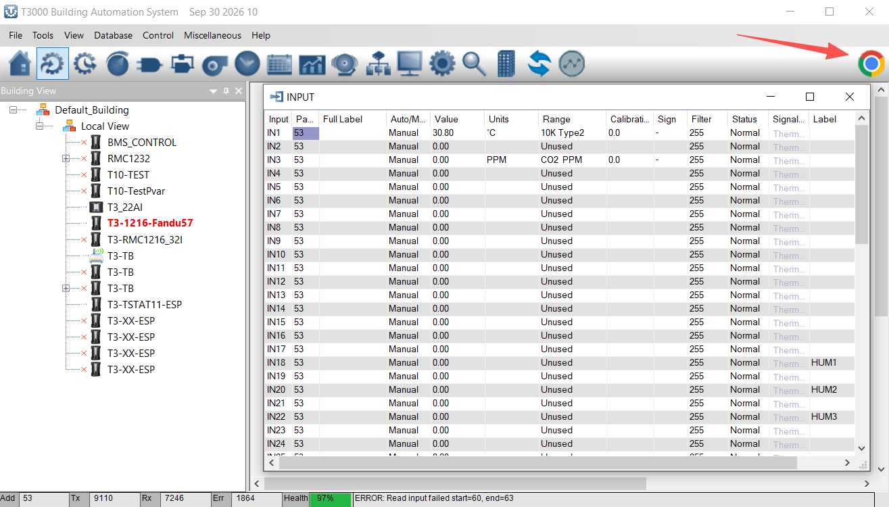

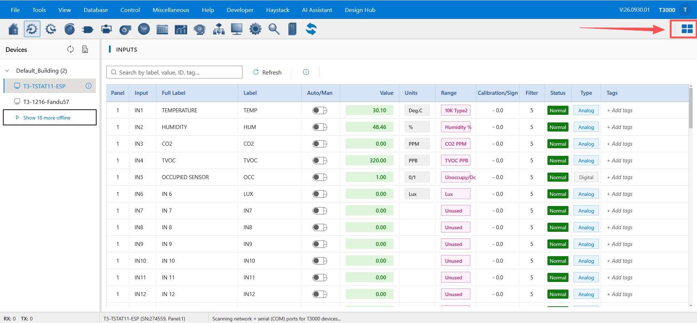

### Your first five minutes

1. Open the beta and click the **Chrome button** in the toolbar.
2. Check that **Inputs** lists one of your devices with the right name and points.
3. Edit one value and commit it — on a test panel if you can.
4. Click the **Windows icon** to return to the T3000 window.

That is the whole round trip. Everything after this section is detail you can read as you need it.

## 1. How to open the new interface

Two ways to open it:

1. **From the address bar** — with the beta running, open `http://localhost:9103/#/t3000/` in any browser.
   From another PC on the same network, use this PC's address instead of `localhost`, for example
   `http://192.168.1.50:9103/#/t3000/` (`ipconfig` shows the address; the port stays `9103`).
2. **From the toolbar** — click the **Chrome button** at the right end of the T3000 toolbar.
   T3000 minimises itself and the new interface opens in your browser (Chrome, Edge or Firefox — whichever you
   have installed). The browser opens on a profile that belongs to T3000, so it does not mix with your normal
   browsing tabs or bookmarks.
   - Clicking the button again does **not** open another window: it brings the same window back, maximised.

**To go back to T3000**, click the **Windows icon** in the new interface's header. It restores and focuses
the T3000 window and closes the browser window that T3000 opened.

**What you need**

- Windows 10 or 11, and Chrome, Edge or Firefox installed.
- Nothing from the internet: the beta serves everything from your own PC (port `9103`).
- Your T3000 installation keeps running as it does today — the beta is a separate copy.

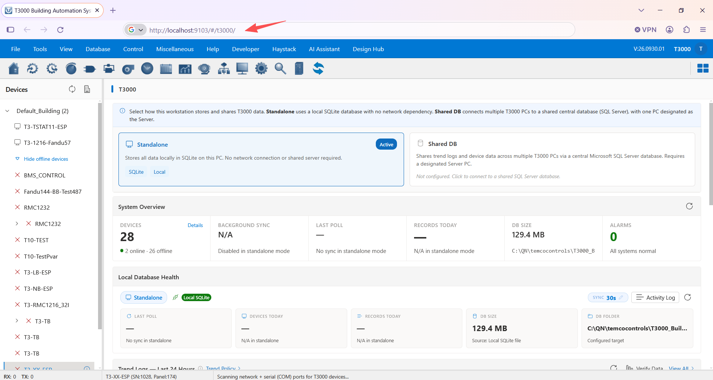

## 2. Where to get the beta

The beta is on the network drive:

```
[\\your-server\share\T3000-Beta-V26.0930.01\   ← fill in the real path]
```

1. Copy the **whole folder** to a local disk (e.g. `C:\T3000-Beta\`). Running it from the network drive works,
   but it is slower and can be locked by other users.
2. Run `T3000.exe` **from that new folder**. Do not copy it over your production installation.
3. Click the **Chrome button** in the toolbar (or open `http://localhost:9103/#/t3000/`).
4. The version is shown in the new interface's top bar (e.g. `V:26.0930.01`); T3000 itself shows it in
   Help ▸ About. Please quote it in your feedback.


## 3. What to try — by category

Each section has a short summary, where to find it, and the detailed document.

| Category | In the new interface | Detailed document |
|---|---|---|
| Inputs, Outputs, Variables | **Inputs · Outputs · Variables** | <a href="https://github.com/temcocontrols/T3000Webview/tree/feature/lvgl-svg-renderer/docs/t3000/data-points/" target="_blank" rel="noopener">Data points</a> |
| Trend Logs (new) | **Trend Logs · Trend Policy · Trends ▸ Chart** | <a href="https://github.com/temcocontrols/T3000Webview/blob/feature/lvgl-svg-renderer/docs/t3000/features/trendlogs.md" target="_blank" rel="noopener">Trend Logs</a> |
| Haystack tags | **Haystack Tags · Auto-Tagging** | <a href="https://github.com/temcocontrols/T3000Webview/tree/feature/lvgl-svg-renderer/docs/t3000/haystack/" target="_blank" rel="noopener">Haystack &amp; MCP</a> |
| MCP tools + AI Assistant | **AI Assistant ▸ MCP** | <a href="https://github.com/temcocontrols/T3000Webview/blob/feature/lvgl-svg-renderer/docs/t3000/haystack/mcp-vscode-copilot.md" target="_blank" rel="noopener">MCP — VS Code Copilot</a> |
| New Designer — HVAC | **Design Hub ▸ HVAC** | <a href="https://github.com/temcocontrols/T3000Webview/tree/feature/lvgl-svg-renderer/docs/t3000/design-hub/" target="_blank" rel="noopener">Design Hub</a> |
| New Designer — LVGL / EEZ Studio | **Design Hub ▸ LVGL 9.5 · LVGL with Flow 9.5** | <a href="https://github.com/temcocontrols/T3000Webview/tree/feature/lvgl-svg-renderer/docs/t3000/t3-eez-studio/" target="_blank" rel="noopener">EEZ Studio</a> |
| Shared Center DB | **Database ▸ Database Configuration** | <a href="https://github.com/temcocontrols/T3000Webview/blob/feature/lvgl-svg-renderer/docs/t3000/shared-db/shared-center-db-summary.md" target="_blank" rel="noopener">Shared Center DB</a> |

### 3.1 Inputs, Outputs, Variables

The everyday point lists, as fast sortable tables with search. Sort by a column, search for a
point, edit a value and commit it — the same works for outputs and variables.

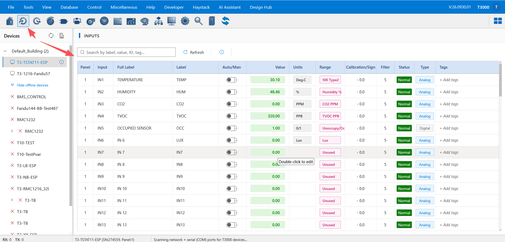
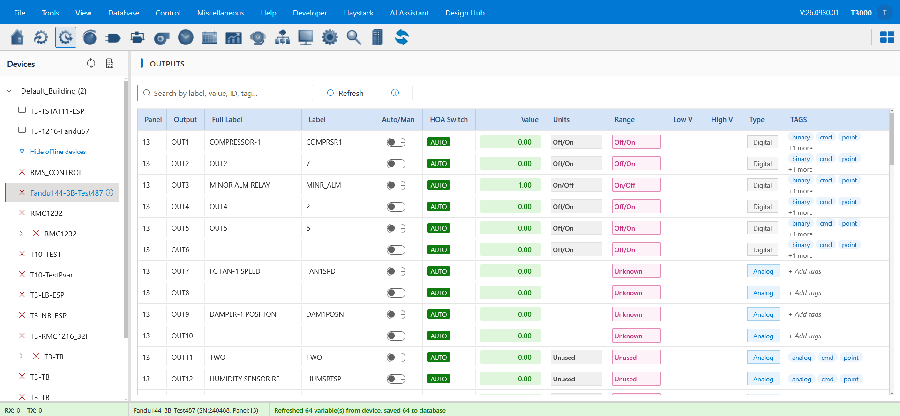
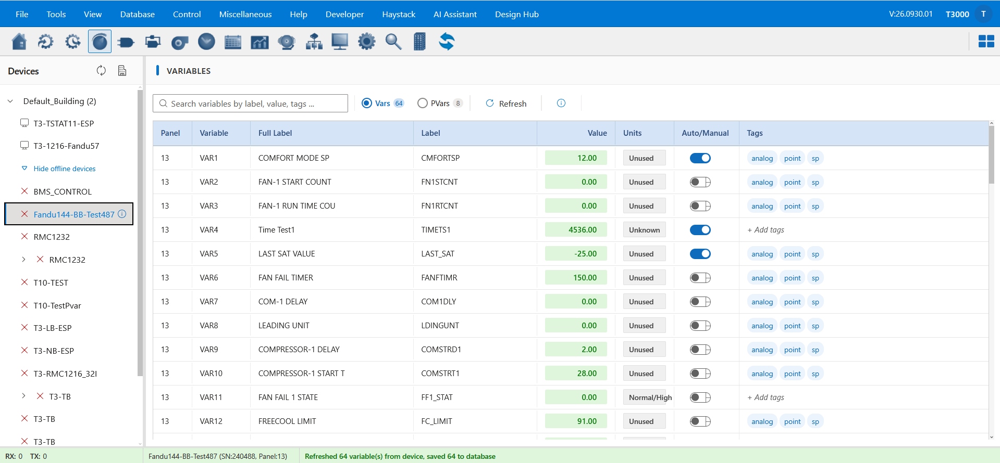
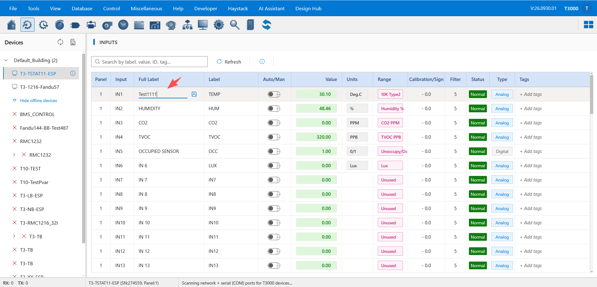
Docs: <a href="https://github.com/temcocontrols/T3000Webview/blob/feature/lvgl-svg-renderer/docs/t3000/data-points/inputs.md" target="_blank" rel="noopener">Inputs</a>. In the beta: **Documentation ▸ Data Points**.

### 3.2 Trend Logs (new)

The new trend logging: a trend centre, trend policies (what gets logged and how often) and the new chart. Start a
trend on an input, set the interval and samples, watch it collect, then open it in the chart and change the range.

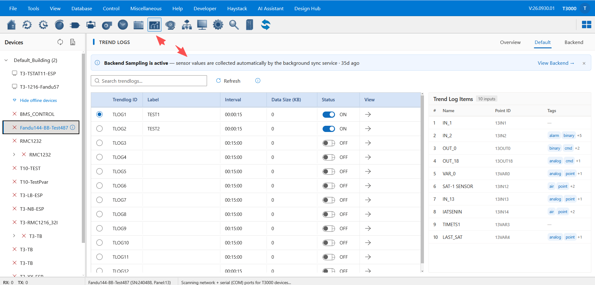
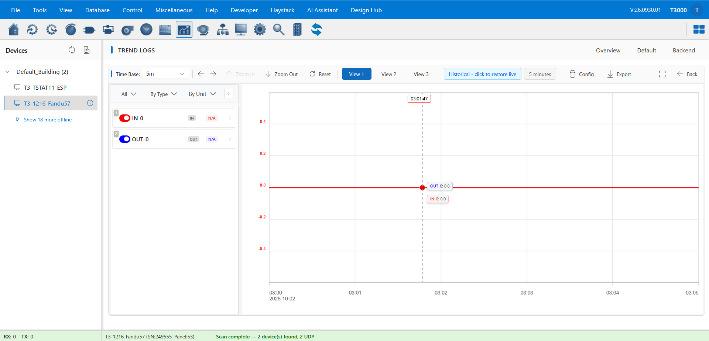
Docs: <a href="https://github.com/temcocontrols/T3000Webview/blob/feature/lvgl-svg-renderer/docs/t3000/features/trendlogs.md" target="_blank" rel="noopener">Trend Logs</a>. In the beta: **Documentation ▸ Features ▸ Trend Logs**.

### 3.3 Haystack tags

Haystack tagging for devices and points, plus auto-tagging that proposes the tags for you. Tag a device, review
the suggestions, then search or filter by a tag.

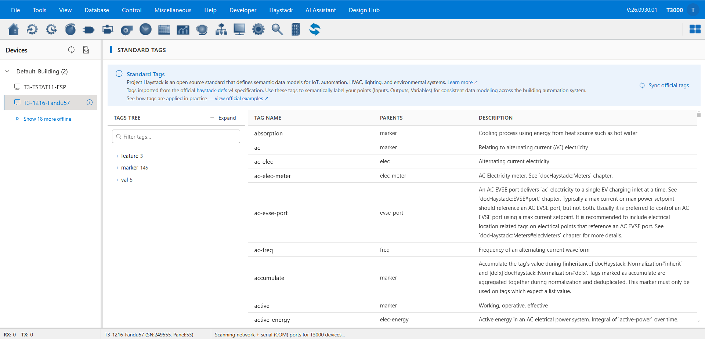
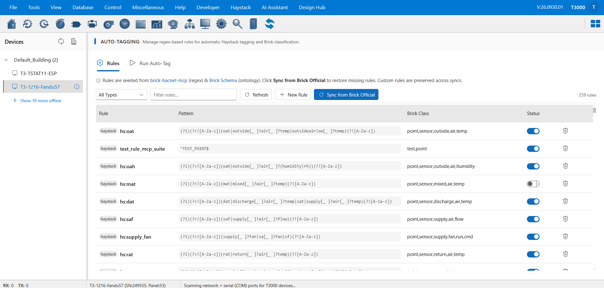
Docs: <a href="https://github.com/temcocontrols/T3000Webview/blob/feature/lvgl-svg-renderer/docs/t3000/haystack/README.md" target="_blank" rel="noopener">Haystack tags</a>. In the beta: **Documentation ▸ Haystack & MCP**.

### 3.4 MCP tools and the AI Assistant

The MCP (Model Context Protocol) tools expose your T3000 system to an AI assistant, which can answer questions
about points, trends and devices and help you configure them. Ask it about a device (for example "what is the
supply air temperature on SN …"), and check the tool list and settings on the MCP page.

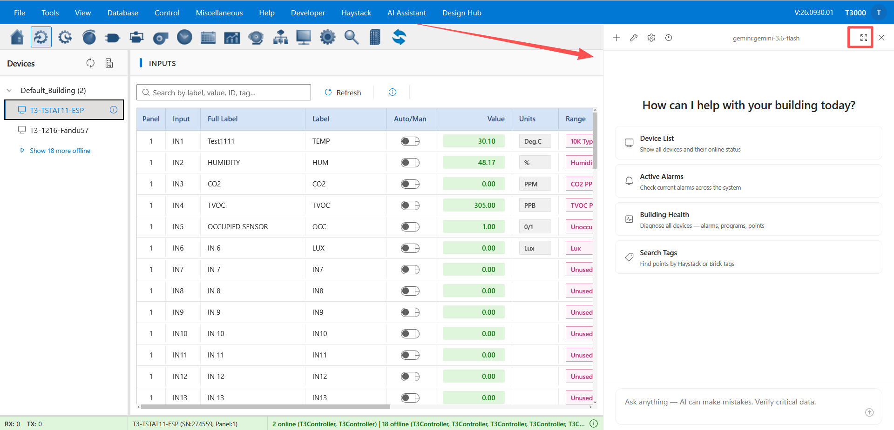
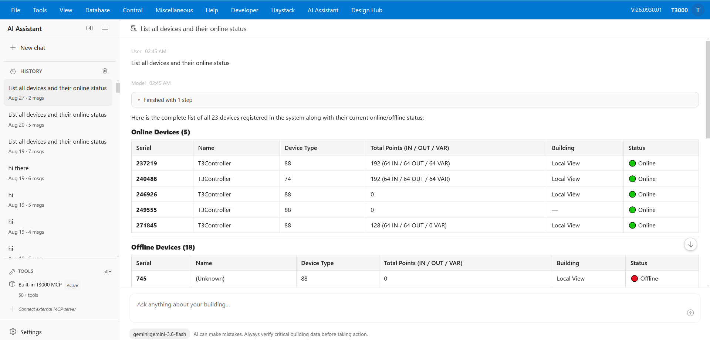
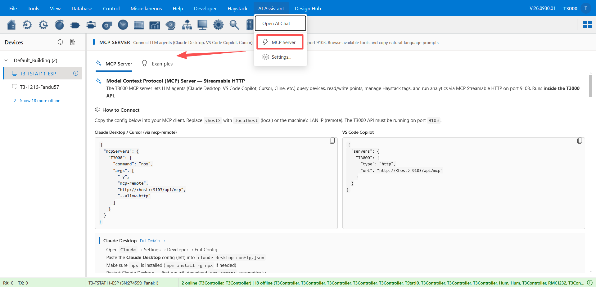
Docs: <a href="https://github.com/temcocontrols/T3000Webview/blob/feature/lvgl-svg-renderer/docs/t3000/haystack/mcp-vscode-copilot.md" target="_blank" rel="noopener">MCP — VS Code Copilot</a>. In the beta:
**Documentation ▸ Haystack & MCP**.

### 3.5 The new Designer — HVAC and LVGL / EEZ Studio

Your graphics and embedded UI projects, made in the browser and deployed to the device. The Design Hub is the
dashboard: create a drawing by type, pick the device, then edit and deploy. HVAC drawings are schematics for a
device's graphic slot (1–8); LVGL 9.5 projects (or LVGL with Flow 9.5) open in the EEZ Studio editor.

A drawing belongs to **one device + one graphic slot** — the hub tells you when a slot is already taken, so you can
open the existing drawing instead of overwriting it.

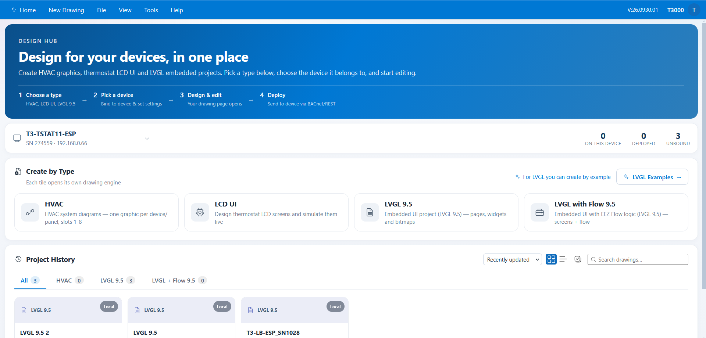
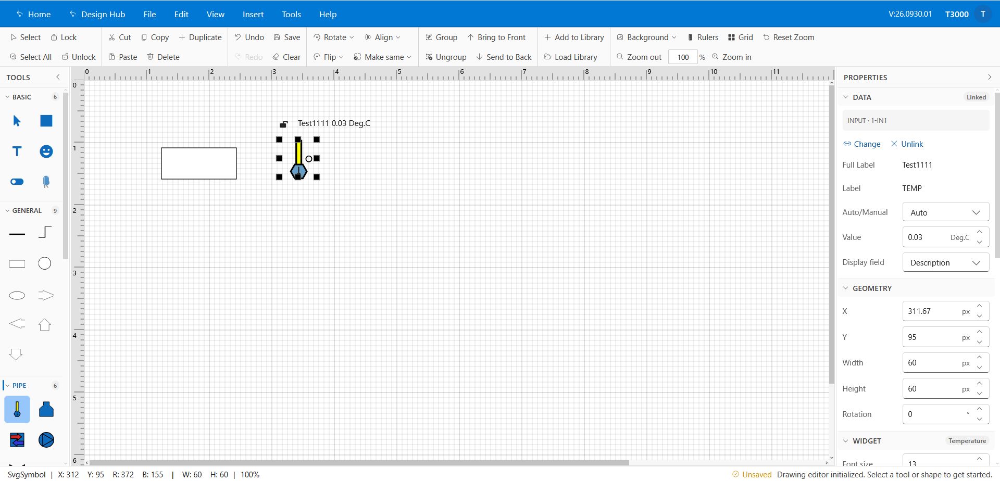
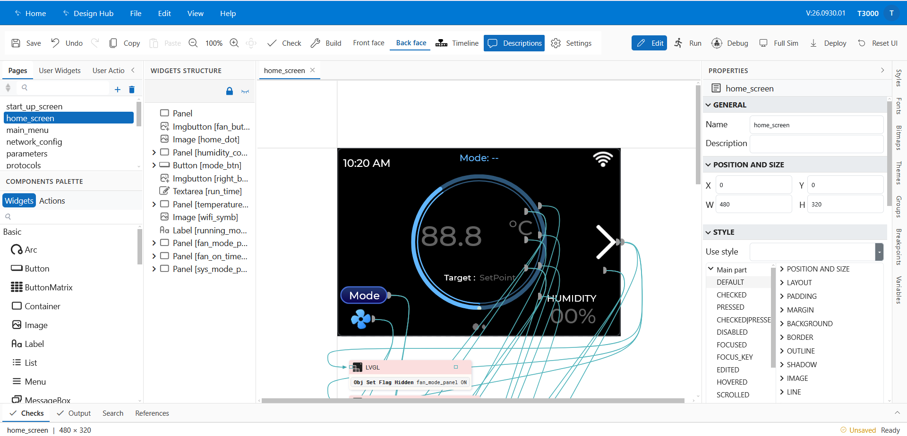
Docs: <a href="https://github.com/temcocontrols/T3000Webview/tree/feature/lvgl-svg-renderer/docs/t3000/design-hub/" target="_blank" rel="noopener">Design Hub</a> (HVAC),
<a href="https://github.com/temcocontrols/T3000Webview/blob/feature/lvgl-svg-renderer/docs/t3000/t3-eez-studio/manual/01-overview.md" target="_blank" rel="noopener">EEZ Studio manual</a> (LVGL / EEZ Studio). In the beta:
**Documentation ▸ Design Studio (Tstat11)**.

### 3.6 Shared Center DB — one database for the whole network

The trend logs and device data of several T3000 PCs kept in **one central Microsoft SQL Server** database,
instead of every PC keeping its own copy — the reason a trend started on one PC can be read from another. Install
SQL Server Express (25–40 minutes, guide below), enable TCP/IP, then point T3000 at that server in
**Database ▸ Database Configuration** and start a trend. Open the same trend from a second PC to confirm both PCs
write into the central database.

**Note:** SQL Server Express allows up to **10 GB per database** — if you expect more, use SQL Server Standard
or higher.

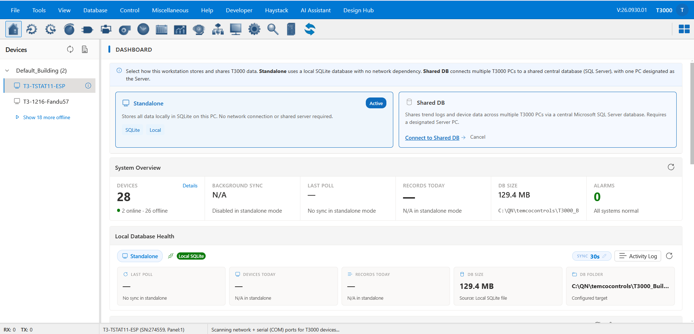
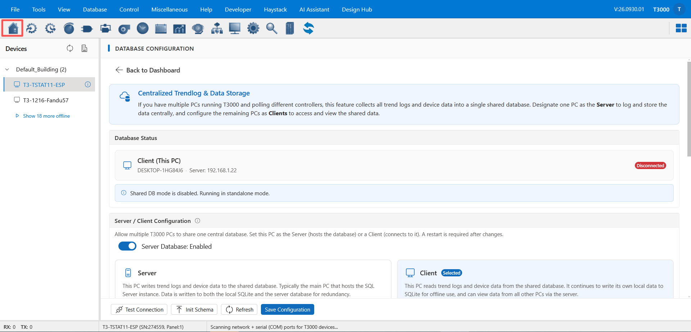

Docs: <a href="https://github.com/temcocontrols/T3000Webview/blob/feature/lvgl-svg-renderer/docs/t3000/shared-db/shared-center-db-summary.md" target="_blank" rel="noopener">Shared Center DB</a> — install:
<a href="https://github.com/temcocontrols/T3000Webview/blob/feature/lvgl-svg-renderer/docs/t3000/shared-db/sql-server-express-setup.md" target="_blank" rel="noopener">SQL Server Express setup</a>, configure:
<a href="https://github.com/temcocontrols/T3000Webview/blob/feature/lvgl-svg-renderer/docs/t3000/shared-db/t3000-center-db-config.md" target="_blank" rel="noopener">T3000 Center DB configuration</a>. In the beta: **Documentation ▸ Shared DB**.

## 4. Where the detailed documents are

They are built into the beta itself — open `http://localhost:9103/#/t3000/documentation` (or
**Help ▸ Documentation** in the menu) and pick the chapter named in each section above. The same pages are in the
GitHub repository:
<a href="https://github.com/temcocontrols/T3000Webview/tree/feature/lvgl-svg-renderer/docs/t3000/" target="_blank" rel="noopener">the T3000 documentation folder</a>.

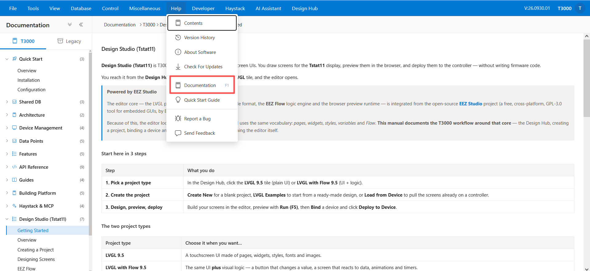

## 5. What we would like you to look at

- Does it open on your PC, and does the **Windows icon** bring the T3000 window back?
- Are your devices, names, buildings and floors correct?
- Are values, units and writes to the device correct?
- Anything that feels slow, hangs on a spinner, or looks wrong in your browser or on your screen.

## 6. Known limitations of the beta

- Beta quality: some pages are still being finished, and a few screens still have no new page.
- The new interface uses a browser profile of its own for T3000 — so sign-ins, extensions and bookmarks from
  your normal browser profile do not apply.
- Please keep using the T3000 window for anything critical; nothing is removed by installing the beta.

## 7. Feedback and suggestions

We would like to hear from you — how it feels to use, what is missing, what should work differently. Any
suggestion is welcome, big or small; we will work them into the next version. Post in this thread, and if
something goes wrong, a screenshot or the version number (Help ▸ About) helps us reproduce it.

## 8. What happens next

This is a beta — your feedback and suggestions shape what comes next. We will move on to an **official
release** and continue with our normal updates from there, announced here. Thank you for trying it and for
helping us get there.
