# SQL Server Express 2022 Setup for T3000 (Detailed Step-by-Step)

<!-- USER-GUIDE -->

Estimated time: 25 to 40 minutes.

> **Official documentation:**
> Microsoft SQL Server installation documentation:
> https://learn.microsoft.com/en-us/sql/database-engine/install-windows/install-sql-server
> This guide may be used as an alternative step-by-step reference for the T3000 setup workflow.

> **Database size limit (SQL Server Express):**
> SQL Server Express has a maximum relational database size of **10 GB per database**.
> This limit is defined by Microsoft in SQL Server 2022 Scale limits.
> If a single database requires more than 10 GB, use SQL Server Standard or higher.
> Source: https://learn.microsoft.com/en-us/sql/sql-server/editions-and-components-of-sql-server-2022#scale-limits

## What You Need Before Starting

1. Windows 10 or Windows 11 PC (64-bit) with administrator rights.
2. Internet access.
3. T3000 application installed.
4. At least 1.5 GB free disk space.

> **Tip: Separate install folder and data folder**
> Keep SQL Server program files in the default install location, and place database data files on another drive.
> During setup, open the **Data Directories** tab and set **Data Root Directory** to a path like **D:\SQLData**.
> This keeps the C: drive from filling up and leaves more room for Windows and applications.

## Step 1: Download SQL Server 2022 Express

1. Open your web browser.
2. Go to this URL:
   ```
   https://www.microsoft.com/en-us/download/details.aspx?id=104781&msockid=01e188d1ef006e6936d29f94ee4a6f7a
   ```
3. Scroll down to **Express** section.
4. Click **Download now** under SQL Server 2022 Express.
5. Save file to your Desktop.

Expected file name:
- `SQL2022-SSEI-Expr.exe` (small web installer, ~5 MB, downloads installation files during setup)

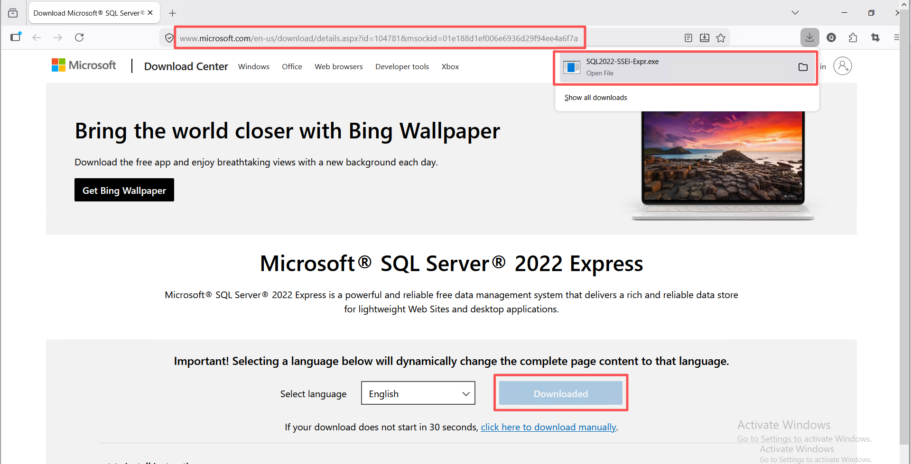

## Step 2: Run SQL Server Express Installer

1. Right-click the downloaded file.
2. Click **Run as administrator**.
3. Click **Yes** on User Account Control prompt.

> If Windows shows a security warning ("publisher can't be verified"), click **Run** to continue.
> This is expected for the Microsoft installer.


## Step 3: Prepare SQL Server Installer Media (Pre-Install)

1. In the SQL Server Express launcher, select **Download Media**.
2. On the download options screen, keep **Express Core** selected.
3. Select a download folder (for example: `C:\Users\<your-user>\Downloads`).
4. Click **Download** and wait for the media download to finish.
5. When download is complete, click **Open folder**.

Expected result:
- The full installer file is available in the selected folder.
- Continue by running that installer in the next step.

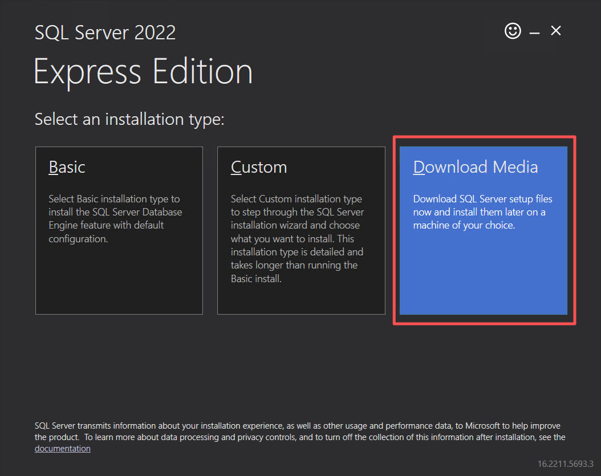
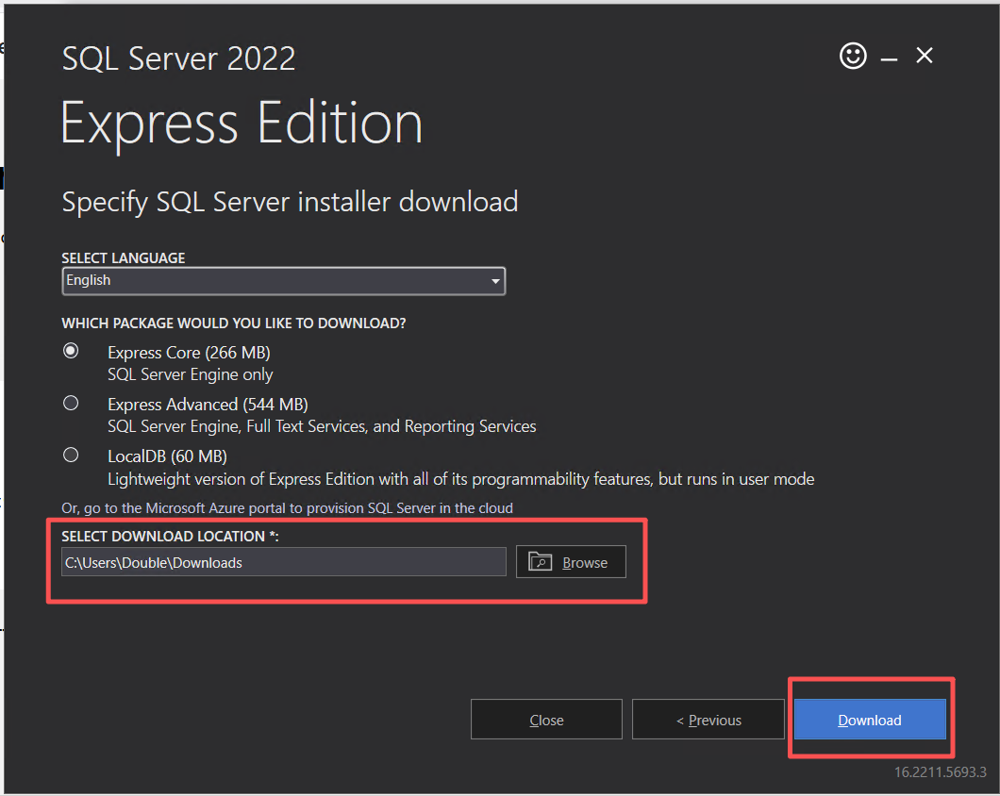
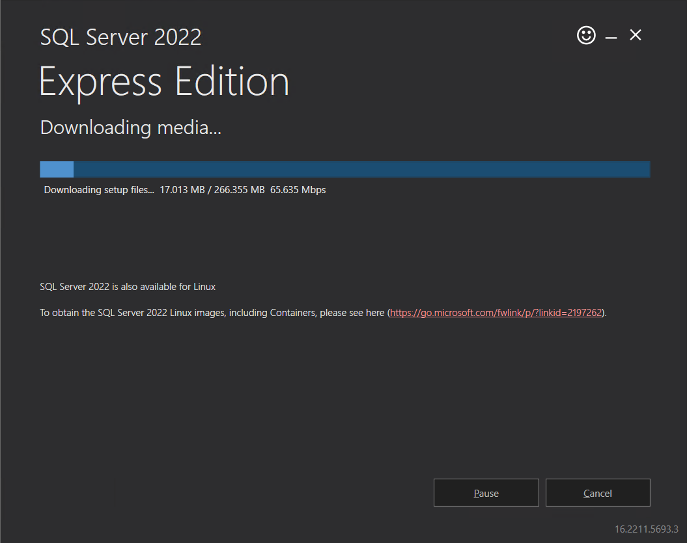
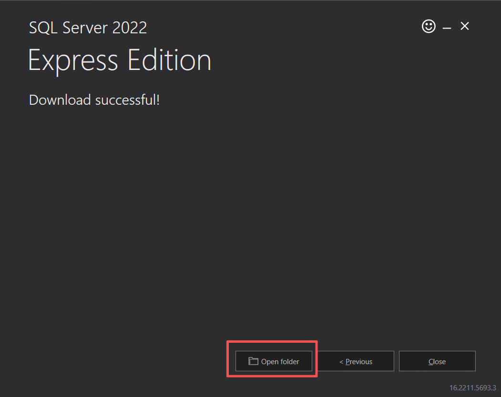

## Step 4: Start the Full SQL Server Installation

1. In the folder opened from Step 3, find and run **SQLEXPR_x64_ENU.exe**.
2. If User Account Control appears, click **Yes**.
3. In **SQL Server Installation Center**, click:
   - **New SQL Server standalone installation or add features to an existing installation**
4. On **Product Updates**, click **Next**.
5. On **Install Rules**, review the results and click **Next**.

Notes:
- A Windows Firewall warning on Install Rules can appear and does not block installation.
- Network and firewall settings will be configured in later steps.


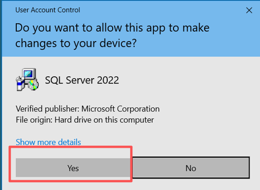


## Step 5: Select Installation Type and Accept Terms

1. On **Installation Type**, select **Perform a new installation of SQL Server 2022**.
2. Click **Next**.
3. On **License Terms**, check **I accept the license terms and Privacy Statement**.
4. Click **Next**.
5. On **Azure Extension for SQL Server**, leave **Use Microsoft Update to check for updates** unchecked.
6. Click **Next**.

Notes:
- If an existing SQL instance is listed, keep **Perform a new installation** selected for SQL Express.
- The Azure Extension option is not required for this setup.


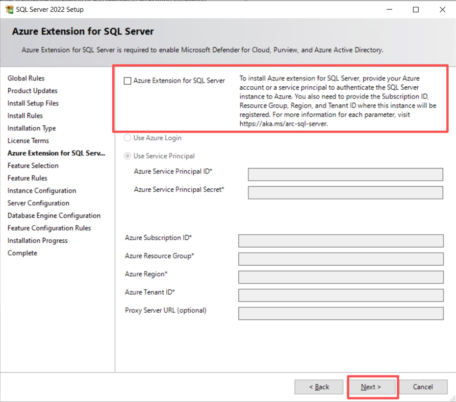

## Step 6: Select Features, Instance, and Server Configuration

1. On **Feature Selection**, keep the default selections shown in the installer.
2. Click **Next**.
3. On **Instance Configuration**, set:
   - **Named instance**: `SQLExpress`
   - **Instance ID**: `SQLEXPRESS`
4. Click **Next**.
5. On **Server Configuration**, review the service settings and click **Next**.

Notes:
- Use the same instance naming shown in the screenshots to match later connection steps.
- SQL Server Browser may appear as **Disabled** at this stage and can be configured later.

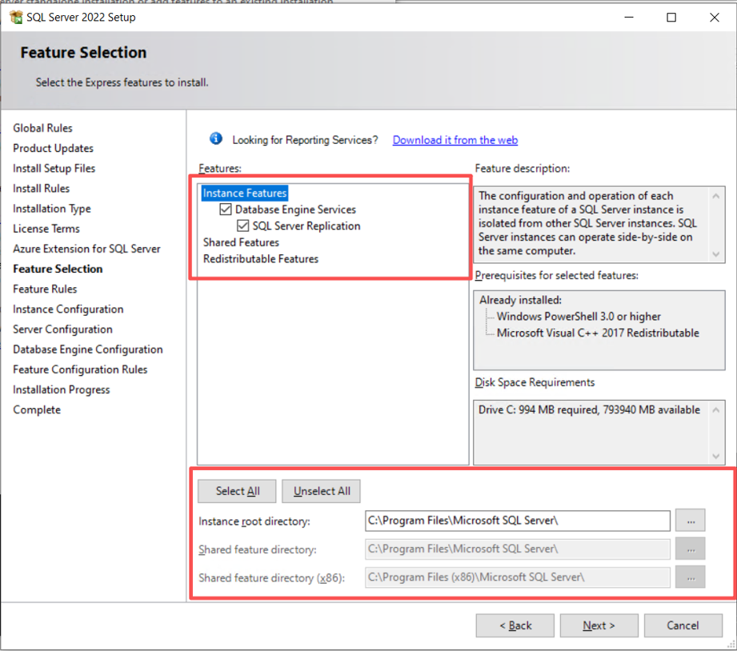


## Step 7: Configure Database Engine and Data Directories

This step has two important tabs: **Server Configuration** and **Data Directories**.

1. In **Database Engine Configuration** on the **Server Configuration** tab:
   - Select **Mixed Mode (SQL Server authentication and Windows authentication)**.
   - Enter and confirm a strong password for the `sa` account.
   - Click **Add Current User** to add your Windows account as SQL administrator.
2. Verify that your Windows account appears in **Specify SQL Server administrators**.
3. Click the **Data Directories** tab.
4. Review the default paths for data, logs, backup, and temp files.
5. If the C: drive is limited, set **Data root directory** to another drive (for example `D:\SQLData`).
6. Keep paths consistent under the selected root so future maintenance is easier.
7. After confirming both tabs, click **Next**.

Recommended practice:
- Keep SQL Server program files and database data files on separate drives when possible.
- This reduces C: drive growth and improves long-term system stability.

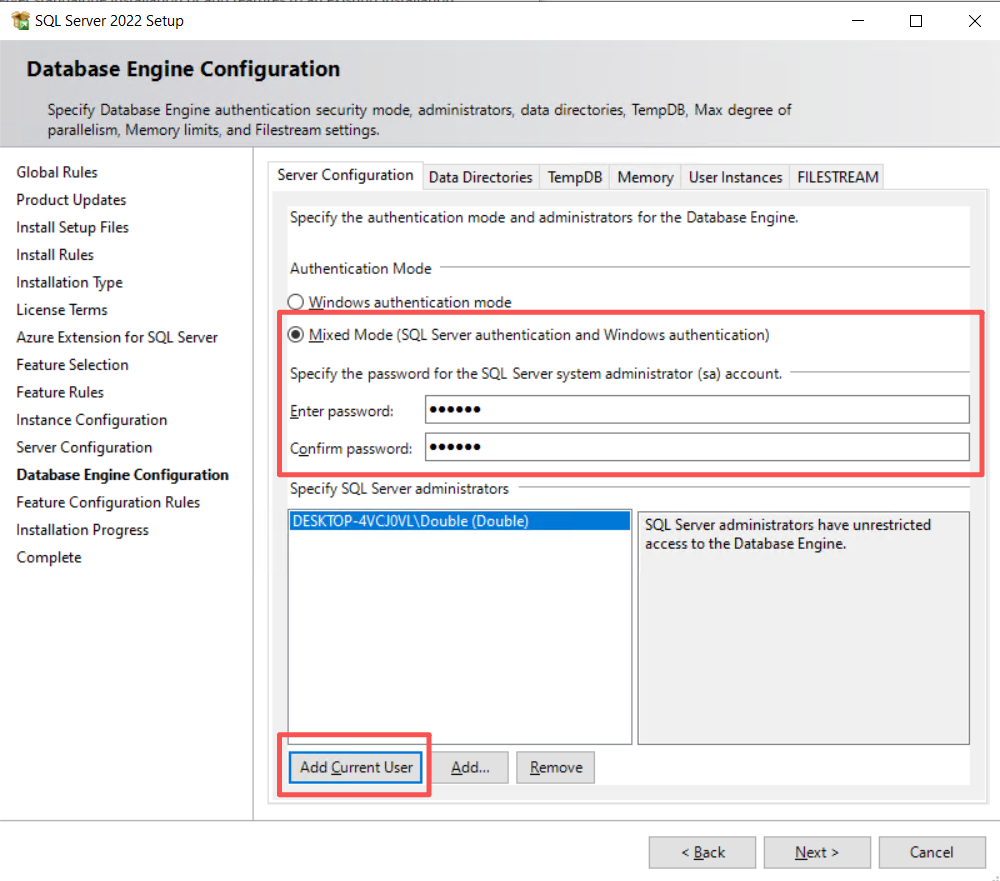
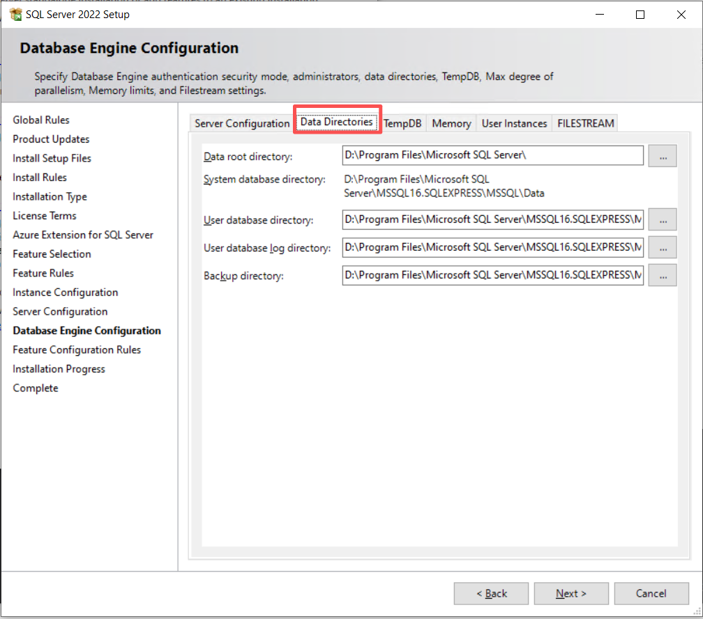

## Step 8: Run Installation and Confirm Completion

1. On the **Installation Progress** page, wait until setup finishes.
2. Do not close the installer while the progress bar is active.
3. When the **Complete** page appears, verify each selected feature shows **Succeeded**.
4. Confirm the details area shows **Install successful**.
5. Click **Close**.

Verification checklist:
- **Database Engine Services** status is **Succeeded**.
- **SQL Server Replication** status is **Succeeded** (if selected in Feature Selection).
- Setup summary shows installation completed successfully.
- In **Windows Services**, **SQL Server (SQLEXPRESS)** shows **Running**.


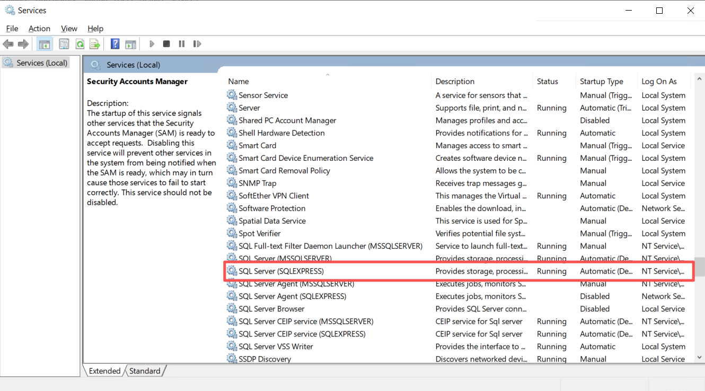

## Step 9 (Optional): Open SQL Server Management Tools Download Page

Use this step only if you want a graphical management tool (SSMS) for manual database tasks.

1. In **SQL Server Installation Center**, stay on the **Installation** tab.
2. Click **Install SQL Server Management Tools**.
3. Your browser opens the Microsoft download page for SSMS.
4. Continue with SSMS installation only if your workflow requires manual administration.

Notes:
- This step is optional for core SQL Server Engine installation.
- It is recommended for troubleshooting, query testing, and manual database setup.


## Step 10: Configure TCP/IP in SQL Server Configuration Manager

Official Microsoft documentation (reference first):
- https://learn.microsoft.com/en-us/sql/database-engine/configure-windows/enable-or-disable-a-server-network-protocol

1. Open **SQL Server 2022 Configuration Manager** from the Windows Start menu.
2. Expand **SQL Server Network Configuration**.
3. Click **Protocols for SQLEXPRESS**.
4. In the right panel, open **TCP/IP** properties and set **Enabled = Yes**.
5. Click **OK** to save.
6. If your environment also requires Named Pipes, open **Named Pipes** properties and set **Enabled = Yes**.
7. Open **Services**, right-click **SQL Server (SQLEXPRESS)**, and click **Restart**.
8. Wait until service status returns to **Running**.

Verification checklist:
- **TCP/IP** shows **Enabled** under Protocols for SQLEXPRESS.
- **SQL Server (SQLEXPRESS)** is **Running** after restart.

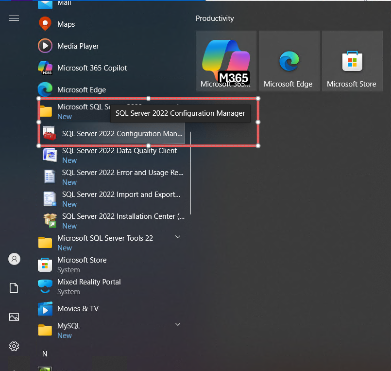


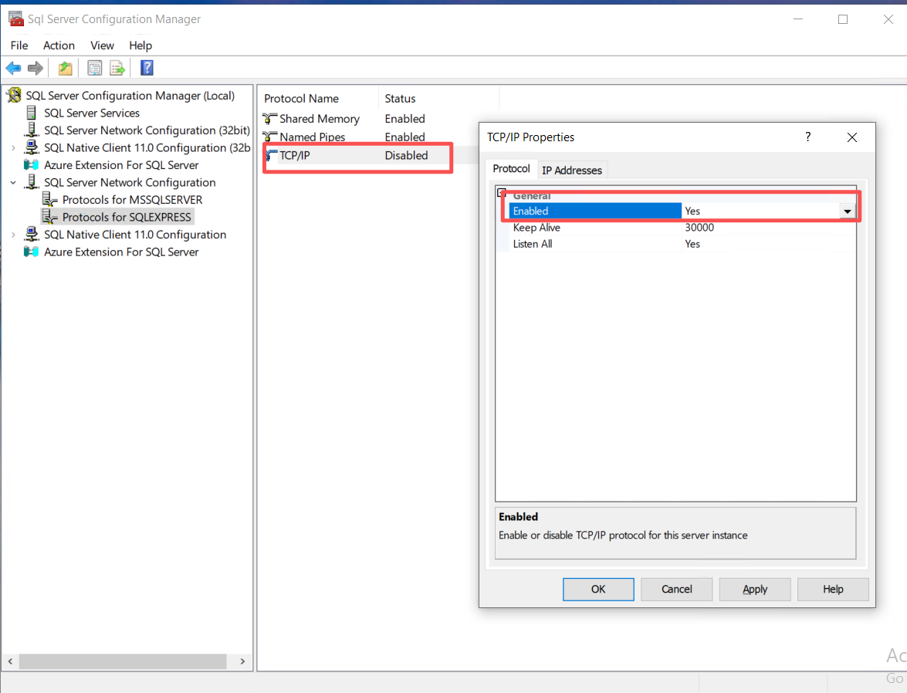
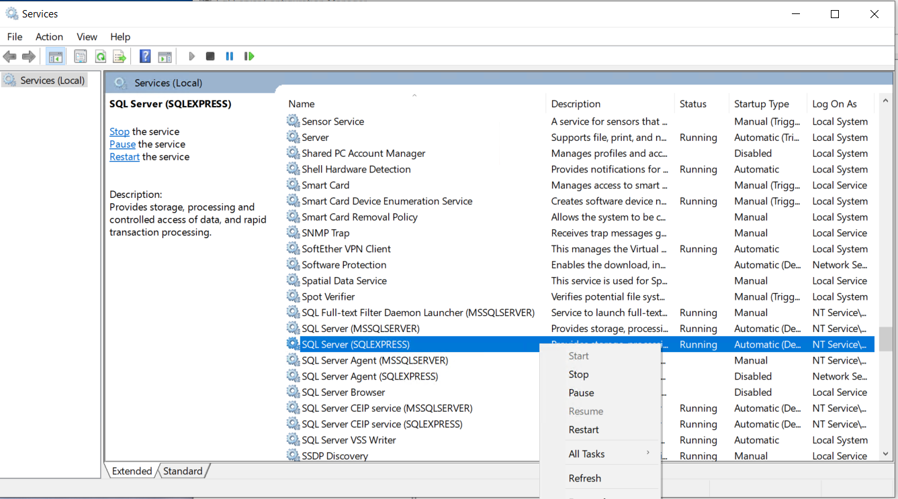

## Step 11: Enable Remote Access for TCP 1433 (Windows Firewall)

Official Microsoft documentation (reference first):
- https://learn.microsoft.com/en-us/sql/sql-server/install/configure-the-windows-firewall-to-allow-sql-server-access

Use this step when clients connect from another PC to this SQL Server instance.

1. Open **Windows Defender Firewall with Advanced Security**.
2. In the left panel, click **Inbound Rules**.
3. In the right panel, click **New Rule...**.
4. In Rule Type, select **Port** and click **Next**.
5. Select **TCP**, choose **Specific local ports**, enter `1433`, then click **Next**.
6. Select **Allow the connection** and click **Next**.
7. Select the network profiles required by your environment (Domain/Private/Public), then click **Next**.
8. Enter a rule name (for example: `SQL SERVER:1433`) and click **Finish**.

Verification checklist:
- New inbound rule for TCP 1433 appears in Firewall Inbound Rules.
- Remote clients can reach the SQL host on port 1433.

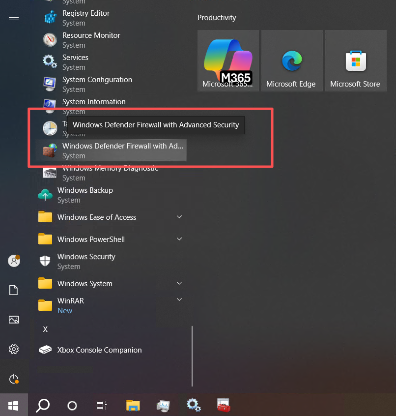


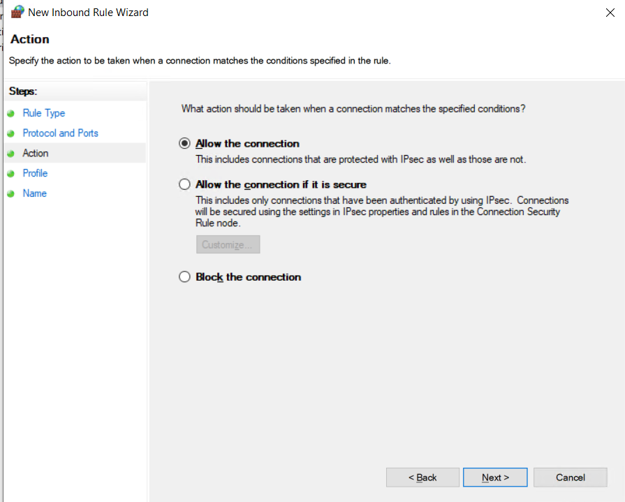
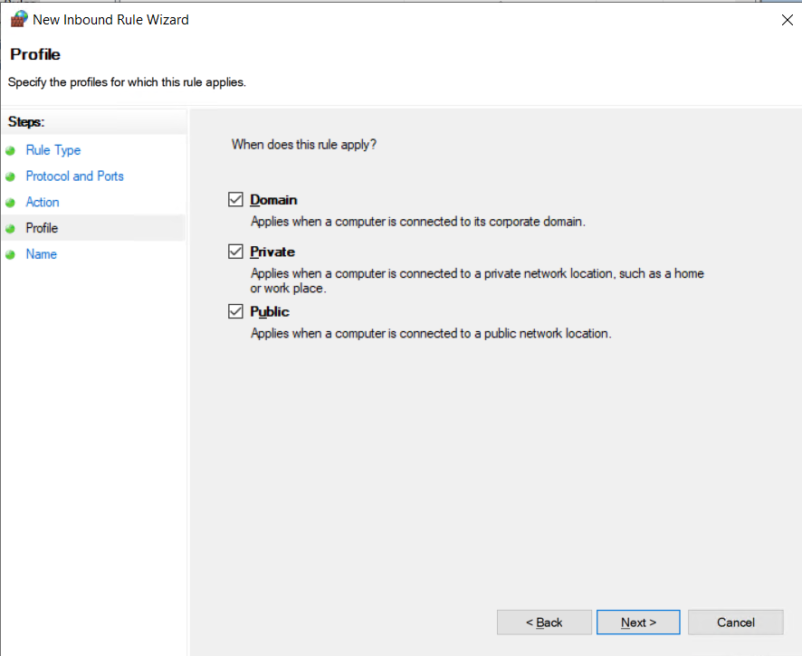


## Step 12 (Optional): Verify Connection via mssql Tool

Use the **mssql** extension in VS Code to confirm SQL Server is reachable before continuing.

1. Open **VS Code** and install the **mssql** extension if not already installed (search `mssql` in the Extensions panel).
2. Press `Ctrl+Shift+P` ¡ú type **MS SQL: Add Connection** ¡ú press Enter.
3. Enter the server name: `localhost\SQLEXPRESS`.
4. Choose **SQL Login**, enter username `sa` and the password you set in Step 7.
5. Click **Connect**.
6. A green status bar item showing the server name confirms the connection is working.

> If the connection fails, verify TCP/IP is enabled (Step 10), mixed mode is set (Step 7), and the SQL Server service is running (Step 8).

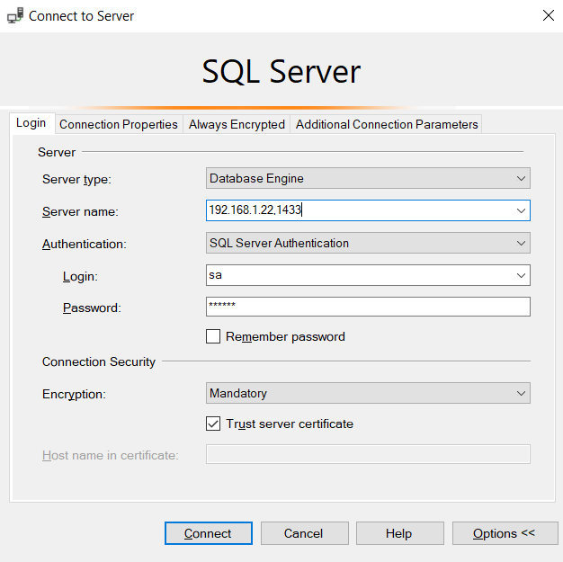
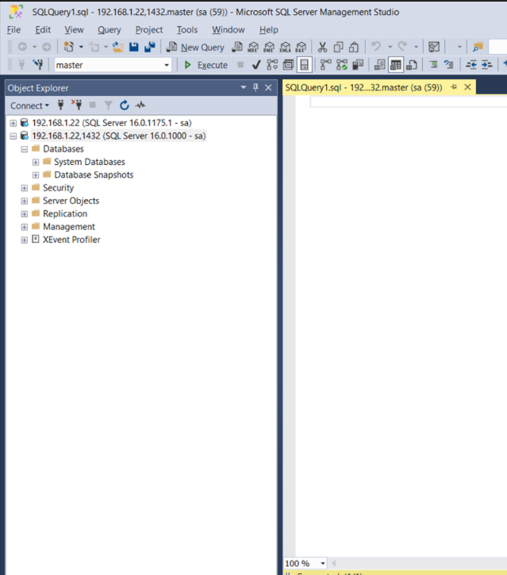


---

## Summary

This guide covered the full installation and configuration of **SQL Server 2022 Express** on a Windows PC for use with T3000.

After completing all steps, you should have:

- SQL Server 2022 Express installed with instance name SQLEXPRESS
- SQL Server Management Studio (SSMS) installed for database administration
- TCP/IP protocol enabled on port **1433**
- Windows Firewall rule allowing TCP 1433 (required for remote connections)
- Mixed mode authentication (SQL + Windows) enabled and active
- SQL Server restarted to apply configuration changes
- (Optional) Connection verified via the mssql tool in VS Code

**Next step:** Configure T3000 to connect to this SQL Server instance.
See the T3000 Database Configuration guide for how to enter connection details, test the connection, initialize the schema, and set the shared database role.
