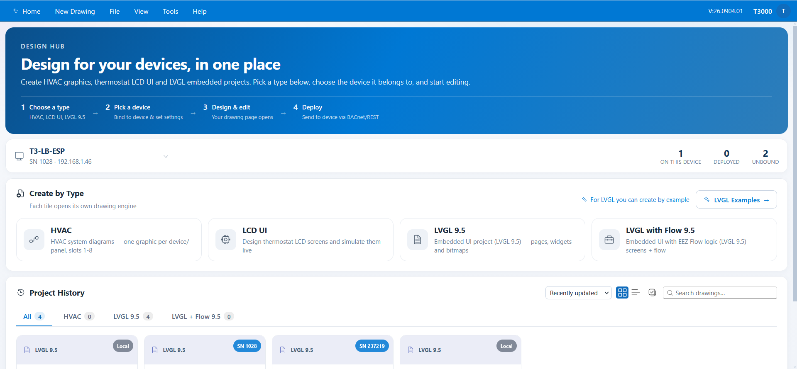
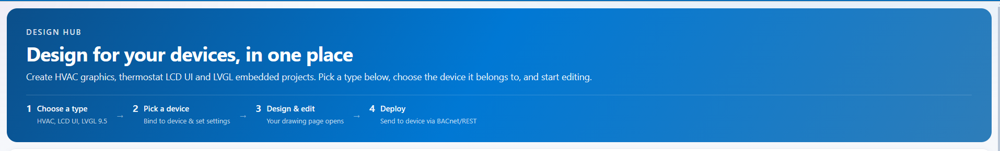
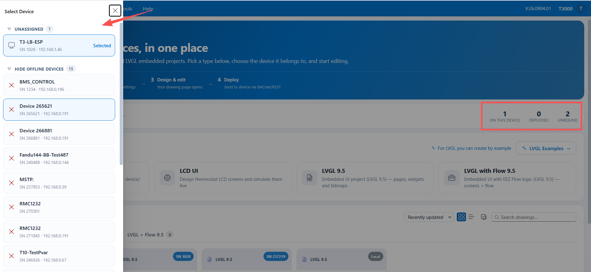
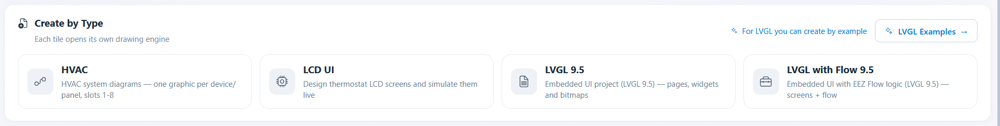
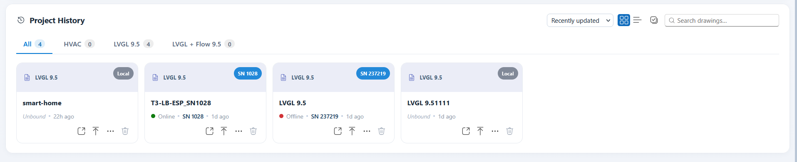
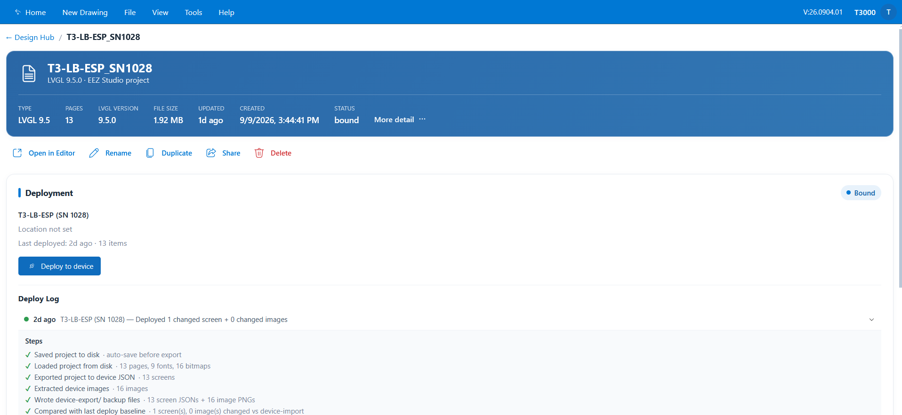
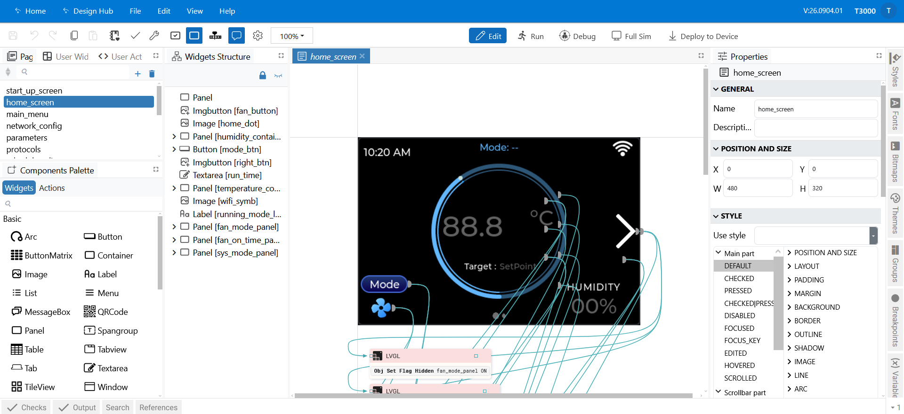

## 01 — Overview

This chapter explains what Design Studio (Tstat11) is, which of the two project types to
choose, where you work, and what you are looking at on each screen.

**In this chapter**

1. [What Design Studio (Tstat11) is](#1-what-design-studio-tstat11-is) — and what you can do with it
2. [The two project types](#2-the-two-project-types) — LVGL 9.5 or LVGL with Flow 9.5
3. [Where you work](#3-where-you-work) — the Design Hub and the editor
4. [Tour: the Design Hub](#4-tour-the-design-hub) — tiles, examples and your projects
5. [Tour: the editor](#5-tour-the-editor) — pages, canvas and inspectors
6. [What you need](#6-what-you-need) — a browser to design, a controller to deploy

---

### 1. What Design Studio (Tstat11) is

Design Studio (Tstat11) is the embedded-touchscreen designer inside T3000. With it you:

- **Draw screens** for a T3 controller's display using ready-made widgets.
- **Add logic** so the UI reacts to touches and to controller data (Flow projects only).
- **Preview** the result in your browser before anything is sent to hardware.
- **Deploy** the finished design to a controller over the network.

You do not need to write C or firmware code, and you do not need the device connected while
you design — you can build the whole UI first and deploy it later.

*Figure 1.1 — The Design Hub, the entry point for all LVGL work.*

---

### 2. The two project types

When you start a project you choose one of two types. They use the same editor; the
difference is whether **Flow** logic is enabled.

| | **LVGL 9.5** | **LVGL with Flow 9.5** |
|---|---|---|
| Screens, widgets, styles, fonts, images | ✅ | ✅ |
| Variables | ✅ | ✅ |
| **Flow** logic editor (actions, event handlers, timers) | — | ✅ |
| Browser preview / simulator | ✅ | ✅ |
| Deploy to device | ✅ | ✅ |

**Choose LVGL 9.5** when the UI only needs to display things and use built-in widget
behaviour (a switch toggles, a slider moves).

**Choose LVGL with Flow 9.5** when the UI must *do* something: a button press that changes a
value, a label that follows a controller reading, a screen that changes automatically, an
animation, or a timed action. See
[04 — Adding Logic with EEZ Flow](04-eez-flow.md).

> You can add Flow later: the Flow editor appears for any project whose **Flow support**
> setting is on. If the Flow tab is missing from your editor, the project was created as
> plain LVGL.

---

### 3. Where you work

There are two places, and it helps to know which one you are in:

| | **Design Hub** | **Editor** |
|---|---|---|
| What it is | The dashboard that lists all your design projects | The place where you draw the screens |
| You go there to | Create, find, bind and deploy projects | Design pages, preview and save |
| Opens at | `#/t3000/design` | `#/t3000/eez` |

The normal journey is:

| Step | Where | What you do |
|---|---|---|
| 1. Create or open | Design Hub | Click an **LVGL tile**, use **LVGL Examples**, or **Open in editor** on an existing project card. |
| 2. Design and preview | Editor | Build your pages, then check them with **Run (F5)**. |
| 3. Bind and deploy | Editor or Design Hub | Choose the controller, then **Deploy to Device**. |

The **project detail page** (reachable from a card's **More (details & manage)**) shows a
preview, statistics and snapshots of one project.

> You normally move between these screens by clicking — the addresses above are listed for
> reference only.

---

### 4. Tour: the Design Hub

This is the screen you land on. It has four parts: the **top bar**, the **4-step guide**,
the **device bar**, and your work under **Create by Type** and **Project History**.

#### Top bar

- **Home** — back to the main T3000 view.
- **New Drawing** — start a new project.
- **File / View / Tools / Help** — menus for hub actions (import, backup/restore, view mode,
  sort order, refresh, sync).
- **Ctrl + K** — opens the **command palette**, a search box for hub actions.
- The right-hand side shows the app version and the signed-in user.

#### The 4-step guide

A short reminder strip: **Choose a type → Pick a device → Design & edit → Deploy**. It is
guidance only — you can work in any order.

*Figure 1.2 — The 4-step guide strip.*

#### Device bar

*Figure 1.3 — The device bar.*

1. **Device selector** — shows the currently selected device ("No device selected — click to
   choose"). The selected device scopes the hub and is pre-selected when you bind or deploy.
2. **Counters** — how many drawings are *On this device*, *Deployed*, and *Unbound*.

#### Create by Type

The tiles are the entry points to the design engines:

| Tile | Opens |
|---|---|
| **HVAC** | The HVAC drawing designer |
| **LCD UI** | The thermostat LCD designer / simulator |
| **LVGL 9.5** | A new LVGL project (no Flow) |
| **LVGL with Flow 9.5** | A new LVGL project with Flow enabled |

*Figure 1.4 — The Create by Type tiles.*

To the right of the tiles is the **LVGL Examples** button, which opens a library of
ready-made LVGL starter projects (see
[02 — Creating a Project](02-creating-projects.md)).

#### Project History

*Figure 1.5 — Project History: sorting, view mode, search and type tabs.*

- **Sort** — Recently updated, Name, or Recently created.
- **View** — grid or list.
- **Select multiple** — batch actions on several projects.
- **Search** — filter by project name.
- **Tabs** — `All`, `HVAC`, `LVGL 9.5`, `LVGL + Flow 9.5` (the count on each tab shows how
  many projects it contains).

Each project card shows the type badge, the project name, its status
(**Unbound / Bound / Deployed**) and when it was last changed.

*Figure 1.6 — A project card and its actions.*

Card actions:

| Action | What it does |
|---|---|
| **Open in editor** | Opens the project in the LVGL editor. |
| **Bind to device** | Chooses the controller this project belongs to. |
| **More (details & manage)** | Opens the project detail page. |
| **Delete** | Removes the project. |

---

### 5. Tour: the editor

Opening a project loads the LVGL editor. (If you open the editor on its own you land on its
home screen first, where your **Recent Projects** are listed.)

The main areas are:

- **Left navigation** — the project's contents: **Pages** (your screens), **Variables**,
  **Actions / Flow** (Flow projects only), **Styles**, **Fonts**, **Bitmaps**, and other
  project sections.
- **Centre** — the **canvas**, where the selected page is designed.
- **Right-hand tabs** — the inspectors for the selected object: **Properties**, **Styles**,
  **Fonts**, **Bitmaps**, **Themes**, and (Flow projects) the **Components Palette**.
- **Top toolbar** — Save, Undo/Redo, Cut/Copy/Paste, build configuration, **Check**,
  **Build**, and the run controls: **Edit mode (Shift+F5)**, **Run (F5)**,
  **Debug (Ctrl+F5)**, **Full Sim (F7)**, and **Deploy to Device**.

*Figure 1.7 — The LVGL project editor.*

Editing is covered in [03 — Designing Screens](03-editing-screens.md).

---

### 6. What you need

- **To design and preview:** nothing but the browser. Projects are saved on the T3000 host.
- **A canvas that matches the display.** The Tstat11 screen is **480 × 320** (landscape), so
  new pages should be designed at that size. If you start from an example, check the project's
  display size in the editor.
- **To deploy:** a T3 controller that is **online and on the network**, and the controller's
  IP/panel information available in T3000. See
  [05 — Preview, Bind & Deploy](05-preview-and-deploy.md).

---

**Next:** [02 — Creating a Project](02-creating-projects.md)
