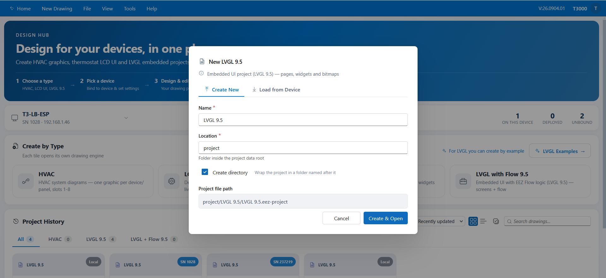
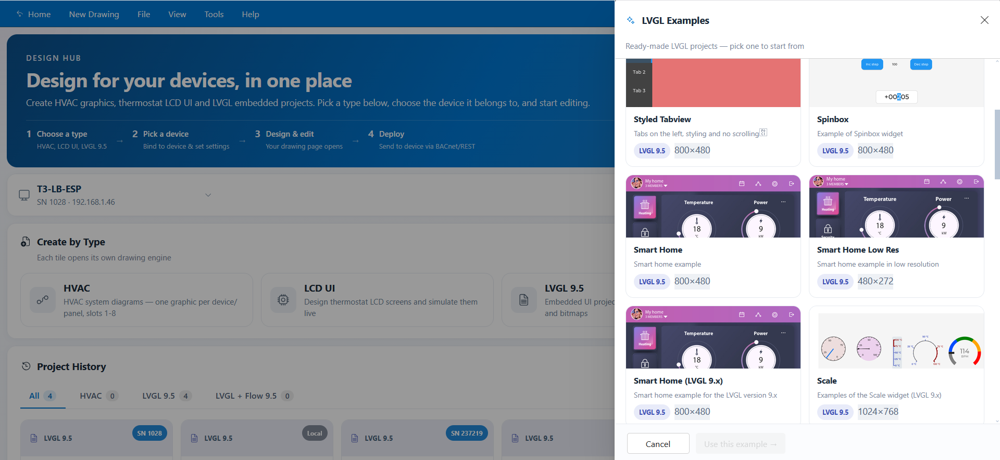
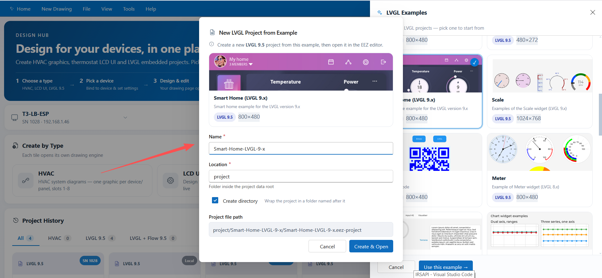
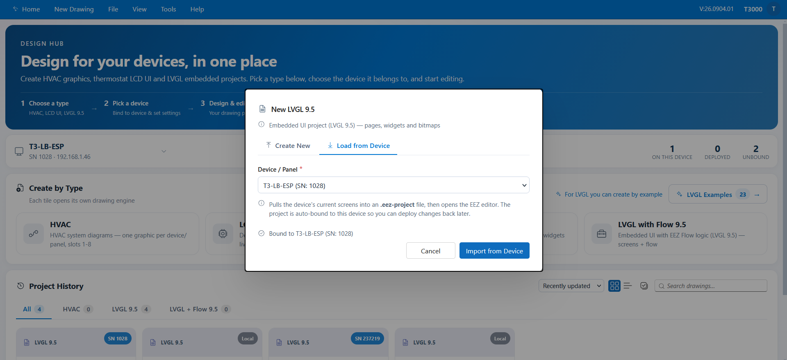
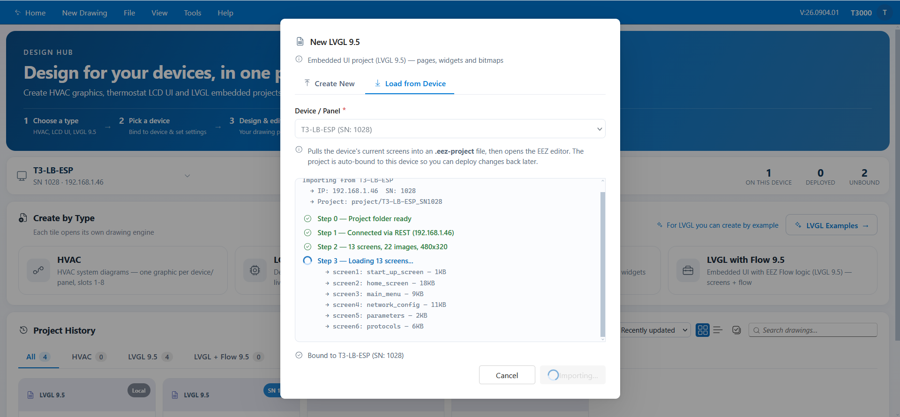

# 02 — Creating a Project

There are three ways to get an LVGL project. All three end with the project open in the
editor.

| Way | Use it when… |
|---|---|
| **Create New** | You want to start from a blank LVGL project. |
| **Start from an Example** | You want a ready-made LVGL design to adapt. |
| **Load from Device** | The controller already has screens you want to edit. |

---

## 1. Way 1 — Create New

1. In the Design Hub, click the **LVGL 9.5** or **LVGL with Flow 9.5** tile.
2. The **New …** dialog opens on the **Create New** tab.

*Figure 2.1 — The Create New tab of the New LVGL project dialog.*

3. Fill in:

| Field | Notes |
|---|---|
| **Name** | The project name. It also names the project file. |
| **Location** | The folder inside the project data root. The default is `project`. |
| **Create directory** | On by default. Wraps the project in a folder named after the project. |
| **Project file path** | Read-only preview of where the project will be created. |

4. Click **Create & Open**. The editor opens with a new, empty project.

*Tip:* with **Create directory** on and Name `my-ui` under Location `project`, the project
file is `project/my-ui/my-ui.eez-project`.

---

## 2. Way 2 — Start from an Example

The examples are real LVGL projects published by EEZ, filtered to the LVGL types.

1. In the Design Hub, click **LVGL Examples** (next to the *Create by Type* tiles).
2. The **LVGL Examples** drawer opens.

*Figure 2.2 — The LVGL Examples drawer.*

3. Narrow the list:

| Filter | Shows |
|---|---|
| **All** | Every LVGL example. |
| **New** | Examples recently added to the catalog. |
| **LVGL** | Examples without Flow. |
| **LVGL + Flow** | Examples that use Flow logic. |

   Use the search box to filter by name or description. Selecting an example shows its
   preview and details.
4. Click **Create & Open**, then fill in **Name**, **Location** and **Create directory**, and
   confirm.

*Figure 2.3 — Naming the project created from an example.*

The example is copied into your project folder and opened in the editor.

> The first time you open the drawer, the catalog is downloaded — this can take a moment.
> If the list is empty, wait a few seconds or press **Retry**.

---

## 3. Way 3 — Load from Device

This reads the screens currently on a controller into a new project, so you can view and edit
what the device already shows.

1. Click an LVGL tile, then switch to the **Load from Device** tab.

*Figure 2.4 — Choosing the device to read screens from.*

2. Pick a device. Online devices are grouped by building; offline devices are listed
   separately at the bottom. The device selected in the Design Hub is pre-selected.
3. Click **Import**.

The dialog reports progress and keeps a collapsible **details log**:

*Figure 2.5 — Import progress with the detail log expanded.*

Behind the scenes the import:

- creates the project folder and a `device-import` staging area,
- connects to the device and reads its screens one by one,
- converts them into an `.eez-project`,
- pulls the images used by the screens,
- draws parameter grids from the device's input / output / variable points,
- writes the project file and registers it in **Recent Projects**.

4. When it finishes, the editor opens the imported project. It is already bound to the device
   it came from, so you can edit and deploy it straight back.

> **Note:** the device must be online and reachable on the network. If the import stops with
> an error, the detail log shows the failing step.

---

## 4. After creation

Whichever way you used, the project now appears in **Project History** on the Design Hub,
under the tab for its type, with the status **Unbound** until you bind a device.

From here you can:

- **Open in editor** to continue designing — see
  [03 — Designing Screens](03-editing-screens.md).
- **Bind to device** and **Deploy** — see
  [05 — Preview, Bind & Deploy](05-preview-and-deploy.md).
- **More (details & manage)** for preview, statistics, snapshots and compare.

---

## 5. Troubleshooting

| Symptom | What to check |
|---|---|
| No devices in **Load from Device** | The device list comes from the running T3000 host — make sure the host is running and devices are discovered. Only online devices can be imported. |
| The examples list stays empty | The catalog download may still be running, or the host cannot reach the internet. Press **Retry**. |
| "Backend offline" messages | The T3000 host service is not reachable; project files cannot be saved or listed. |
| Name is rejected | Names must start with a letter or underscore and contain only letters, digits, `-` and `_`. |

---

**Next:** [03 — Designing Screens](03-editing-screens.md)
