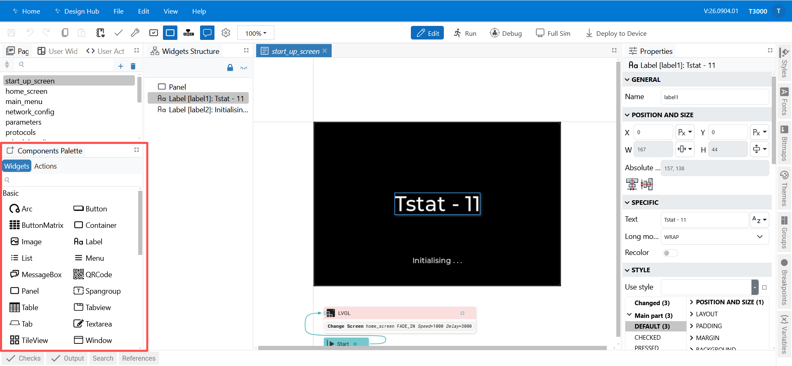
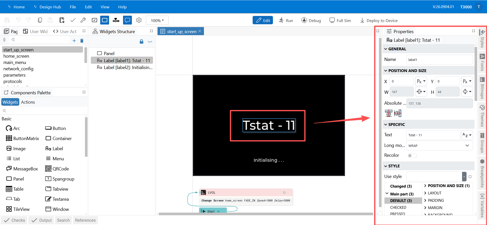
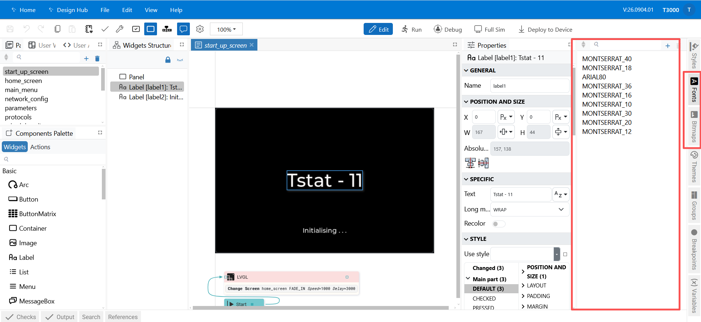

## 03 — Designing Screens

This chapter walks through the LVGL editor and the everyday tasks: creating pages, placing
widgets, and managing styles, fonts and images.

**In this chapter**

1. [The editor at a glance](#1-the-editor-at-a-glance) — the areas and the toolbar
2. [Pages (your screens)](#2-pages-your-screens) — adding screens and the start page
3. [Adding and arranging widgets](#3-adding-and-arranging-widgets) — the palette and Properties
4. [Styles, themes and colours](#4-styles-themes-and-colours)
5. [Fonts](#5-fonts)
6. [Bitmaps (images)](#6-bitmaps-images)
7. [Variables](#7-variables)
8. [Saving your work](#8-saving-your-work)
9. [Where to go next](#9-where-to-go-next)

---

### 1. The editor at a glance

*Figure 3.1 — The LVGL project editor.*

| Area | What it is for |
|---|---|
| **Left navigation** | The project contents: **Pages**, **Variables**, **Actions / Flow** (Flow projects), **Styles**, **Fonts**, **Bitmaps**, … Select an item to edit it. |
| **Canvas (centre)** | The page you are designing. Drag, resize and arrange widgets here. |
| **Right-hand tabs** | Inspectors: **Properties**, **Components Palette**, **Styles**, **Fonts**, **Bitmaps**, **Themes** (and **Breakpoints** in Flow projects). |
| **Top toolbar** | File and edit commands, **Check** / **Build**, run controls, and **Deploy to Device**. |

#### Toolbar controls

| Control | Purpose |
|---|---|
| **Save** | Writes the project to disk. |
| **Undo / Redo** | Steps backwards/forwards through your edits. |
| **Cut / Copy / Paste** | Standard clipboard for widgets. |
| **Configuration** | Picks the build configuration when the project has more than one. |
| **Check** | Validates the project and reports problems. |
| **Build** | Generates the output for the target. |
| **Edit mode (Shift+F5)** | Returns the editor to design mode. |
| **Run (F5)** | Runs the project so you can try it out. |
| **Debug (Ctrl+F5)** | Runs with the debugger. |
| **Full Sim (F7)** | Runs the full simulator (when enabled). |
| **Deploy to Device** | Opens the deploy drawer — see [05](05-preview-and-deploy.md). |

---

### 2. Pages (your screens)

A **page** is one screen on the controller's display.

- To add one: right-click **Pages** in the left navigation and choose **New Page**
  (or use the equivalent **+** action in the Pages list).
- Give the page a clear name — this is how you will refer to it in Flow actions and event
  handlers.
- Set the page's size to match the target display, and pick a background colour or image.

The **start page** is the page that appears first when the UI loads. Make sure exactly one
page is set as the start page.

> If a page is not the size you expect, check the project's **display width / height** in the
> project settings — the canvas uses that as the frame. For the Tstat11, design at
> **480 × 320** (see **What you need** in [01 — Overview](01-overview.md)).

---

### 3. Adding and arranging widgets

Open the **Components Palette** on the right, then drag a widget onto the canvas.

*Figure 3.2 — The Components Palette.*

Available widgets include:

| Widget | Typical use |
|---|---|
| **Label** | Static or dynamic text (a value, a title). |
| **Button** | A pressable button, usually with a label inside. |
| **ImageButton** | A button drawn with images for its states. |
| **Image** | A bitmap from the project. |
| **Switch** | An on/off toggle. |
| **Slider** | A draggable value control. |
| **Bar** | A read-only progress/value indicator. |
| **Arc** | A round gauge-style control or indicator. |
| **Dropdown** | A pick-one list. |
| **Textarea** | Text entry. |
| **Roller** | A scrolling picker. |
| **Checkbox** | A tick box. |
| **Calendar** | A date picker. |
| **Keyboard** | An on-screen keyboard for text entry. |
| **Panel** | An invisible container used to group widgets. |

Common actions:

- **Move / resize** — drag the widget or its handles on the canvas.
- **Group things** — place widgets inside a **Panel** so they move together.
- **Name it** — give important widgets a meaningful name: a flow action targets a widget **by
  name**, and the same names appear in the device's screen JSON.

> **What the device stores.** Every widget you place becomes an object in the screen's JSON —
> `sub_type`, position, `style` and `events`. See
> [Design Studio (Tstat11) API → Screen JSON Format](../../bacnet-api/screen-json.md).

#### Properties

With a widget selected, use the **Properties** tab to set its position, size, text, style and
behaviour.

*Figure 3.3 — Properties for the selected widget.*

Fields you will use most:

| Field | Meaning |
|---|---|
| **left / top** | Position on the page. |
| **width / height** | Size. Can be a number, or `content` to size to the widget's content. |
| **text** | A label's or button's text. Set the **text type** to *literal* for fixed text, or *expression* to build it from variables. |
| **style** | The named style applied to the widget. |
| **hidden / disabled** | Whether the widget is hidden or cannot be interacted with — can be a fixed value or an expression. |
| **event handlers** | Actions to run when the widget is clicked, changed, etc. See [04 — EEZ Flow](04-eez-flow.md). |

---

### 4. Styles, themes and colours

- **Styles** (right-hand **Styles** tab) are reusable appearance definitions — background,
  border, padding, text colour, font. Apply a style to many widgets so a change in one place
  updates all of them.
- **Themes** provide the overall look (for example a dark theme). The project setting
  **dark theme** switches the default theme.
- **Colours** — define named colours once and reuse them, instead of typing hex values
  everywhere.

*Figure 3.4 — The Styles / Fonts / Bitmaps tabs.*

---

### 5. Fonts

Text needs a font that contains the characters you use.

1. Open the **Fonts** section in the left navigation.
2. Add a font, choose the family, size and the character set you need (include only the
   characters you actually use — every extra character costs space on the device).
3. Assign the font to a widget or a style from the **Properties** tab.

> Missing glyphs show as boxes or blanks. If a character does not render, add it to the font's
> character set.

---

### 6. Bitmaps (images)

1. Open **Bitmaps** in the left navigation.
2. Add your image file (PNG works well). Give it a short, meaningful name — this is the name
   you reference from an **Image** widget, an **ImageButton**, or a page background.
3. Set the **Image** widget's **src** to that bitmap name.

The editor pre-processes images into the format the device needs, so you can use ordinary PNG
files while designing. Images reach the device as **separate assets referenced by name** — they
are not embedded inside the screen.

---

### 7. Variables

**Variables** hold values your UI uses — a counter, a mode, a temperature, a flag.

1. Open **Variables** in the left navigation.
2. Add a variable: give it a **name**, a **type** (number, boolean, string, …) and a
   **default value**.
3. Use it:
   - in an **expression** (for example a label whose text is built from the variable), or
   - from **Flow**, where components read and write variables.

Variables are the bridge between what is on screen and what the controller knows. Combining a
controller reading with a variable keeps the screen updated without redeploying.

---

### 8. Saving your work

- **Save** (or the usual save shortcut) writes the project to disk as
  `<project>.eez-project`.
- The project is also saved automatically before a deploy, so what you deploy always matches
  what you see.
- **Recent Projects** on the editor's home screen lists projects you have opened recently.

Good practice: save before previewing or deploying, and check the toolbar's **Check** result
before deploying to catch missing fonts, images or bindings.

---

### 9. Where to go next

- Add behaviour to the screen — [04 — Adding Logic with EEZ Flow](04-eez-flow.md).
- Try it out and send it to the controller —
  [05 — Preview, Bind & Deploy](05-preview-and-deploy.md).
- See exactly what a screen becomes on the device —
  [Design Studio (Tstat11) API → Screen JSON Format](../../bacnet-api/screen-json.md).

---

**Next:** [04 — Adding Logic with EEZ Flow](04-eez-flow.md)
