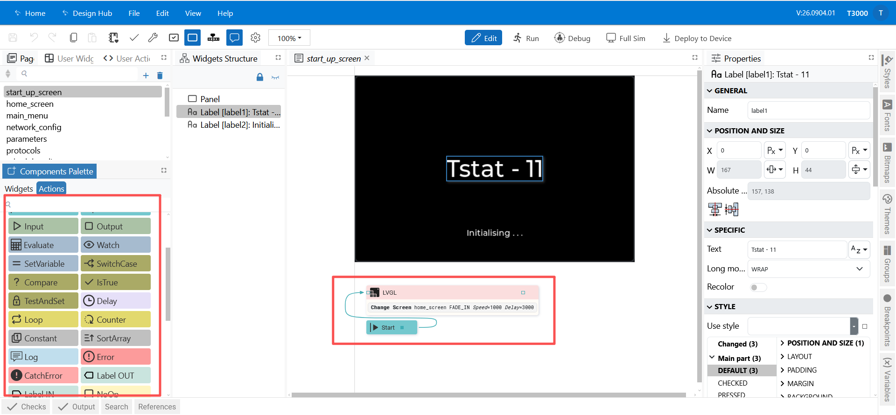
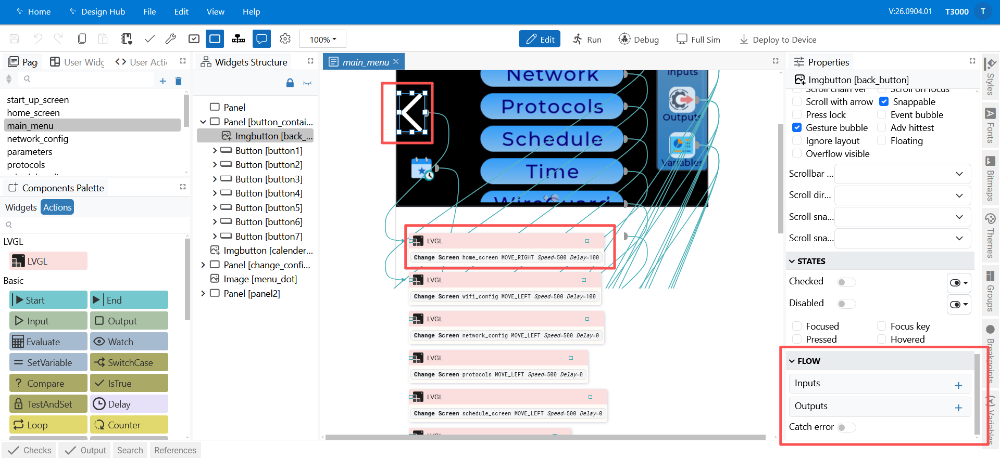
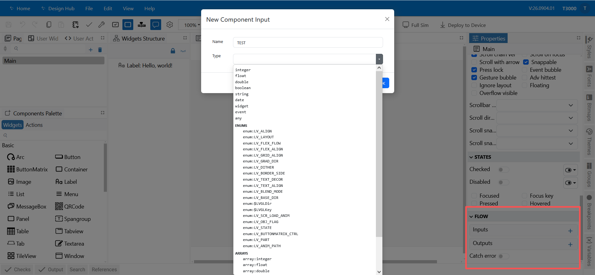

## 04 — Adding Logic with EEZ Flow

**EEZ Flow** is the visual logic editor. It lets a screen *do* something when the user
interacts with it or when a value changes — without writing code.

> Flow is available only in **LVGL with Flow 9.5** projects. If your project was created as
> plain **LVGL 9.5**, the Flow section is not shown.

**In this chapter**

1. [What Flow is for](#1-what-flow-is-for) — when you need it and when you do not
2. [The Flow section](#2-the-flow-section) — where flows live in the editor
3. [Components](#3-components) — the building blocks
4. [Starting a flow from a widget event](#4-starting-a-flow-from-a-widget-event)
5. [Worked example — a button that raises a setpoint](#5-worked-example-a-button-that-raises-a-setpoint)
6. [Testing flows](#6-testing-flows)
7. [Notes and limitations](#7-notes-and-limitations)

---

### 1. What Flow is for

Use Flow when the UI must react:

| You want… | Flow gives you… |
|---|---|
| A button that changes a value | An **event handler** on the button that runs a *set variable* action |
| A label that follows a reading | A *watch variable* component that updates text when the value changes |
| A screen that switches automatically | A *change screen* action, possibly after a condition |
| A value that blinks / moves | An *animate* action |
| Something that happens after a delay | A *delay* component |

Simple, built-in behaviour — a switch toggling itself, a slider moving — does **not** need
Flow. Reach for Flow when you need to connect widgets, variables and timing.

---

### 2. The Flow section

Open **Actions / Flow** in the left navigation. Flow projects also get two extra tabs in the
editor:

- **Components Palette** — the building blocks you drag onto the flow canvas.
- **Breakpoints** — for debugging flows.

*Figure 4.1 — A small flow: an event starts it, components run in order.*

A flow is a set of components connected by wires. Data flows along the wires; execution
follows the connections from a starting point (an event) to the end.

---

### 3. Components

Drag components from the palette and wire them together.

*Figure 4.2 — The components palette.*

Typical groups:

| Group | Examples | Purpose |
|---|---|---|
| **Variables** | Get Variable, Set Variable, Watch Variable | Read and write the project's variables. |
| **Actions** | Output, Delay, Animate, Is True | Make something happen, wait, animate, or branch. |
| **Widget events** | Clicked, Value Changed, Screen Loaded | Start a flow when the user interacts with a widget, or when a screen opens. |
| **Screens** | Change Screen | Navigate to another page. |

A component has **inputs** (values it needs), **outputs** (values it produces), and an
**execute** connection that controls when it runs.

---

### 4. Starting a flow from a widget event

The usual pattern is *widget event → action*.

1. Select the widget on the canvas.
2. In **Properties**, find its **event handlers**.
3. Add a handler and choose the event, for example:
   - **CLICKED** — the user tapped the widget.
   - **VALUE_CHANGED** — a slider, switch or dropdown changed.
   - **SCREEN_LOADED** — the screen has just opened. Useful for a splash screen that advances
     by itself.
4. Choose **flow** as the handler type, and create or select the flow it should run.

*Figure 4.3 — A widget event handler pointing at a flow.*

> **What it becomes on the device.** An event handler is stored in the screen's JSON under
> `events`, with one or more `actions`. A button that toggles a panel's visibility exports as
> two `flag_modify` actions on `CLICKED`; the start-up screen exports a `screen_change` on
> `SCREEN_LOADED`. See the worked examples and **Events and actions** in
> [Screen JSON — Format Reference](../../bacnet-api/screen-json.md).

---

### 5. Worked example — a button that raises a setpoint

Goal: pressing a button increases a `setpoint` variable by 1 and shows the new value.

1. **Create the variable.** In **Variables**, add `setpoint`, type *number*, default `20`.
2. **Show it.** On the page, add a **Label** and set its text type to *expression*, using the
   `setpoint` variable, for example `"Setpoint: " + setpoint`.
3. **Add the button.** Drag a **Button** onto the canvas and name it (for example `upButton`).
4. **Create the flow.** Open **Actions / Flow** and add a new flow.
5. **Add the action.** Drag a **Set Variable** component onto the canvas. Point it at
   `setpoint` and give it the value `setpoint + 1`.
6. **Connect the event.** Select `upButton`, add a **CLICKED** event handler, set its type to
   *flow*, and select the flow you just created.
7. **Test it.** Click **Run (F5)** and press the button — the label should update each time.
8. **Deploy it.** When it behaves correctly, bind a device and
   **Deploy to Device** ([05](05-preview-and-deploy.md)).

---

### 6. Testing flows

- **Run (F5)** runs the project in the editor so you can click through the UI and watch values
  change. Use the variable status readout in the toolbar to see current values.
- **Debug (Ctrl+F5)** runs with the debugger — set **Breakpoints** to pause a flow and inspect
  values at a specific component.
- **Full Sim (F7)** runs the full simulator when it is enabled.

---

### 7. Notes and limitations

- Flow is part of the project: **save** it (and deploy) for your changes to take effect.
- Keep flows small and readable — a screen with one clear flow per action is easier to debug
  than one very large flow.
- Variables that should survive a restart have a **persist** setting; leave it off for purely
  visual values.

If a flow does not run when you expect:

- The project must have Flow support — if there is no **Flow** section, it was created as plain
  LVGL.
- The widget's event handler must be set to type **flow**, and must point at the flow you built.
- The flow must be wired **from** an event component; a flow with no entry point never runs.
- Try **Run (F5)** and watch the variable readout in the toolbar.

---

**Next:** [05 — Preview, Bind & Deploy](05-preview-and-deploy.md)
