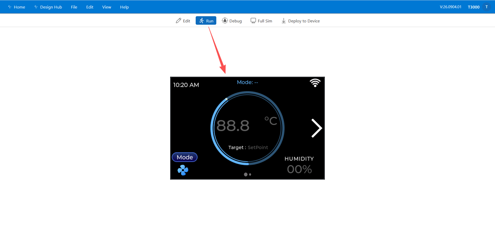
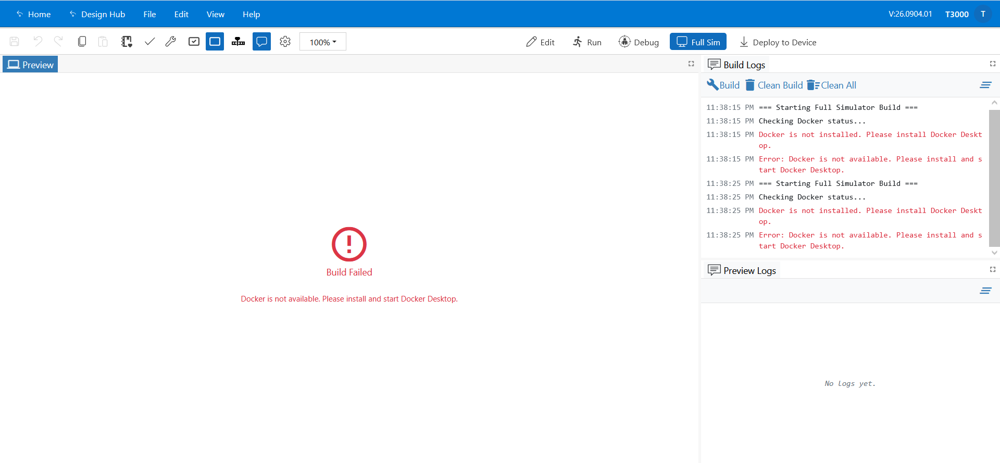
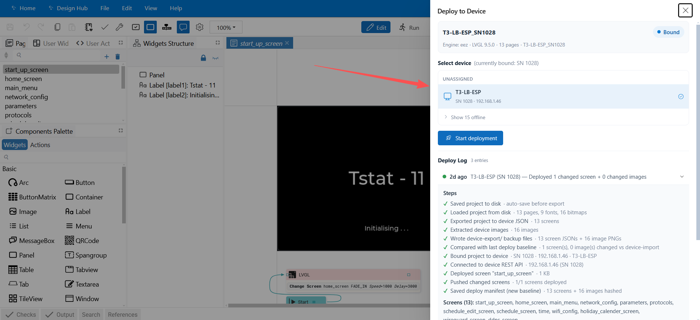
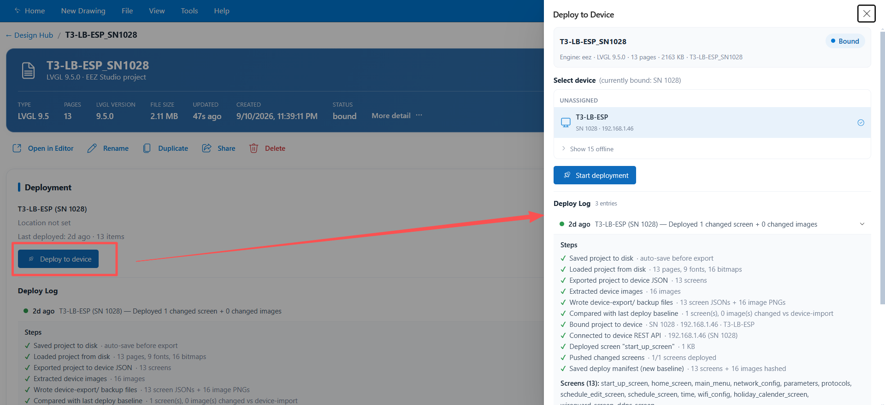
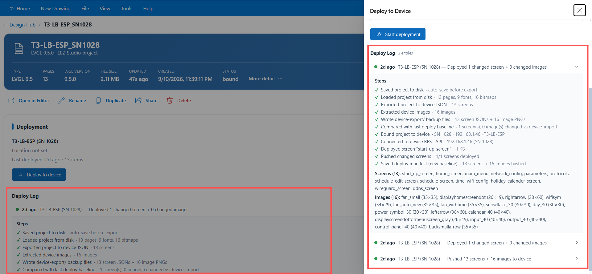
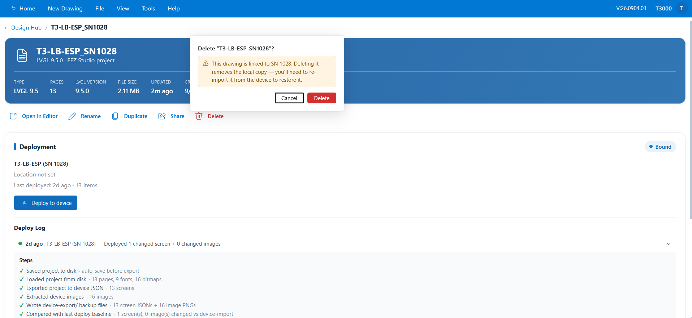

## 05 — Preview, Bind & Deploy

This chapter covers the last part of the workflow: checking the UI in the browser, telling
T3000 which controller the project belongs to, and sending the design to that controller.

```
Design  →  Preview (Run)  →  Bind a device  →  Deploy  →  Deployed
```

---

### 1. Preview before you deploy

Always preview before deploying. The editor runs your project so you can click through it
exactly as a user would.

| Control | What it does |
|---|---|
| **Run (F5)** | Runs the project in the editor. Buttons respond, values change, flows execute. |
| **Debug (Ctrl+F5)** | Same, with the debugger attached (breakpoints, value inspection). |
| **Full Sim (F7)** | Runs the full simulator, when it is enabled in settings. |
| **Edit mode (Shift+F5)** | Stops running and returns to design mode. |



*Figure 5.1 — Previewing the design with Run mode.*



*Figure 5.2 — The full simulator (F7), when enabled.*

While previewing, use the toolbar's variable status readout to watch the values your flows
produce.

---

### 2. Bind a project to a device

Binding records **which controller this project belongs to**. It is remembered with the
project, so the next deploy already knows the target.

1. In the Design Hub, find the project card and click **Bind to device**
   (or open the project detail page and bind from there).
2. Choose the device.



*Figure 5.3 — Choosing the controller for the project.*

3. Confirm the building / floor / room shown for the device, and accept.

The project status changes from **Unbound** to **Bound**.

> You can also deploy without binding first — the deploy drawer will ask you to pick a device.
> Binding first is recommended so the target is never ambiguous.

---

### 3. Deploy

#### From the editor

1. Save the project (the deploy saves automatically as its first step anyway).
2. Click **Deploy to Device** in the toolbar.
3. In the deploy drawer, confirm the device and start the deploy.

#### From the Design Hub

1. Open the project's detail page (**More (details & manage)** on the card), or use the deploy
   action available for the project.
2. Choose the device and start the deploy.

Either entry point runs the **same** deploy pipeline.



*Figure 5.4 — Deploying: the step list and progress.*

---

### 4. What a deploy actually does

The deploy is **incremental**: after the first time, only what changed is sent to the device.

| Step | What happens |
|---|---|
| 1. Save | The project is written to disk so the deploy reflects your latest edits. |
| 2. Load & export | The project is converted into the per-screen format the controller expects, and its images are extracted. |
| 3. Back up locally | A copy of the exported screens and images is written next to the project, so you always have the last-deployed state on disk. |
| 4. Compare | Each screen and image is compared against the **last successful deploy**. Unchanged screens and images are skipped. |
| 5. Connect | The editor connects to the device over the network. |
| 6. Push | Only the changed screens and images are sent. |
| 7. Record | The deploy log is updated, and the project is marked **Deployed**. |

Because step 4 compares content, re-deploying without changes does nothing — the drawer
reports that everything is already up to date.

> If a deploy fails partway through, the comparison baseline is **not** updated, so the next
> deploy retries the remaining changes.

---

### 5. Watching a deploy

The drawer shows each step with a status (running, done, skipped, or error) and, when you
expand it, a per-step detail line. After a deploy completes, the project's **deploy history**
keeps the log — device, time, screens and images sent, and any error.



*Figure 5.5 — Deploy history on the project detail page.*

---

### 6. Project detail page

**More (details & manage)** on a project card opens the detail page:



*Figure 5.6 — Project detail: preview, statistics and management.*

| Section | What it gives you |
|---|---|
| **Preview** | A rendered preview of the project. |
| **Details / statistics** | Pages, widgets, LVGL version, file size, and when it last changed. |
| **Snapshots** | Capture the current state, restore an earlier one, or delete snapshots. |
| **Compare** | Side-by-side comparison of a snapshot against the current project. |
| **Manage** | Bind, deploy, rename, duplicate, share, delete. |

Snapshots are useful before a large redesign: capture one, make your changes, and you can
always compare or restore.

---

### 7. Troubleshooting deploys

| Symptom | What to check |
|---|---|
| The device is not listed, or the deploy cannot connect | The controller must be online and reachable on the network from the T3000 host. Check the device's status in T3000 first. |
| Deploy stops with an error | Expand the failing step in the drawer — it names the step and the message. Fix the cause and deploy again; the remaining changes are retried. |
| The deploy reports "nothing changed" | The exported project matches the last successful deploy. Edit and save the project, then deploy again. |
| Deploy is slow on the first run | The first deploy sends every screen and image. Later deploys send only changes. |
| The device does not show the new design | Re-run the deploy and confirm every step finished with a ✔ in the log. |

---

**Next:** [06 — Reference & FAQ](06-reference-and-faq.md)
