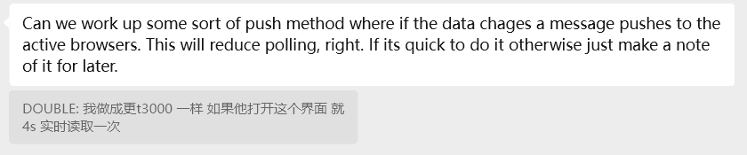
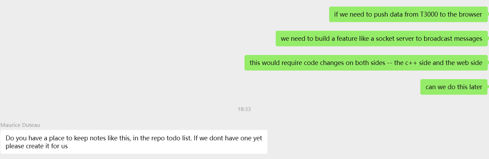
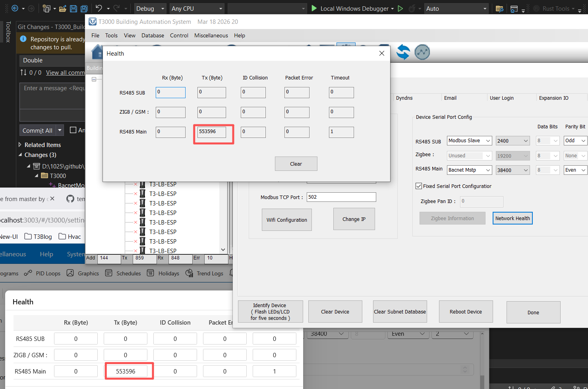

# T3000 TODO List

## 2026-03-20
## Push Notification / WebSocket Feature

> "Can we work up some sort of push method where if the data changes, a message pushes to the active browsers? This will reduce polling. If it's quick to do, great — otherwise just make a note of it for later."

---

### Tasks

- [ ] **Research** — Evaluate WebSocket vs SignalR vs Server-Sent Events (SSE) for push implementation
- [ ] **C++ Side** — Add socket server / broadcast mechanism in T3000 when data changes
- [ ] **Web Side** — Add WebSocket / SignalR client listener in the browser to receive push messages
- [ ] **Replace polling** — Remove or reduce existing polling logic once push is working
- [ ] **Test** — Verify data change events are received in real-time across active browser sessions
- [ ] **Fallback** — Handle reconnection if WebSocket connection drops

---

### Notes

- This feature requires changes on **both** the C++ side (T3000) and the **web side** (browser client)
- Priority: **Low** — implement when time allows, polling is acceptable for now
- Recommended approach: **SignalR** (if .NET backend) or raw **WebSocket** (if C++ side broadcasts directly)

## 2026-03-15

case WEBVIEW_MESSAGE_TYPE::GET_PANELS_LIST:

int temp_panel = g_bacnet_panel_info.at(i).panel_number;
const char* panelNamePtr = reinterpret_cast<const char*>(g_Device_Basic_Setting[g_bacnet_panel_info.at(i).panel_number].reg.panel_name);

=> check docs\legacy\legacy-code\c++\BacnetWebView.cpp for the history "Add for Str_MISC"

## 2026-03-30

case WEBVIEW_MESSAGE_TYPE::GET_WEBVIEW_LIST:

Update
for (int idx = temp_start; idx < temp_end; idx++)

To
for (int idx = temp_start; idx <= temp_end; idx++)
