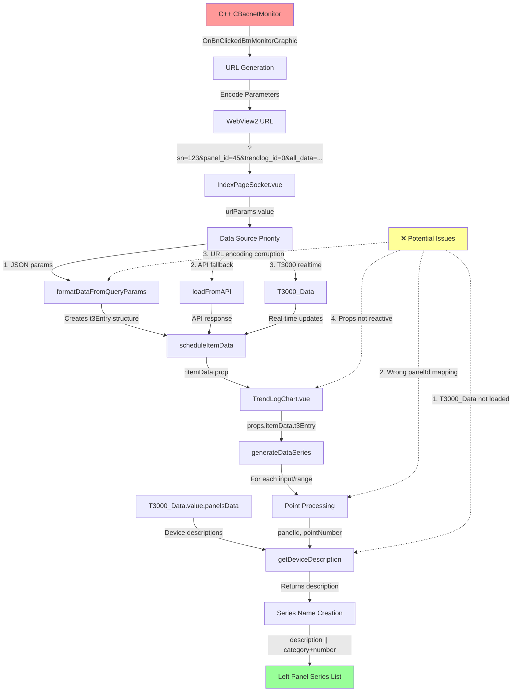

# TrendLog Data Flow Analysis

## Complete Data Flow Diagram



## Data Structure Flow

### 1. C++ Backend → URL Parameters
```
C++ CBacnetMonitor::OnBnClickedBtnMonitorGraphic()
├── Collects: Serial Number, Panel ID, TrendLog ID
├── Encodes: all_data JSON with t3Entry structure
└── Opens: WebView2 with URL parameters
```

### 2. URL Parameters → IndexPageSocket
```
URL: ?sn=123&panel_id=45&trendlog_id=0&all_data=encoded_json
├── Parsed by: urlParams.value (computed)
├── Processed by: formatDataFromQueryParams()
└── Creates: scheduleItemData reactive ref
```

### 3. scheduleItemData Structure
```javascript
scheduleItemData = {
  title: "TRL123_45_0",
  t3Entry: {
    pid: 45,           // Panel ID
    input: [1,2,3,4],  // Input point numbers
    range: [5,6,7,8],  // Range point numbers
    // ... other properties
  }
}
```

### 4. IndexPageSocket → TrendLogChart Props
```vue
<TrendLogChart
  :itemData="scheduleItemData"
  :title="pageTitle"
/>
```

### 5. TrendLogChart Series Generation
```javascript
// In generateDataSeries()
props.itemData.t3Entry.input.forEach((pointNumber, index) => {
  const panelId = props.itemData.t3Entry.pid;
  const description = getDeviceDescription(panelId, pointNumber);
  const seriesName = description || `${pointTypeInfo.category}${pointNumber + 1} (P${panelId})`;
  // Creates series for left panel
});
```

### 6. Device Description Lookup
```javascript
// getDeviceDescription() checks:
T3000_Data.value.panelsData?.[panelId]?.inputs?.[pointNumber]?.description
T3000_Data.value.panelsData?.[panelId]?.ranges?.[pointNumber]?.description
```

## Critical Data Transformation Points

### Point A: C++ Data Collection
- **Source**: CBacnetMonitor in C++ backend
- **Data**: Real panel data from T3000 devices
- **Format**: Native C++ structures

### Point B: URL Encoding
- **Process**: C++ encodes data to JSON then URL
- **Risk**: JSON encoding/decoding errors
- **Format**: URL-encoded JSON string

### Point C: IndexPageSocket Parsing
- **Process**: `decodeUrlEncodedJson(all_data)`
- **Risk**: Parsing failures, malformed JSON
- **Format**: JavaScript object

### Point D: TrendLogChart Props
- **Process**: Vue props reactivity
- **Risk**: Props not updating, reactivity issues
- **Format**: Vue reactive object

### Point E: Series Name Generation
- **Process**: `getDeviceDescription()` lookup
- **Risk**: T3000_Data not loaded, wrong mapping
- **Format**: Display string

## Diagnostic Questions

Based on the flow analysis, here are the key questions to investigate:

1. **Is T3000_Data properly loaded?**
   - Check if `T3000_Data.value.panelsData` contains panel 45 data
   - Verify timing: T3000_Data loads after TrendLogChart mounts

2. **Are URL parameters correctly parsed?**
   - Check if `all_data` parameter contains correct panel/point data
   - Verify JSON encoding/decoding process

3. **Is panelId mapping correct?**
   - Verify `props.itemData.t3Entry.pid` matches actual panel ID
   - Check if point numbers align with panel structure

4. **Are device descriptions available?**
   - Check if `T3000_Data.value.panelsData[45]` exists
   - Verify input/range arrays have description fields

## Recommended Debug Steps

1. **Add URL Parameter Logging**
   ```javascript
   console.log('Raw URL params:', {
     sn: sn.value,
     panel_id: panel_id.value,
     all_data: all_data.value?.substring(0, 100) + '...'
   });
   ```

2. **Add T3000_Data State Logging**
   ```javascript
   console.log('T3000_Data state:', {
     panelsDataKeys: Object.keys(T3000_Data.value.panelsData || {}),
     targetPanel: T3000_Data.value.panelsData?.[45],
     loadingState: T3000_Data.value.isLoading
   });
   ```

3. **Add Props Validation**
   ```javascript
   console.log('TrendLogChart props:', {
     itemData: props.itemData,
     hasT3Entry: !!props.itemData?.t3Entry,
     pid: props.itemData?.t3Entry?.pid,
     inputCount: props.itemData?.t3Entry?.input?.length,
     rangeCount: props.itemData?.t3Entry?.range?.length
   });
   ```

## Expected vs Actual Data Flow

### Expected Flow
```
C++ Panel Data → URL Encoding → JSON Parsing → Props → Series Generation → Real Device Names
```

### Likely Issue Points
1. **T3000_Data timing**: Chart renders before panel data loads
2. **Panel ID mismatch**: URL panel_id ≠ actual device panel ID
3. **Point mapping**: Input/range numbers don't match device structure
4. **Description availability**: Panel data missing description fields

## Next Steps

1. Run the updated code with new diagnostic logs
2. Check browser console for data flow logs
3. Compare C++ panel data vs frontend parsed data
4. Identify where real device descriptions get lost
