## 2024-11-01

#### 1. Added a toolbar along the top with menu [Edit] and [Object]'s all options.

#### 1. Added a new option "Weld Selected" to menu [Edit] and top toolbar. Allow user to weld two selected ducts into one duct.

## 2024-11-22

#### 1. Updated the “Weld Selected” function to make the welded item resizable and moveable.

#### 2. Added rulers and grid dots to the drawing area.

#### 3. Added a new tool category “General” with some basic shapes.

#### 4. Added a new type of wall “Interior/Exterior Wall” to Room tool category.

## 2024-12-13

#### 1. Updated the default value of link entry's [Display field] to description field, and can remember the user last selection after window been closed.

#### 2. Updated the Auto/Manual mode icon with larger size.

#### 3. Updated the draw logic, can draw the shape by single click the left mouse

#### 4. Added a context menu to toggle the value of [Mode] and [Value] fields, when the selected shape been right clicked.

## 2024-12-18

#### 1. Added a new feature [Insert key], to add a new shape and automatically link to the selected entry when the insert key been pressed

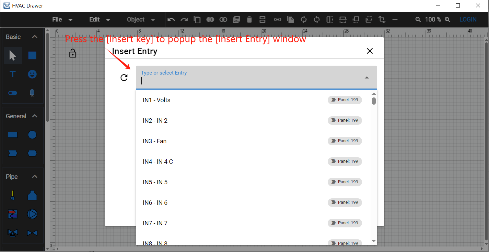

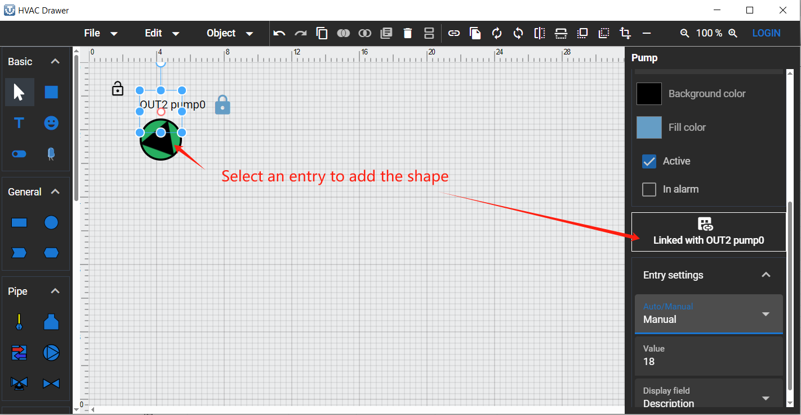

## 2025-01-21

#### 1. Added a new feature, to access the "Webview Graphic" via external browser (Firefox, Chrome, Microsoft Edge).

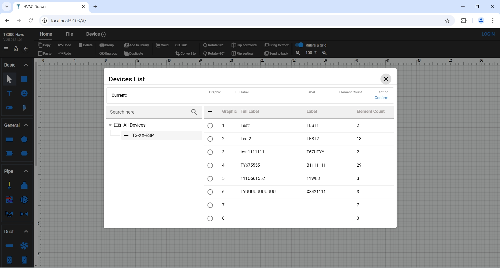

##### 1.1 Open the T3000 application, and keep it running.

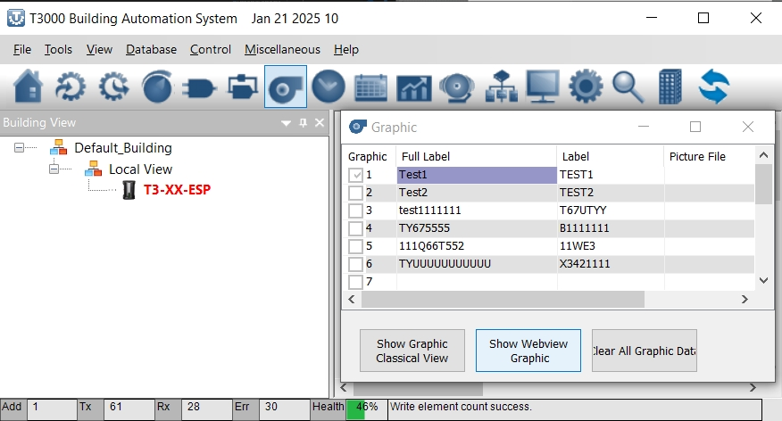

##### 1.2 Open a web browser (e.g. Firefox), and type "http://localhost:9103" in the address bar to access the webview graphic.

###### 1.2.1 If you want to access it in a local area network (LAN), open a cmd window to find the host ip address where the T3000 is running.

use cmd "ipconfig" to find the IPV4 address (e.g. 192.168.1.8)

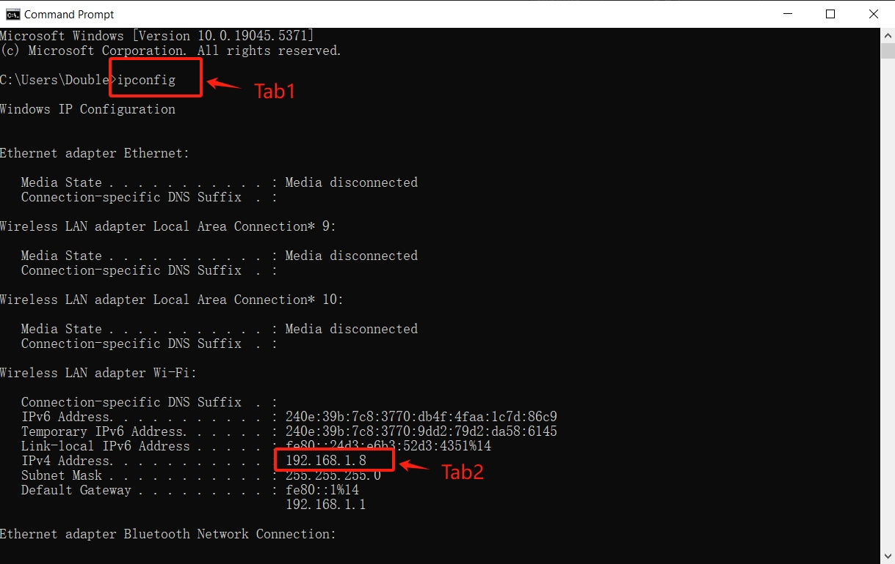

###### 1.2.2 Use http://192.168.1.8:9103 to access it on a remote computer.

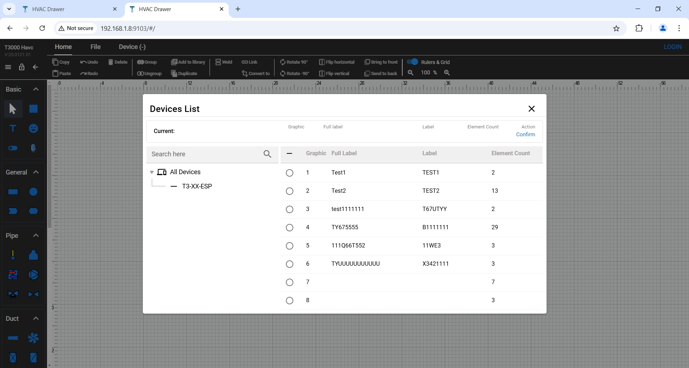

##### 1.3 By default, system will automatically load all devices info from T3000. Please choose one device and one graphic before working on it. By click "Confirm" to confirm the selection.

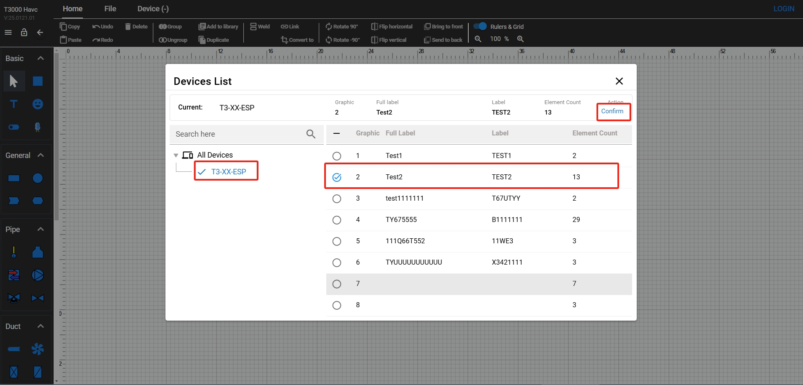

##### 1.4 System will load existing data from T3000 for selected device and graphic.

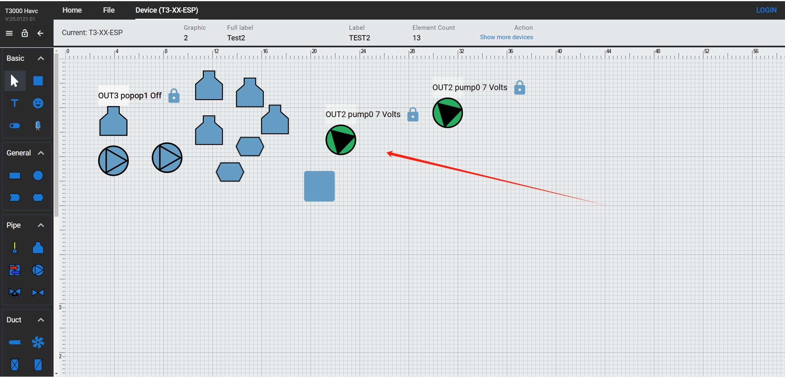

##### 1.5 By clicking the "Show more devices" under "Device(***)" section to switch the device and graphic.

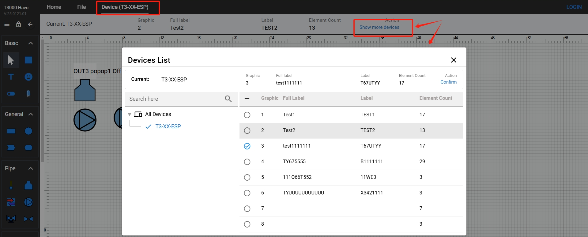

##### 1.6 Updated the top menu bar and divided the operations into "Home","File","Device" categories.

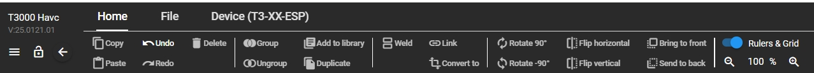

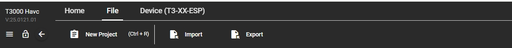

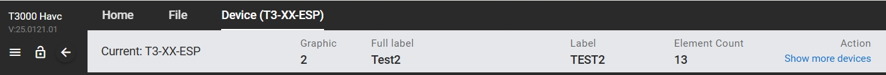
