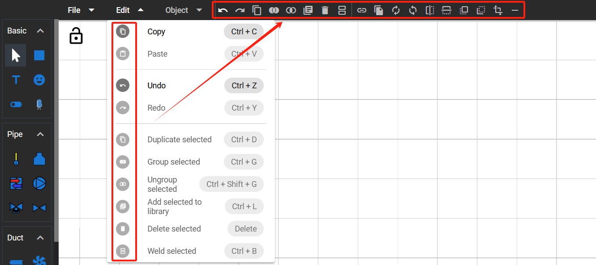
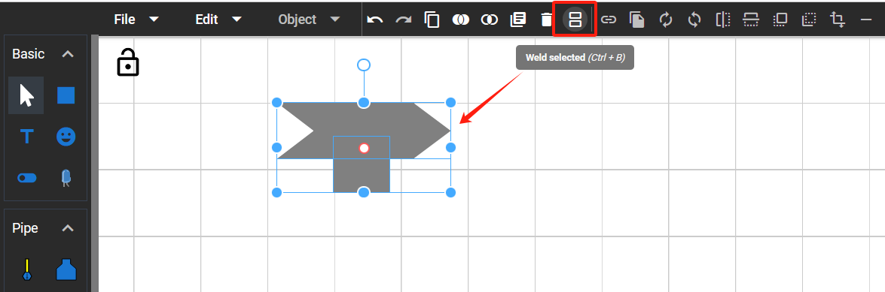
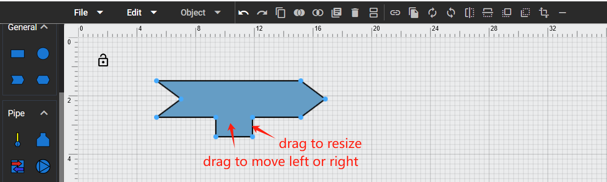
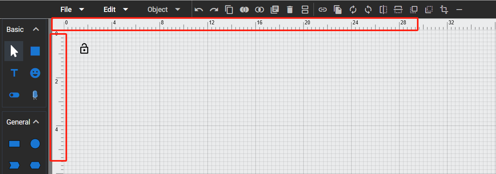
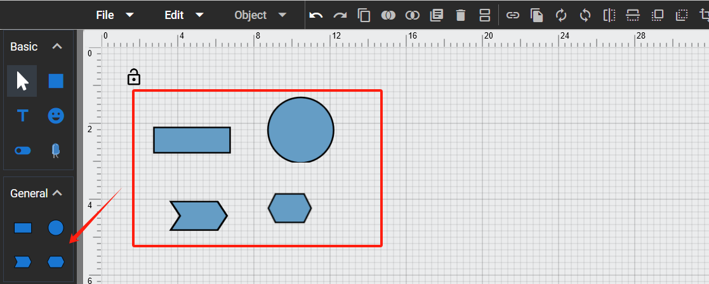
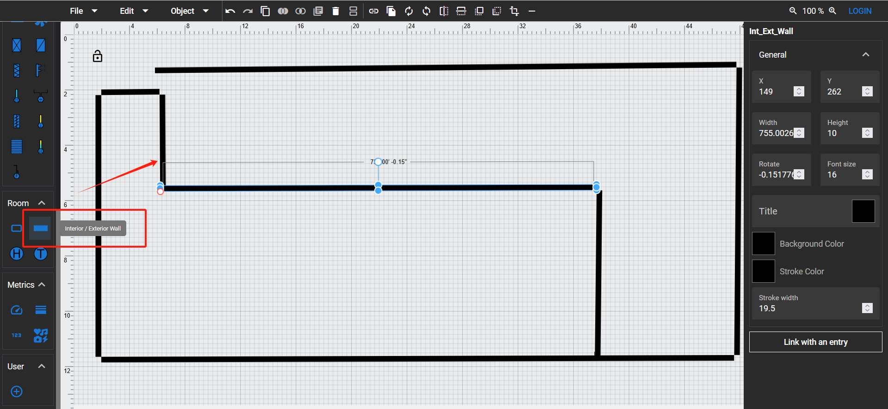
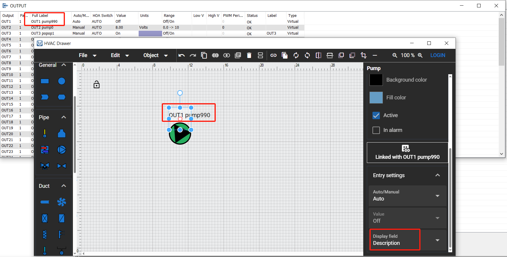
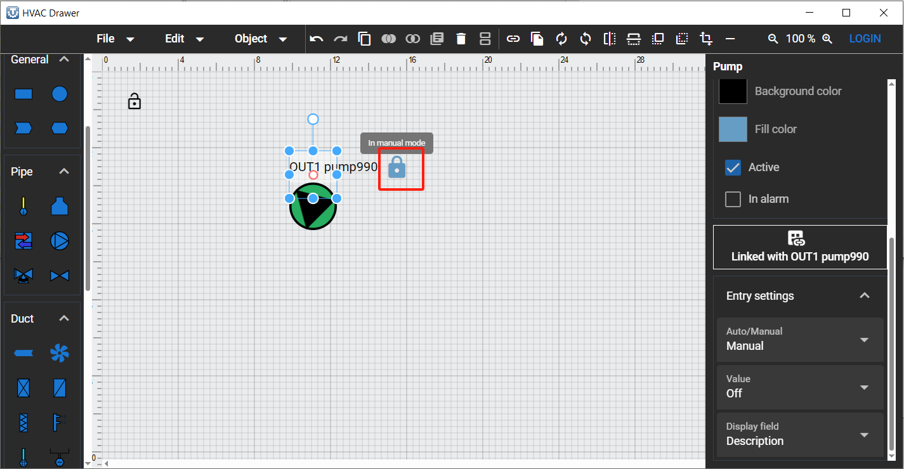
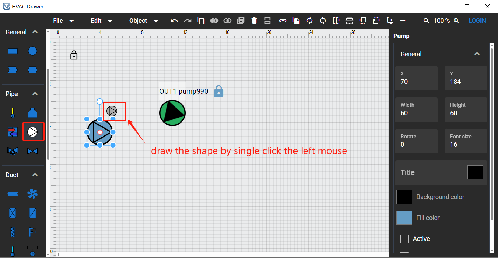
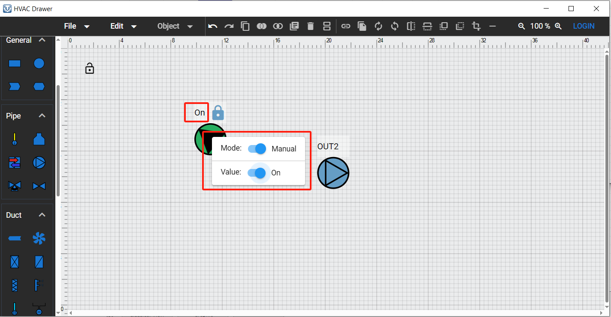

## 2024-11-01

## 1. Added a toolbar along the top with menu [Edit] and [Object]'s all options.

## 1. Added a new option "Weld Selected" to menu [Edit] and top toolbar. Allow user to weld two selected ducts into one duct.

## 2024-11-22

## 1. Updated the “Weld Selected” function to make the welded item resizable and moveable.

## 2. Added rulers and grid dots to the drawing area.

## 3. Added a new tool category “General” with some basic shapes.

## 4. Added a new type of wall “Interior/Exterior Wall” to Room tool category.

## 2024-12-13

## 1. Updated the default value of link entry's [Display field] to description field, and can remember the user last selection after window been closed.

## 2. Updated the Auto/Manual mode icon with larger size.

## 3. Updated the draw logic, can draw the shape by single click the left mouse

## 4. Added a context menu to toggle the value of [Mode] and [Value] fields, when the selected shape been right clicked.

